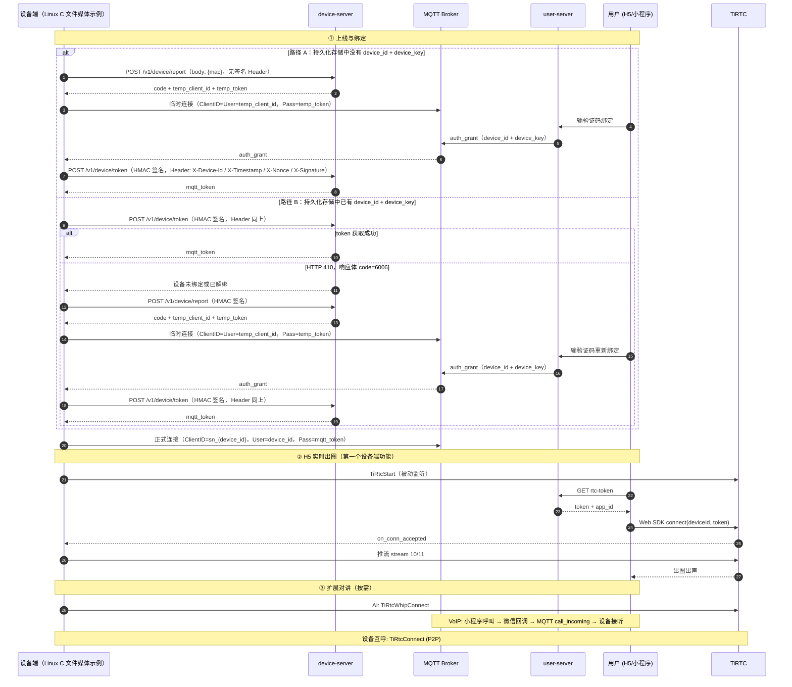

# ThingConnect 开发者文档

ThingConnect 展示设备如何接入 **H5 实时预览与对讲、AI 对讲、微信 IoT VoIP、设备间互呼** 四类能力。仓库包含 Linux 用户态 **「C 参考实现」**、Python 模拟器、H5/小程序前端和五个 Go 服务；真实产品设备不属于仓库已实现范围。

本页按「业务流程 → H5 出图 → 扩展对讲」展开。首次体验请先按[项目快速体验](../README.md)跑通「上线 → 绑定 → H5 出图」。

> 本页提供各能力的**最小接入步骤和 TiRTC SDK 调用骨架**。完整字段、错误码和排查方法见各节的「参考实现」和「深入」链接。

> 三端使用不同的接入方式：设备端使用 **TiRTC C SDK**（[SDK 头文件](device-sim/sdk/linux-x86_64/2.2.1/include/tirtc/tiRTC.h)）；H5 使用 [TiRTC Web SDK](device-h5-live.md#h5-端接入)；微信小程序使用[微信 IoT VoIP](weixin-mini-program/README.md#微信-voip-开发)。设备协议顺序和会话控制可参考 [Linux C 参考实现](device-sim/device-sim-c/README.md)；产品化时必须完成[十项二次开发 TODO](device-porting.md#二次开发-todo)，不能只替换几个系统库就视为移植完成。

---

## 业务流程

设备端流程分为「上线与绑定、H5 实时出图、扩展对讲」三段，下面通过时序图展示。

> **启动时先检查持久化存储：** 没有 `device_id + device_key`，调用 [`POST /v1/device/report`](api-reference.md#post-v1devicereport) 注册绑定；已有凭证，先调用 [`POST /v1/device/token`](api-reference.md#post-v1devicetoken)。如果接口返回 **HTTP 410**，且响应体业务错误码为 **`6006`**，说明设备未绑定或已解绑，需携带 HMAC 签名重新调用 [`POST /v1/device/report`](api-reference.md#post-v1devicereport)。



三段分别展开：

**① 上线与绑定**（设备获得身份）

根据持久化存储中是否已有 `device_id + device_key` 选择上线流程。

- **路径 A：持久化存储中没有凭证。** 调用 [`POST /v1/device/report`](api-reference.md#post-v1devicereport) 获取验证码和临时 MQTT 凭证。用户绑定后，设备收到 `device_id + device_key`，先安全持久化，再调用 [`POST /v1/device/token`](api-reference.md#post-v1devicetoken) 获取正式 MQTT token。

- **路径 B：持久化存储中已有凭证。** 先调用 [`POST /v1/device/token`](api-reference.md#post-v1devicetoken)。成功后直接使用返回的 MQTT token；如果接口返回 **HTTP 410**，且响应体业务错误码为 **`6006`**，则携带 HMAC 签名调用 [`POST /v1/device/report`](api-reference.md#post-v1devicereport)，重新完成绑定。

两条路径调用 [`POST /v1/device/token`](api-reference.md#post-v1devicetoken) 时，均使用相同的签名 Header：`X-Device-Id` / `X-Timestamp` / `X-Nonce` / `X-Signature`。Linux C 参考实现使用 **mbedTLS HMAC-SHA256 → Base64**：

```c
// 签名串 = device_id + timestamp + nonce
// 签名值 = Base64(HMAC-SHA256(device_key, 签名串))

#include <mbedtls/md.h>
#include <mbedtls/base64.h>

char raw[256];
int n = snprintf(raw, sizeof(raw), "%s%s%s", device_id, timestamp, nonce);
if (n < 0 || (size_t)n >= sizeof(raw)) return -1;

unsigned char hmac[32];
const mbedtls_md_info_t *md = mbedtls_md_info_from_type(MBEDTLS_MD_SHA256);
if (md == NULL ||
    mbedtls_md_hmac(md,
                    (const unsigned char *)device_key, strlen(device_key),
                    (const unsigned char *)raw, strlen(raw), hmac) != 0)
    return -1;

size_t olen = 0; char sig[64];
if (mbedtls_base64_encode((unsigned char *)sig, sizeof(sig), &olen,
                          hmac, sizeof(hmac)) != 0 || olen >= sizeof(sig))
    return -1;
sig[olen] = '\0';
```

**「C 参考实现」**封装为 `hmac_sha256_b64()`（[device_flow.h](device-sim/device-sim-c/src/device_flow.h)）。最终拿到 `mqtt_token`，建正式连接（`ClientID=sn_{device_id}`，`User=device_id`，`Pass=mqtt_token`）。

**② H5 实时出图**（第一个设备端功能）
设备调用 <a href="https://docs.tange.ai/products/tirtc/api-reference/c.html#tirtcstart" target="_blank" rel="noopener">`TiRtcStart`</a> 被动监听 → H5 取 `rtc-token`、用 Web SDK 连设备 → 设备 `on_conn_accepted` 后向固定 stream 推音视频 → H5 出图出声、可按住说话。

**③ 扩展对讲**（第一个闭环跑通后，按需接入）
- **AI 对讲**：设备主动调用 <a href="https://docs.tange.ai/products/tirtc/api-reference/c.html#tirtcwhipconnect" target="_blank" rel="noopener">`TiRtcWhipConnect`</a>
- **微信 VoIP**：小程序 ↔ 设备（经 MQTT 来电通知）
- **设备互呼**：设备 ↔ 设备调用 <a href="https://docs.tange.ai/products/tirtc/api-reference/c.html#tirtcconnect" target="_blank" rel="noopener">`TiRtcConnect`</a>（P2P）

**各方职责：**

| 一方 | 负责 |
|---|---|
| Linux C 参考实现 | 上线、凭证、MQTT、TiRTC、会话控制，以及 `DeviceAdapterV1` 二次开发边界；默认仍为文件媒体/stdin 演示 |
| 产品设备 | 平台与硬件适配、真实身份、采集编码、解码播放、视频显示、产品交互、资源仲裁、异常恢复和量产安全 |
| H5 / 小程序 | 登录、绑定、取 token、发起 / 接听通话 |
| 服务端（5 个 Go 服务） | 身份、绑定、签发各业务 token、MQTT 信令、微信回调、房间管理 |
| MQTT Broker | 设备长连接、来电与通知下发 |
| TiRTC | 实时音视频传输 |

> 设备端按以下顺序接入：TiRTC SDK 基础 → H5 出图 → 按需扩展对讲。

---

## 设备端

> **📌 MQTT 正式连接参数**（设备所有业务通信的前提）
>
> - **ClientID** = `sn_{device_id}`
> - **Username** = `device_id`（**不带 `sn_` 前缀**——EMQX 用它比对 token 里的 `device_id` claim）
> - **Password** = `mqtt_token`（`POST /v1/device/token` 签发的 JWT）
>
> 临时连接、Token 签发与刷新、心跳、断连原因码见 [device-integration.md](device-integration.md#凭证与连接)。

### TiRTC SDK 速查

设备侧的四类能力共用 TiRTC C SDK。先掌握以下 5 点，再看各功能代码。

**① 进程级生命周期（顺序固定）**：<a href="https://docs.tange.ai/products/tirtc/api-reference/c.html#tirtcsetoption" target="_blank" rel="noopener">`TiRtcSetOption(TIRTC_OPT_MAX_SEND_BUFFER)`</a> → <a href="https://docs.tange.ai/products/tirtc/api-reference/c.html#tirtcinit" target="_blank" rel="noopener">`TiRtcInit`</a> → 其余 <a href="https://docs.tange.ai/products/tirtc/api-reference/c.html#tirtcsetoption" target="_blank" rel="noopener">`TiRtcSetOption`</a> → <a href="https://docs.tange.ai/products/tirtc/api-reference/c.html#tirtcstart" target="_blank" rel="noopener">`TiRtcStart`</a> → 等 `on_event(SYS_STARTED)` → 多个业务会话共享 SDK → 进程退出时 <a href="https://docs.tange.ai/products/tirtc/api-reference/c.html#tirtcstop" target="_blank" rel="noopener">`TiRtcStop`</a> → 等 `on_event(SYS_STOPPED)` → <a href="https://docs.tange.ai/products/tirtc/api-reference/c.html#tirtcuninit" target="_blank" rel="noopener">`TiRtcUninit`</a>

> H5 实时、VoIP、AI 和设备互呼共用一个进程级 SDK runtime 和一张统一回调表。业务切换只停止媒体、断开当前连接并更新会话代次，不调用 `TiRtcStop` / `TiRtcUninit`。连接及异步结果必须绑定会话代次，迟到回调不能进入新的同类会话。

> 参数来源：`device_id / device_key` 来自[设备上线](#业务流程)，`endpoint` 取[服务发现](api-reference.md#service-discovery)返回的 `tirtc-srv`，`client_id` 推荐使用设备 MAC，必须唯一且不可变；一旦变更，设备将无法连接。
>
> `g_sdk_ready`、`s_active_conn` 和 `s_force_key` 是下方精简示例的应用状态变量，不是 SDK 字段。完整实现由 `tirtc_runtime` 保存 SDK 状态和连接归属。

```c
/* ── 1. 实现 SDK 回调（运行在 SDK 内部线程，避免 sleep、阻塞和耗时操作）── */

/* 系统事件：data/len 是事件附加数据。SYS_STARTED=启动完成可开始连接；SYS_STOPPED=已停止 */
static void on_event(int event, const void *data, int len) {
    (void)data; (void)len;
    if (event == TIRTC_EVENT_SYS_STARTED)      g_sdk_ready = 1;
    else if (event == TIRTC_EVENT_SYS_STOPPED) g_sdk_ready = 0;
}

/* 新连接接入（H5 直连 / 设备互呼对端连入）。
   SDK 回调只向应用自己的固定队列投递事件；控制任务再保存 hconn、启动媒体。 */
static void on_conn_accepted(tirtc_conn_t hconn) {
    app_rtc_event_push(APP_RTC_CONNECTED, hconn, 0);
}

/* 连接出错：此后该 hconn 上收发全部失效。Disconnect 由控制任务延后执行。 */
static void on_conn_error(tirtc_conn_t hconn, int error) {
    app_rtc_event_push(APP_RTC_CONN_ERROR, hconn, error);
}

/* 收到对端音频：pFi 描述本帧（stream_id / media / length / ts），data 指向 payload。
   ⚠️ data 在回调返回后即失效，需要保留须先拷贝。
   stream 14 = H5 talkback 音频；AI 下行音频也走这里 → 拷贝后交给扬声器。 */
static void on_audio(tirtc_conn_t hconn, const TIRTCFRAMEINFO *pFi, void *data) {
    /* 复制后投递；控制/媒体任务再调用 speaker_write。 */
    app_rtc_media_push(hconn, pFi, data, pFi->length);
}

/* 0x2000 / 0x2100 是平台预留业务命令；复制后由控制任务解析。 */
static void on_command(tirtc_conn_t hconn, uint32_t cmdw, const void *data, uint32_t len) {
    app_rtc_command_push(hconn, cmdw, data, len);
}

/* 对端请求在 stream_id 上立即发关键帧 → 置标志，推流线程下一帧强制 IDR（第一个功能） */
static void on_request_key_frame(tirtc_conn_t hconn, uint8_t stream_id) {
    (void)hconn; (void)stream_id;
    /* 例：s_force_key = 1; 见第一个功能 push_thread */
}

/* 未使用的回调也提供 NOP，订阅回调返回 0 表示接受。 */
static void on_disconnected_nop(tirtc_conn_t hconn) { (void)hconn; }
static void on_frame_nop(tirtc_conn_t hconn, const TIRTCFRAMEINFO *fi, void *data) {
    (void)hconn; (void)fi; (void)data;
}
static int on_subscribe_nop(tirtc_conn_t hconn, uint8_t stream_id) {
    (void)hconn; (void)stream_id; return 0;
}
static void on_unsubscribe_nop(tirtc_conn_t hconn, uint8_t stream_id) {
    (void)hconn; (void)stream_id;
}

/* ── 2. 注册回调 + 初始化 + 启动（顺序固定）── */
static TIRTCCALLBACKS cbs;                 /* 必须 static：SDK 只存指针，生命周期须覆盖整个运行期 */

static int process_rtc_start(const char *endpoint, const char *device_key,
                             const char *client_id, const char *device_id) {
    int rc;
    uint32_t max_send_buffer = 512 * 1024;

    memset(&cbs, 0, sizeof cbs);
    cbs.on_event             = on_event;
    cbs.on_conn_accepted     = on_conn_accepted;
    cbs.on_conn_error        = on_conn_error;
    cbs.on_disconnected      = on_disconnected_nop;
    cbs.on_audio             = on_audio;
    cbs.on_video             = on_frame_nop;
    cbs.on_message           = on_frame_nop;
    cbs.on_command           = on_command;
    cbs.on_request_key_frame = on_request_key_frame;
    cbs.on_subscribe_video   = on_subscribe_nop;
    cbs.on_unsubscribe_video = on_unsubscribe_nop;
    cbs.on_subscribe_audio   = on_subscribe_nop;
    cbs.on_unsubscribe_audio = on_unsubscribe_nop;

    /* 必须在 TiRtcInit 前设置。 */
    rc = TiRtcSetOption(TIRTC_OPT_MAX_SEND_BUFFER, &max_send_buffer, sizeof max_send_buffer);
    if (rc != 0) return rc;
    rc = TiRtcInit();
    if (rc != 0) return rc;

    /* endpoint 必须取 GET http://ep-open.tangeopen.com/services 的 tirtc-srv。
       空值只作防御性处理：不设置 option，也不在设备端固化替代地址。 */
    if (endpoint && endpoint[0]) {
        rc = TiRtcSetOption(TIRTC_OPT_SERVICE_ENDPOINT, endpoint, (uint32_t)strlen(endpoint));
        if (rc != 0) goto fail;
    }
    rc = TiRtcSetOption(TIRTC_OPT_DEVICE_SECRET_KEY, device_key, (uint32_t)strlen(device_key));
    if (rc != 0) goto fail;
    /* client_id：推荐设备 MAC；必须唯一且保持不变，变动后设备无法连接。 */
    rc = TiRtcSetOption(TIRTC_OPT_CLIENT_ID, client_id, (uint32_t)strlen(client_id));
    if (rc != 0) goto fail;

    rc = TiRtcStart(device_id, &cbs); /* 返回 0 仅初检通过；真正启动看 SYS_STARTED */
    if (rc != 0) goto fail;
    return 0;

fail:
    TiRtcUninit();
    return rc;
}
```

> ⚠️ SDK 回调运行在内部线程，不要 `sleep`、阻塞、创建/等待线程，也不要从回调中反向调用 `TiRtcDisconnect`、`TiRtcStop` 或 `TiRtcUninit`。回调只复制仍需使用的数据、更新受保护状态或投递到应用自己的固定队列；断开、线程启停、命令解析、文件/声卡 I/O、会话恢复和延时动作由常驻控制或媒体任务在回调栈外执行。`app_rtc_event_push()`、`app_rtc_media_push()` 和 `app_rtc_command_push()` 是上例中的应用队列抽象，不是 TiRTC API。需要延时的操作（如 AI 等待 300ms）只记录时间，由业务主循环执行。[`TiRtcStart`](https://docs.tange.ai/products/tirtc/api-reference/c.html#tirtcstart) 返回 0 仅表示初步检查通过；收到 `SYS_STARTED` 后 SDK 才可用。

**② 三种连接方式**

| 能力 | SDK 调用 | 方向 |
|---|---|---|
| H5 实时 | 被动：<a href="https://docs.tange.ai/products/tirtc/api-reference/c.html#tirtcstart" target="_blank" rel="noopener">`TiRtcStart`</a> 后等 `on_conn_accepted` | 设备不主动连 |
| AI / VoIP | <a href="https://docs.tange.ai/products/tirtc/api-reference/c.html#tirtcwhipconnect" target="_blank" rel="noopener">`TiRtcWhipConnect(peer_id, token, cb, user)`</a> | WHIP client → server |
| 设备互呼 | <a href="https://docs.tange.ai/products/tirtc/api-reference/c.html#tirtcconnect" target="_blank" rel="noopener">`TiRtcConnect(caller_id, token, cb, user)`</a> | 设备 ↔ 设备 P2P（被叫发起） |

[`TiRtcWhipConnect`](https://docs.tange.ai/products/tirtc/api-reference/c.html#tirtcwhipconnect) 和 [`TiRtcConnect`](https://docs.tange.ai/products/tirtc/api-reference/c.html#tirtcconnect) 都通过 `TIRTCCONNECTCALLBACK` 返回连接结果：`void cb(int error, tirtc_conn_t hconn, void *user_data)`。`error == 0` 时可使用 `hconn` 发送媒体或命令。[`TiRtcDisconnect`](https://docs.tange.ai/products/tirtc/api-reference/c.html#tirtcdisconnect) 异步断开连接；该方法返回后，`hconn` 立即失效。

**③ 发送音视频**（`TIRTCFRAMEINFO` 帧头 + payload）

```c
/* 音频：stream_id 与视频不能重复。 */
TIRTCFRAMEINFO audio = {0};
audio.stream_id = 10;                         /* 0~15，全局唯一 */
audio.media     = TIRTC_AUDIO_ALAW;           /* PCM=1/ALAW=2/AAC=3/OPUS=4/AMR=5 */
audio.flags     = TIRTC_AUDIOSAMPLE_8K16B1C;  /* 音频采样规格 */
audio.ts        = (uint32_t)(audio_pts_ms & 0xFFFFFFFF); /* 主机序，精度 ms */
audio.length    = 320;                        /* G.711A 8kHz：约 320B/40ms */
TiRtcSendAudioStream(hconn, &audio, audio_pkt);

/* 视频：同样使用 TIRTCFRAMEINFO，但媒体类型、flags 与发送接口不同。 */
TIRTCFRAMEINFO video = {0};
video.stream_id = 11;                          /* 必须与音频 stream_id 不同 */
video.media     = TIRTC_VIDEO_H264;            /* 也可为 TIRTC_VIDEO_H265 / TIRTC_VIDEO_JPEG */
video.flags     = is_key_frame ? TIRTC_FRAME_FLAG_KEY_FRAME : 0; /* bit0：关键帧 */
video.ts        = (uint32_t)(video_pts_ms & 0xFFFFFFFF); /* 主机序，精度 ms */
video.length    = video_len;                   /* 一帧编码后视频数据的字节数 */
TiRtcSendVideoStream(hconn, &video, video_frame);
```

> 音频与视频都使用 `TIRTCFRAMEINFO`，但分别调用 <a href="https://docs.tange.ai/products/tirtc/api-reference/c.html#tirtcsendaudiostream" target="_blank" rel="noopener">`TiRtcSendAudioStream`</a> 和 <a href="https://docs.tange.ai/products/tirtc/api-reference/c.html#tirtcsendvideostream" target="_blank" rel="noopener">`TiRtcSendVideoStream`</a>。视频流**第一帧必须是关键帧**；返回 `TIRTC_E_BUSY` 表示发送缓冲满，SDK 自动丢弃非关键帧直到下一个关键帧。

**④ 命令通道（信令）**：调用 [`TiRtcSendCommand`](https://docs.tange.ai/products/tirtc/api-reference/c.html#tirtcsendcommand) 发送命令。开发者自定义 `cmdw` 必须 `≥ 0x10000`；`0x2000` 和 `0x2100` 是平台预定义命令，不能用于自定义业务。AI 使用 `0x2100`，设备互呼使用 `0x2000`。`on_command` 收到原始 `cmdw`，直接按原值分发。

**⑤ 错误处理**：所有 SDK 返回码统一用 <a href="https://docs.tange.ai/products/tirtc/api-reference/c.html#tirtcgeterrorstr" target="_blank" rel="noopener">`TiRtcGetErrorStr(rc)`</a> 转可读串；版本号 <a href="https://docs.tange.ai/products/tirtc/api-reference/c.html#tirtcgetversion" target="_blank" rel="noopener">`TiRtcGetVersion()`</a>。

> **「C 参考实现」**由 [session_arbiter.c](device-sim/device-sim-c/src/session_arbiter.c) 原子处理准入、pending 和 generation，再由 [session_coordinator.c](device-sim/device-sim-c/src/session_coordinator.c) 串行切换四类业务。空闲时运行 `stream`；进入 `voip / ai / call` 时暂停 `stream`，由当前业务独占 TiRTC，结束后恢复 `stream`。这种设计适合媒体资源有限、业务互斥的设备，但不是 SDK 限制。

---

### 你的第一个设备端功能：H5 出图

如果还没有跑通过完整流程，请先按[项目快速体验](../README.md)使用 Python 模拟器完成「上线 → 绑定 → H5 出图」。本节先用 **Linux C 参考实现**验证设备协议和文件媒体路径；真实设备再按[二次开发文档](device-porting.md)接入硬件。

#### 步骤 1：设备上线

所有能力共用这个前提：设备完成上线，持有 `device_id + device_key`、`mqtt_token` 和正式 MQTT 长连接。**Linux C 参考实现**用 `device_flow.c` 封装该流程；[main.c](device-sim/device-sim-c/src/main.c) 是 Linux 上可运行的控制流，不是硬件产品启动代码：

```c
#include "device_flow.h"

DeviceServices svc;
fetch_services(&svc, "http://ep-open.tangeopen.com");   /* 阶段 0：服务发现，拿到各 server 地址 + tirtc_endpoint */

/* 阶段 1：未绑定设备 → report 拿 6 位验证码 → 临时 MQTT 等用户在 H5 输码绑定 */
ReportResult rep;
report_device(svc.device_server, mac, NULL, NULL, &rep); /* → rep.code：TTS 播报的 6 位验证码 */
char did[64] = "", dkey[256] = "";
connect_temp_mqtt(svc.mqtt_host, svc.mqtt_port,
                  rep.temp_client_id, rep.temp_token, 190, svc.mqtt_tls,
                  did, sizeof did, dkey, sizeof dkey);   /* 收到 auth_grant 后回填 did/dkey */

/* 阶段 2：已绑定 → HMAC 签名换 mqtt_token（返回 6006 表示已解绑，需带签名重新 report，见 device-integration） */
char mqtt_token[512];
get_mqtt_token(svc.device_server, did, dkey, mac, mqtt_token, sizeof mqtt_token);

/* 阶段 3：正式 MQTT（ClientID=sn_{device_id}），阻塞运行 */
MqttMsgHandler handler = {0};   /* 业务回调集合：各能力把来电等回调注册进来（见扩展能力） */
connect_mqtt_blocking(svc.mqtt_host, svc.mqtt_port, did, mqtt_token,
                      &handler, &rt /*运行时上下文，透传给回调*/,
                      &g_stop /*停止标志*/, svc.mqtt_tls);
```

> 绑定后必须持久化 `did/dkey`。Linux C 参考实现写入 `device_creds.json`，使用同目录临时文件 + `fsync` + `rename`，权限为 0600；产品设备应换成受保护的设备存储。已预置凭证的设备直接从阶段 2 开始。完整字段、临时/正式连接参数、Token 刷新和断连原因码见 [device-integration.md](device-integration.md#上线全流程)。

#### 步骤 2：H5 推流出图

**特点：** H5 实时预览由设备被动监听，无需调用业务 HTTP API 或发送 MQTT 消息。设备调用 [`TiRtcStart`](https://docs.tange.ai/products/tirtc/api-reference/c.html#tirtcstart) 后等待 H5 连接，连接建立后推送音视频。

**流契约（H5 固定，不协商）：**

| 方向 | stream_id | 格式 |
|------|-----------|------|
| 设备 → H5 音频 | `10` | G.711A，8kHz（320B / 40ms） |
| 设备 → H5 视频 | `11` | H.264 裸流，首帧须关键帧 |
| H5 → 设备 按住说话 | `14` | G.711A，默认 8kHz |

**TiRTC SDK 调用：** `on_conn_accepted` 只投递连接事件，设备控制任务在回调返回后保存句柄并启动推流线程；线程按时间戳节流，循环「取一帧 → 填帧头 → 发送」。下面是说明调用顺序的产品侧伪代码，`app_rtc_event_push`、`h264_source_next_*`、`src` 和 `VIDEO_FRAME_MS` 都不是 TiRTC API，也不是可直接编译的 Linux C 参考实现符号；实际代码见 [tirtc_stream.c](device-sim/device-sim-c/src/tirtc_stream.c) 和 [file_media_source.c](device-sim/device-sim-c/src/file_media_source.c)。

```c
/* SDK 回调：只投递事件。 */
static void on_conn_accepted(tirtc_conn_t hconn) {
    app_rtc_event_push(APP_RTC_CONNECTED, hconn, 0);
}

/* 应用控制任务：从固定队列取事件后调用，不在 SDK 回调栈内。 */
static void stream_control_on_connected(tirtc_conn_t hconn) {
    s_active_conn = hconn;
    pthread_create(&s_push_thread, NULL, push_thread, NULL);
}

/* 推流线程：按 pts 节流，循环发送 */
static void *push_thread(void *arg) {
    int64_t audio_pts = 0, video_pts = 0, start = now_ms();   /* now_ms / sleep_ms 见 common.h */
    while (s_active_conn && !g_stop) {
        /* 节流：对齐单调时钟，等到下一帧该发的时刻，避免发太快 */
        int64_t target = audio_pts < video_pts ? audio_pts : video_pts;
        int64_t wait = target - (now_ms() - start);
        if (wait > 2) { sleep_ms(wait > 50 ? 50 : (int)wait); continue; }

        if (audio_pts <= video_pts) {
            unsigned char pkt[320];
            int len = h264_source_next_audio(&src, pkt, 320);   /* 取一帧 G.711A；产品替换为编码器输出 */
            TIRTCFRAMEINFO fi = {0};
            fi.stream_id = 10; fi.media = TIRTC_AUDIO_ALAW; fi.flags = TIRTC_AUDIOSAMPLE_8K16B1C;
            fi.ts = (uint32_t)audio_pts; fi.length = len;
            if (TiRtcSendAudioStream(s_active_conn, &fi, pkt) == TIRTC_E_INVALID_HANDLE)
                { sleep_ms(5); continue; }                      /* 句柄未就绪，短暂重试 */
            audio_pts += 40;                                    /* G.711A 8kHz = 40ms/帧 */
        } else {
            unsigned char *frame = NULL; int is_key = 0;
            int len = h264_source_next_video(&src, &frame, &is_key, s_force_key);  /* 取一帧 H.264；s_force_key 由 on_request_key_frame 置位 */
            TIRTCFRAMEINFO fi = {0};
            fi.stream_id = 11; fi.media = TIRTC_VIDEO_H264;
            fi.flags = is_key ? TIRTC_FRAME_FLAG_KEY_FRAME : 0;  /* 首帧须关键帧 */
            fi.ts = (uint32_t)video_pts; fi.length = len;
            TiRtcSendVideoStream(s_active_conn, &fi, frame);
            free(frame);
            video_pts += VIDEO_FRAME_MS;                        /* 视频帧间隔，如 33ms@30fps */
        }
    }
}
/* 其余回调（在 cbs 里注册，见速查①）：
   on_request_key_frame(hconn, sid) → 置 s_force_key，下一帧强制 IDR
   on_audio(hconn, pFi, data)       → sid=14；产品复制并投递给播放队列 */
```

> 上述变量和函数只服务于伪代码。Linux C 默认适配实际使用 `FileMediaSource` 读取已编码文件；产品通过 `DeviceMediaSourceOps` 替换成真实采集和编码模块。连接断开及 `TIRTC_E_BUSY` 处理见 [tirtc_stream.c](device-sim/device-sim-c/src/tirtc_stream.c) 的 `_push_thread()`。

**Linux C 参考实现完成标志：** H5 能播放参考实现从文件发送的音视频；按住说话时，参考实现能记录收到的 H5 音频帧。收到帧不代表扬声器已播放。

**参考实现：** [tirtc_runtime.c](device-sim/device-sim-c/src/tirtc_runtime.c) 统一管理进程级 SDK 生命周期与回调分发，[tirtc_stream.c](device-sim/device-sim-c/src/tirtc_stream.c) 只管理实时流会话和媒体发送。完整契约与排查见 [device-h5-live.md](device-h5-live.md#设备侧接入)。

---

### 扩展更多能力

完成「上线 + H5 出图」后，再根据产品需求接入 AI 对讲、微信 VoIP 或设备互呼。建议每次只接入一种能力，完成流程和验收后再接入下一种。

#### 1. AI 对讲

**目标：** 设备主动发起 AI 语音对话；该流程**不经过 MQTT 来电**。

**协议步骤：**

1. [`GET /v1/ai/token`](api-reference.md#get-v1aitoken)（`Authorization: Bearer <mqtt_token>`）→ 返回 `peer_id` + `token` + `role_id`

**TiRTC SDK 调用：** 获取 token 后，调用 [`TiRtcWhipConnect`](https://docs.tange.ai/products/tirtc/api-reference/c.html#tirtcwhipconnect) 建立连接；连接建立 300ms 后，调用 [`TiRtcSendCommand`](https://docs.tange.ai/products/tirtc/api-reference/c.html#tirtcsendcommand) 发送 `start_session`；调用 [`TiRtcSendAudioStream`](https://docs.tange.ai/products/tirtc/api-reference/c.html#tirtcsendaudiostream) 上行音频，下行音频由 `on_audio` 接收。示例：

```c
/* peer_id / token / role_id 来自协议步骤第 1 步 */

TiRtcWhipConnect(peer_id, token, on_ai_connected, NULL);   /* WHIP 建连（异步） */

void on_ai_connected(int err, tirtc_conn_t hconn, void *user) {
    if (err) { LOG_E("%s", TiRtcGetErrorStr(err)); return; }   /* SDK 错误码统一转串 */
    g_ai_conn = hconn;
    g_ai_connect_at = now_ms();   /* 业务侧记录连接时刻，供主循环判断 300ms（now_ms=平台毫秒时间戳） */
}

/* 主循环（业务线程）：连接满 300ms 后发 start_session */
if (g_ai_conn && !g_ai_started && now_ms() - g_ai_connect_at >= 300) {
    TiRtcSendCommand(g_ai_conn, 0x2100, start_session_json, start_session_len);
    g_ai_started = 1;             /* start_session_json：JSON-RPC payload，字段见 device-ai.md */
}

/* on_command 收到 0x2100 成功响应 → 起上行线程：TiRtcSendAudioStream(g_ai_conn, &fi, pcm_16k_buf) */
/* on_audio(hconn, pFi, data) → AI 下行音频，交给扬声器播放 */
```

**完成标志：** 设备发起对话后能听到 AI 应答，多轮对话正常。

**参考实现：** [tirtc_ai.c](device-sim/device-sim-c/src/tirtc_ai.c) 中，`ai_get_token()` 获取会话凭证，`ai_start_session()` 建立会话，`ai_poll()` 处理 300ms 延迟信令。完整字段见 [device-ai.md](device-ai.md#建立会话)。

---

#### 2. 微信 VoIP 对讲

**目标：** 微信小程序与设备进行双向音视频对讲；设备调用 [`TiRtcWhipConnect`](https://docs.tange.ai/products/tirtc/api-reference/c.html#tirtcwhipconnect) 建立连接。

**协议步骤：**

1. [`POST /v1/voip/device/profile`](api-reference.md#post-v1voipdeviceprofile)（`Bearer <mqtt_token>`）上报媒体能力——**硬前提**，缺失会导致来电推送失败：

   ```http
   POST /v1/voip/device/profile
   Authorization: Bearer <mqtt_token>
   Content-Type: application/json

   {
     "screen_width": 640,        // 设备自身屏幕宽度（px）；no_video=true 时传 1
     "screen_height": 480,       // 设备自身屏幕高度（px）；no_video=true 时传 1
     "camera_rotation": 0,       // 微信通话 UI 顺时针旋转：0 / 90 / 180 / 270
     "aspect_ratio": 1.3333333333, // 视频宽高比，例如 4/3
     "object_fit": "contain",    // 可选：fill / contain；省略时使用微信默认值
     "hor_mirror": false,        // 水平镜像
     "vert_mirror": false,       // 垂直镜像
     "audio_rate": 8000,         // 音频采样率：8000 / 16000
     "audio_channels": 1,        // 声道数：1 / 2
     "up_video_mt": "h264",      // 上行视频编码（设备→小程序）：h264 / h265 / mjpeg / none
     "down_video_mt": "h264",    // 下行视频编码（小程序→设备）：h264 / mjpeg / none（不支持 h265）
     "down_audio_mt": "amr",     // 下行音频编码（小程序→设备）：alaw / amr / opus，默认 alaw
     "no_video": false,          // 无视频能力置 true，此时 up/down_video_mt 可留空
     "calling_timeout_sec": 30   // 呼叫超时秒数
   }
   ```

   > 字段全集与取值以 [api-reference.md](api-reference.md#post-v1voipdeviceprofile) 为准。**注意没有上行音频字段**：上行音频编码由设备调用 `TiRtcSendAudioStream` 发送时的实际帧格式决定，无需在此上报（本接口仅有 `down_audio_mt`）。

2. 监听 MQTT `device/sn_{device_id}/cmd`，收到 `call_incoming`（payload 含 `peer_id` + `token`）；`device/sn_{device_id}/notify` 收 `call_cancel` / `callers_update`
3. 设备主动呼小程序：调 [`POST /v1/voip/device/call`](api-reference.md#post-v1voipdevicecall)，等微信回调后同样走第 2 步的 `call_incoming`

**TiRTC SDK 调用：** 收到来电且业务决定接听后，调用 [`TiRtcWhipConnect`](https://docs.tange.ai/products/tirtc/api-reference/c.html#tirtcwhipconnect) 建立连接；调用 [`TiRtcSendAudioStream`](https://docs.tange.ai/products/tirtc/api-reference/c.html#tirtcsendaudiostream) 上行音频，启用视频时再调用 [`TiRtcSendVideoStream`](https://docs.tange.ai/products/tirtc/api-reference/c.html#tirtcsendvideostream)；下行媒体由 `on_audio` / `on_video` 接收。示例：

```c
/* call_incoming payload 里的 peer_id / token（来自协议步骤第 2 步） */
TiRtcWhipConnect(peer_id, token, on_voip_connected, NULL);

void on_voip_connected(int err, tirtc_conn_t hconn, void *user) {
    if (err) { LOG_E("%s", TiRtcGetErrorStr(err)); return; }
    g_voip_conn = hconn;   /* 随后 SendAudioStream 上行；on_audio 收对端音频 */
}
```

**完成标志：** 小程序呼叫设备能接通、双向音视频正常；设备主动呼叫时小程序弹出来电。

**参考实现：** [tirtc_voip.c](device-sim/device-sim-c/src/tirtc_voip.c) 提供 `voip_report_profile()`、`voip_accept_pending()`、`voip_reject_pending()` 和 `voip_dial_authorized()`，分别处理能力上报、接听、拒接和外呼。完整流程见 [device-voip.md](device-voip.md#小程序呼设备)｜小程序侧见[微信小程序开发](#微信小程序开发)。

---

#### 3. 设备互呼

**目标：** 两台设备通过 [`TiRtcConnect`](https://docs.tange.ai/products/tirtc/api-reference/c.html#tirtcconnect) 建立 P2P 音视频通话，不使用 VoIP/AI 的 [`TiRtcWhipConnect`](https://docs.tange.ai/products/tirtc/api-reference/c.html#tirtcwhipconnect)。

**协议步骤：**

1. 双方须是「已接受」的设备联系人（同账号设备免好友，跨账号走 [`POST /v1/call/device/contacts/request`](api-reference.md#post-v1calldevicecontactsrequest) → 对方 [`POST /v1/call/device/contacts/respond`](api-reference.md#post-v1calldevicecontactsrespond) 接受）
2. 主叫调用 [`POST /v1/call/request`](api-reference.md#post-v1callrequest) 创建房间，等待被叫通过 [`TiRtcConnect`](https://docs.tange.ai/products/tirtc/api-reference/c.html#tirtcconnect) 建立连接
3. 被叫收到 MQTT `call_incoming(channel=device)`
4. 被叫 [`POST /v1/call/device/info`](api-reference.md#post-v1calldeviceinfo) 换取连接 `token`

**TiRTC SDK 调用：** 被叫调用 [`TiRtcConnect`](https://docs.tange.ai/products/tirtc/api-reference/c.html#tirtcconnect) 主动连接主叫。连接成功后，调用 [`TiRtcSendCommand`](https://docs.tange.ai/products/tirtc/api-reference/c.html#tirtcsendcommand) 发送 `0x2000` 接通确认；再通过 [`TiRtcSendAudioStream`](https://docs.tange.ai/products/tirtc/api-reference/c.html#tirtcsendaudiostream) 和 [`TiRtcSendVideoStream`](https://docs.tange.ai/products/tirtc/api-reference/c.html#tirtcsendvideostream) 发送媒体，下行媒体由 `on_audio` / `on_video` 接收。示例：

```c
/* caller_id（主叫 device_id）/ token 来自协议步骤第 4 步 */

TiRtcConnect(caller_id, token, on_call_connected, NULL);   /* P2P 建连（异步） */

void on_call_connected(int err, tirtc_conn_t hconn, void *user) {
    if (err) { LOG_E("%s", TiRtcGetErrorStr(err)); return; }
    TiRtcSendCommand(hconn, 0x2000, room_id_json, room_id_len);   /* 通知主叫“已接通” */
    /* 随后 SendAudioStream / SendVideoStream 双向收发 */
}
```

**完成标志：** 同账号两台设备互呼接通；跨账号设备完成好友绑定后呼叫接通。

**参考实现：** [call_session.c](device-sim/device-sim-c/src/call_session.c) 中的 `call_session_do_call()` 负责主叫建房；[tirtc_call.c](device-sim/device-sim-c/src/tirtc_call.c) 中的 `call_on_device_call_incoming()` 负责被叫获取 token、建立连接并发送 `0x2000` 接通确认。完整流程见 [device-call.md](device-call.md#被叫流程)。

> ⚠️ 一台设备要同时承载多类业务（推流中来了 VoIP 来电、AI 会话中收到设备呼叫），必须按统一状态机处理抢占与恢复。先看 [统一状态机](device-session-model.md)，并发控制与产品实现细节见 [会话仲裁参考](device-session-arbiter.md)。

---

## 前端开发

> **H5：** 使用 TiRTC Web SDK，通过 [`TiRtcConn`](device-h5-live.md#h5-端接入) 直连设备。
>
> **微信小程序：** 使用[微信 IoT VoIP](weixin-mini-program/README.md#微信-voip-开发) 与设备对讲，不使用 `TiRtcConn`。

### H5 开发

H5 页面由 user-server 提供静态文件。用户登录后取 RTC token，再用 Web SDK 直连设备。完整页面见 [player.html](user-server/static/player.html)。

**步骤：**

1. 用户登录 user-server 拿 `user_jwt`，且 `device_id` 已绑定在该用户名下
2. [`GET /v1/user/device/rtc-token?device_id=...`](api-reference.md#get-v1userdevicertc-token) 拿 `token`、`app_id`
3. 用 `app_id` 初始化 Web SDK，按固定 stream 建连、订阅

```js
const { rtcToken, appId } = await fetchRtcToken();   // GET /v1/user/device/rtc-token

TiRtc.initialize(TiRtcInitOptions({ appId }));
await TiRtc.videoOutputReady();                       // 等待视频输出就绪
const conn = new TiRtcConn();
const audioOutput = TiRtcAudioOutput({ connection: conn, streamId: 10 });      // 设备音频
const videoOutput = TiRtcVideoOutput({ connection: conn, streamId: 11 });      // 设备视频
const talkback    = new TiRtcAudioInput({ connection: conn, streamId: 14 });   // 按住说话
talkback.setOptions({ sampleRate: 8000 });

await conn.connect({ deviceId, token: rtcToken });   // 触发设备 on_conn_accepted
videoOutput.attach(); audioOutput.attach();
conn.subscribeVideo({ streamId: 11 });
conn.subscribeAudio({ streamId: 10 });
/* 离开页面：conn.disconnect() + 三个 output.detach() + talkback.stop() */
```

**完成标志：** 页面出图出声；按住说话按钮时设备端收到音频。

**深入：** [device-h5-live.md](device-h5-live.md#h5-端接入)

---

### 微信小程序开发

小程序负责用户账户、设备绑定和微信 VoIP 授权；设备侧来电仍由 C 固件处理。工程在 [weixin-mini-program](weixin-mini-program)，微信开发者工具直接打开。

**步骤：**

1. 导入 `thing-connect/weixin-mini-program`，AppID 用已开通 IoT VoIP 的正式 AppID（不要用测试号）
2. 编辑 [app.js](weixin-mini-program/app.js) 的 `globalData`：

```js
globalData: {
  userServerBaseUrl: 'https://api.example.com',   // 登录、注册、绑定、设备列表
  voipServerBaseUrl: 'https://api.example.com',   // 微信登录、授权、取消呼叫
  modelId: '微信 IoT 平台分配的 ModelID',
  wxAppId: '你的正式小程序 AppID',
}
```

3. 跑通账户与设备：登录 → 绑定（6 位验证码或 device_id）→ 设备列表 → `wx.login()` + [`POST /v1/voip/user/wechat-mini-login`](api-reference.md#post-v1voipuserwechat-mini-login)
4. 接入 VoIP（**不能只调插件，须先建授权关系**）：

```js
const ticket = await POST('/v1/voip/user/sn-ticket');          // 1. 取授权票据（见下方链接）
await wx.requestDeviceVoIP({ /* modelId / ticket / sn */ });    // 2. 微信侧授权
await POST('/v1/voip/user/report-auth', { /* 微信返回结果 */ }); // 3. 回写 voip-server（见下方链接）
// 4. 用户在插件通话 UI 发起呼叫 → 微信回调 voip-server → MQTT call_incoming 下发设备
```

调用顺序与字段说明：[`POST /v1/voip/user/sn-ticket`](api-reference.md#post-v1voipusersn-ticket) → [`POST /v1/voip/user/report-auth`](api-reference.md#post-v1voipuserreport-auth)。

**完成标志：** 可登录、绑定、授权并成功发起 VoIP 呼叫。

**深入：** [weixin-mini-program/README.md](weixin-mini-program/README.md)

---

## 服务端：功能与部署

五个 Go 服务共用 MySQL、Redis、MQTT Broker；**五份配置的 `jwt_secret` 必须一致**（device-server 签发的 `mqtt_token` 由其余服务验证）。

| 服务 | 调用方 | 主要职责 |
|---|---|---|
| device-server | 设备 | Report、Token、设备上线 |
| user-server | H5、小程序 | 用户账户、设备绑定、H5 RTC token、静态页面 |
| voip-server | 小程序、微信服务器、设备 | 微信 VoIP 回调、授权、来电 MQTT 通知 |
| ai-server | 设备、H5 管理页 | AI 会话 token、AI 角色管理 |
| call-server | 设备、H5 | 设备联系人、房间、设备互呼 token 与通知 |

**部署步骤：**

```bash
# 1. 初始化数据库（schema.sql 与 internal/db/migrate.go 同步，服务启动也会自动迁移）
mysql -u root -p < scripts/schema.sql

# 2. 各服务复制配置并填好 jwt_secret / database / redis / mqtt
cp device-server/config.yaml.example  device-server/config.yaml
cp user-server/config.yaml.example    user-server/config.yaml
cp voip-server/config.yaml.example    voip-server/config.yaml
cp ai-server/config.yaml.example      ai-server/config.yaml
cp call-server/config.yaml.example    call-server/config.yaml

# 3. 构建
bash build.sh

# 4. 启动（端口见各 config.yaml；config.yaml.example 默认 :9001-9005）
./bin/device-server -c device-server/config.yaml
./bin/user-server   -c user-server/config.yaml
./bin/voip-server   -c voip-server/config.yaml
./bin/ai-server     -c ai-server/config.yaml
./bin/call-server   -c call-server/config.yaml
```

访问 H5：`http://localhost:{user-server-port}/`。

**完成标志：** 五个服务进程存活，H5 可登录、设备可上线绑定。

**深入：** [deployment.md](deployment.md)（数据库、EMQX、微信公众平台、二次开发、测试）

---

## 查接口与错误码

所有 HTTP 接口的请求/返回字段、成功码、业务错误码、微信回调错误码统一维护在：

- **[api-reference.md](api-reference.md)** — 按 `device-server / user-server / voip-server / ai-server / call-server` 分组，含错误码表。

各专题文档末尾的「问题排查」「协议速查」给出该能力的常见错误与定位；MQTT 断连原因码、TiRTC SDK 返回值约定见 [device-integration.md](device-integration.md)。

---

## 文档地图

| 文档 | 何时看 |
|---|---|
| [设备上线与 MQTT](device-integration.md) | 第一个功能 · 步骤 1 上线 |
| [H5 实时查看与按住说话](device-h5-live.md) | 第一个功能 · 步骤 2 出图 / H5 开发 |
| [AI 对讲设备接入](device-ai.md) | 扩展：AI 对讲 |
| [微信 VoIP 对讲设备接入](device-voip.md) | 扩展：VoIP / 小程序 |
| [设备呼设备接入](device-call.md) | 扩展：设备互呼 |
| [设备统一状态机](device-session-model.md) | 一台设备承载多类业务时 |
| [设备会话竞态仲裁](device-session-arbiter.md) | 待处理来电、会话代次、迟到回调与事件队列 |
| [从 Linux C 参考实现进行二次开发](device-porting.md) | Linux 交叉编译 / 十项产品 TODO 与验收 |
| [微信小程序开发](weixin-mini-program/README.md) | 做小程序 |
| [部署与运维](deployment.md) | 上生产 / 二次开发服务端 |
| [API Reference](api-reference.md) | 联调字段、排错 |
| [API 错误响应规范](error-response-policy.md) | 错误码兼容、`msg` 使用和安全边界 |

## 代码地图

```text
thing-connect/
├── device-sim/device-sim-c/  # Linux C 参考实现（文件媒体，不接硬件）
├── device-sim/device-sim-py/  # Python 设备模拟器（首次体验用）
├── device-sim/sdk/<platform>/2.2.1/include/tirtc/tiRTC.h  # TiRTC C SDK 权威头文件
├── device-server/            # 设备身份与 MQTT token
├── user-server/              # 用户、绑定、H5 静态页面与 RTC token
├── voip-server/              # 微信 IoT VoIP
├── ai-server/                # AI 对话和角色管理
├── call-server/              # 设备联系人和设备互呼
├── weixin-mini-program/      # 微信小程序
├── internal/                 # Go 服务共享能力
├── scripts/                  # 数据库与迁移脚本
└── tests/                    # 集成测试
```

## License

MIT © 探鸽智能
