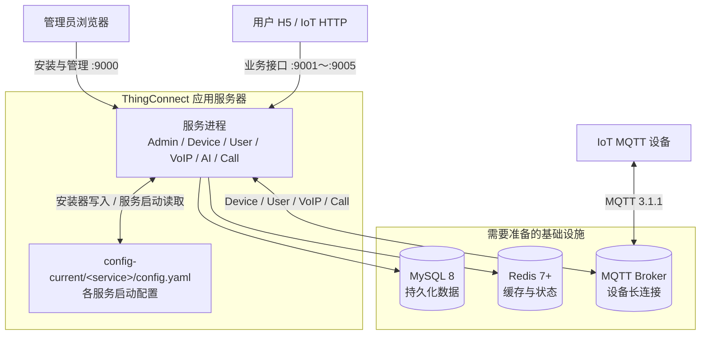

# ThingConnect 安装指南

本文给出 Ubuntu 22.04/24.04 上可复制执行的首次安装流程，以及安装完成后必须进行的服务验收、业务配置、进程托管、HTTPS、安全收尾和版本更新。默认安装目录为 `/opt/thing-connect`。

浏览器访问地址默认使用 `127.0.0.1`，表示安装服务器本机；从其他电脑访问时，只需把浏览器 URL 中的 `127.0.0.1` 替换为服务器实际 IP。命令中的其他 `127.0.0.1` 表示同机依赖，应按实际部署调整。`thing.example.com`、账号和密码是占位值；任一步失败都应停止并处理错误。

## 整体架构



各组件的职责和依赖关系：

- MySQL 保存用户、设备、Admin、业务数据、动态配置和安装状态。安装器使用迁移账号创建数据库与表；所有已安装服务共用一个独立于迁移账号的 DML 运行账号。
- Redis 保存会话、验证码、限频、设备在线状态、短期任务状态和分布式协调数据。Admin 与已启用业务服务都需要访问同一个 Redis 实例和 DB。
- MQTT Broker 承载设备长连接和实时指令。Device、User、VoIP、Call 服务连接 Broker；AI 服务不直接连接 MQTT。设备使用业务接口签发的凭据连接同一个 Broker。
- `config-current/<service>/config.yaml` 由首次安装器生成，按服务保存其启动所需的 MySQL、Redis、MQTT、Admin 地址和共享密钥。普通业务配置在 Admin 中发布并存入 MySQL，业务服务启动后通过内部接口读取。
- Admin 必须先启动并就绪，业务服务再启动。Nginx 和 HTTPS 位于公网访问路径前端，进程托管负责服务生命周期；三者都不是首次安装页面运行的前置条件。

因此，开始安装前需要准备：一台可构建并运行 Go/Node.js 的 Linux 应用服务器、一个 MySQL 8 实例及迁移/运行两个账号、一个 Redis 7+ 实例、一个支持 MQTT 3.1.1 的 Broker 及认证凭据，以及首个管理员邮箱和密码。生产环境还应提前确定最终域名和 HTTPS 方案；Nginx、证书、TiRTC、SMTP、人机验证、微信和 AI 资源可以在首次安装完成后接入。

## 1. 服务与端口

| 服务 | 默认 HTTP 端口 | 安装要求 |
|---|---:|---|
| `admin-server` | 9000 | 必装，管理后台和配置中心 |
| `device-server` | 9001 | 必装 |
| `user-server` | 9002 | 必装，同时提供用户 H5 |
| `voip-server` | 9003 | 可选 |
| `ai-server` | 9004 | 可选 |
| `call-server` | 9005 | 可选 |

首次安装会构建服务清单中的全部服务。安装器固定配置 Admin、Device、User，只为安装页面勾选的 VoIP、AI、Call 生成配置。配置和数据库状态对账后，页面要求管理员显式确认，才启动业务服务并执行就绪检查；未选择的可选服务不参与启动和检查。

应用端口使用上表默认值。安装页面填写的是 MySQL、Redis、MQTT 端口及部署访问地址，不在首次安装中任意重排应用端口。业务服务必须在 Admin 就绪后启动。

服务清单的事实源是 [`internal/installer/service_catalog.tsv`](internal/installer/service_catalog.tsv)。构建脚本、首次安装、本地进程控制、日常发布和安装页面都读取这份清单；安装时还会把清单和加载器发布到部署根目录。增加业务服务时，在清单中登记名称、HTTP 端口、必装/可选、MQTT 依赖、静态资源目录和显示名称，并提供同名 Go 构建入口及可由安装器生成和校验的配置。服务有专用跨服务配置、动态配置或生产进程托管要求时，仍需同步实现对应 adapter、注册表和托管配置，不能只登记名称。

## 2. 安装前准备

### 2.1 安装构建工具

首次安装只需准备构建工具和外部依赖；反向代理与生产进程托管在安装成功后配置。安装基础工具：

```bash
(
  set -Eeuo pipefail
  sudo apt-get update
  sudo apt-get install -y \
    ca-certificates curl default-mysql-client git mosquitto-clients \
    redis-tools snapd util-linux
  sudo systemctl enable --now snapd.socket
  sudo snap install go --classic
  sudo snap install node --classic --channel=24/stable
)
```

使用企业软件源或已有工具链时可跳过 `snap install`，但必须满足 Go 1.21+、Node.js 20.19+ 或 22.12+、npm 10+。验证：

```bash
(
  set -Eeuo pipefail
  go version
  node --version
  npm --version
  GO_VERSION="$(go env GOVERSION)"
  awk -v version="${GO_VERSION#go}" '
    BEGIN {
      split(version, part, ".")
      exit !(part[1] > 1 || (part[1] == 1 && part[2] >= 21))
    }
  ' || {
    echo "Go 版本不满足 1.21+: $GO_VERSION" >&2
    exit 1
  }
  node -e '
    const [major, minor] = process.versions.node.split(".").map(Number);
    if (!((major === 20 && minor >= 19) ||
          (major === 22 && minor >= 12) || major > 22)) {
      console.error(`Node.js 版本不满足要求: ${process.versions.node}`);
      process.exit(1);
    }
  '
  NPM_MAJOR="$(npm --version | cut -d. -f1)"
  [ "$NPM_MAJOR" -ge 10 ] || {
    echo "npm 版本不满足 10+: $(npm --version)" >&2
    exit 1
  }
  command -v \
    cp curl flock git go mosquitto_sub mv mysql mysqldump \
    node npm redis-cli setsid
)
```

安装服务器需要访问 Git 仓库、Go Module 源和 npm Registry。`install.sh` 会自行拉取源码并在服务器上构建二进制、用户 H5 和 Admin Web。

### 2.2 准备依赖和网络

准备以下信息：

- MySQL 8.0+ 地址、端口、目标数据库名和两个账号。
- Redis 7+ 地址、端口、密码和 DB 编号。
- 支持 MQTT 3.1.1 的 Broker 地址，以及 Username 或 ClientID 认证凭据。
- 应用服务器 IP；生产反向代理还需提前确定最终域名和 HTTPS 方案。
- 首个管理员邮箱和密码。密码至少 8 位，且必须包含英文大写字母、英文小写字母和数字；允许同时使用中文和特殊字符。

首次安装时只需允许管理员来源访问 TCP 9000。完成后按实际启用服务允许受信网络访问 9000～9005。MySQL 和 Redis 不应对公网开放；MQTT 仅在公网设备确需连接时开放启用 TLS、强认证和 Topic ACL 的设备接入端口，Broker 管理端口不得开放公网。

直接暴露业务端口会同时暴露该进程的路由面，只适合可信网络或验收。公网部署应使用第 4 节的 Nginx 单一入口，并禁止代理 `/v1/internal/*` 及各业务服务的 `/internal/*`。

### 2.3 准备 MySQL 账号

安装页面要求两个不同账号：

- 迁移账号：创建目标数据库、建表并执行版本化迁移。
- 运行账号：所有已启用服务共用，只授予 DML 权限。

安装器不创建 MySQL 用户、不执行 `GRANT`，因此迁移账号不需要 `GRANT OPTION`。先以 DBA 账号登录：

```bash
export MYSQL_HOST=127.0.0.1
export MYSQL_PORT=3306
mysql -h "$MYSQL_HOST" -P "$MYSQL_PORT" -u root -p
```

在 MySQL 客户端中执行。先替换两个密码；`thing_connect` 必须与安装页面填写的数据库名一致。生产环境应把 `%` 改成应用服务器来源地址：

```sql
CREATE USER IF NOT EXISTS 'thingconnect_migrator'@'%';
ALTER USER 'thingconnect_migrator'@'%'
  IDENTIFIED BY 'replace-with-migration-password';

CREATE USER IF NOT EXISTS 'thingconnect_runtime'@'%';
ALTER USER 'thingconnect_runtime'@'%'
  IDENTIFIED BY 'replace-with-runtime-password';

GRANT CREATE, ALTER, INDEX, SELECT, INSERT, UPDATE, DELETE
ON thing_connect.* TO 'thingconnect_migrator'@'%';

GRANT SELECT, INSERT, UPDATE, DELETE
ON thing_connect.* TO 'thingconnect_runtime'@'%';

EXIT;
```

目标数据库可以不存在。迁移账号的库级 `CREATE` 权限允许安装器创建该库；运行账号只有 DML 权限。如果数据库必须由 DBA 创建，在授权前执行：

```sql
CREATE DATABASE thing_connect
  CHARACTER SET utf8mb4 COLLATE utf8mb4_0900_ai_ci;
```

验证账号可以登录；此时不需要选择目标数据库：

```bash
(
  set -Eeuo pipefail
  export MYSQL_HOST=127.0.0.1
  export MYSQL_PORT=3306
  mysql -h "$MYSQL_HOST" -P "$MYSQL_PORT" \
    -u thingconnect_migrator -p -e "SELECT CURRENT_USER()"
  mysql -h "$MYSQL_HOST" -P "$MYSQL_PORT" \
    -u thingconnect_runtime -p -e "SELECT CURRENT_USER()"
)
```

不要手工导入 `scripts/schema.sql`。安装器会识别不存在的数据库、空库和可信旧版本，并按需初始化或迁移。运行账号权限会以不写入业务数据的语句逐表验证。

### 2.4 验证 Redis，并准备 MQTT 凭据

```bash
(
  set -Eeuo pipefail
  export REDIS_HOST=127.0.0.1
  export REDIS_PORT=6379
  read -srp "Redis 密码（无密码直接回车）: " REDISCLI_AUTH
  echo
  export REDISCLI_AUTH
  redis-cli -h "$REDIS_HOST" -p "$REDIS_PORT" PING
  unset REDISCLI_AUTH
)
```

MQTT 的通用 CLI 发布测试需要一个明确获准的 Topic，不能假设任意 Topic 都有权限；安装页面会使用所填凭据执行不发布消息的连接认证。`mosquitto_sub -C 1 -W 1` 在连接和订阅成功后仍可能因为主题没有消息而输出 `Timed out`，应以 `CONNACK (0)` 和 `SUBACK` 判断认证与订阅成功。

Username 模式允许所有服务共享一个认证用户名，实际连接 ClientID 会结合各进程的 `SERVICE_INSTANCE_ID` 生成，适合单机和多副本部署。ClientID 模式要求为 Device、User 以及选中的 VoIP、Call 分别准备不同的已注册 ClientID；安装器会逐一连接验证，并把对应 ClientID 写入各服务配置。固定 ClientID 不能被多个服务或多个副本共享，因此需要扩容时使用 Username 模式。生产 MQTT 使用 TLS 时，应填写 `mqtts://` 地址，并确保应用服务器的系统信任库能够验证 Broker 证书链。

TiRTC、SMTP、人机验证、微信和 AI 资源可在首次安装后从 Admin Web 配置。TiRTC App ID、Access Key ID、Secret Key ID 没有可用默认值；不填写不会阻止进程启动，但相关音视频、呼叫和 AI 功能不可用。

## 3. 首次安装

### 3.1 下载并运行安装脚本

以下命令只下载首次安装入口。脚本会把完整仓库克隆到 `/opt/thing-connect/tirtc-server-example`：

```bash
(
  set -Eeuo pipefail
  curl -fsSLo /tmp/thing-connect-install.sh \
    https://raw.githubusercontent.com/tangeai/tirtc-server-example/main/thing-connect/scripts/install.sh
  bash -n /tmp/thing-connect-install.sh
  chmod 0755 /tmp/thing-connect-install.sh
  sudo env \
    PATH=/usr/local/sbin:/usr/local/bin:/usr/sbin:/usr/bin:/sbin:/bin:/snap/bin \
    /tmp/thing-connect-install.sh
)
```

使用其他工具链目录时，把它显式加入上述受控 `PATH`，不要把未经检查的用户 `PATH` 整体传给 `sudo`。

私有镜像仓库或自定义目录使用环境变量，不要修改脚本：

```bash
sudo env \
  PATH=/usr/local/sbin:/usr/local/bin:/usr/sbin:/usr/bin:/sbin:/bin:/snap/bin \
  REPO_URL=git@example.com:team/tirtc-server-example.git \
  DEPLOY_ROOT=/opt/thing-connect \
  /tmp/thing-connect-install.sh
```

`install.sh` 依次执行：

1. 检查目标不是已安装实例，并取得部署锁。
2. 克隆仓库；已有干净工作树时只允许 `git pull --ff-only`。
3. 按服务清单完整构建所有服务和 Web 静态资源。
4. 发布首次运行所需的二进制、静态资源、服务清单和本地服务脚本。
5. 生成只显示一次的安装令牌，通过本地启动脚本启动 Admin 安装模式。

脚本不配置反向代理、HTTPS、开机自启或日志轮转，也不复制示例配置。检测到正式配置、激活配置或安装完成标记时会拒绝重新安装。

### 3.2 完成 Web 安装

在安装服务器本机的浏览器打开：

```text
http://127.0.0.1:9000/admin/
```

从其他电脑访问时，把 `127.0.0.1` 替换为安装服务器实际可达的局域网或公网 IP。

安装端口默认监听所有网卡，但所有写操作都要求终端输出的一次性令牌。安装完成前仍应通过安全组或防火墙把 9000 限制到管理员来源，不要把令牌发送到聊天、工单或监控系统。

安装页面依次填写：

1. 业务服务：页面按服务清单显示必需服务和可选服务；当前 VoIP、AI、Call 可选，Device 和 User 固定启用。
2. MySQL 主机、端口、数据库名、迁移账号和 DML 运行账号。
3. Redis 主机、端口、密码和 DB。
4. MQTT Broker 地址、认证方式和密码。同机 Broker 默认使用 `mqtt://127.0.0.1:1883`；远程 Broker 替换为实际地址。Username 模式填写共享用户名；ClientID 模式分别填写各 MQTT 服务的固定 ClientID。
5. 首个管理员账号。
6. 统一对外访问地址、可信代理和 HTTPS Cookie。生产环境即使稍后才配置 Nginx，也应填写最终的 `https://` 地址并勾选 HTTPS Cookie；只做本机或可信内网直连验收时可以留空并关闭 HTTPS Cookie。同机 Nginx 使用默认可信代理 `127.0.0.1`。当前服务发现要求同时安装 VoIP、AI、Call；缺少任一可选服务时不会启用 `/services`。

先执行“连接检查并生成安装计划”，核对数据库动作，再确认安装：

| 数据库状态 | 安装器行为 |
|---|---|
| 不存在 | 创建数据库并初始化表 |
| 已存在且无表 | 初始化表 |
| 可信且已是当前版本 | 保留表和数据，校验结构并补齐安装状态和 Admin 默认数据 |
| 可信旧版本 | 只执行缺失迁移，保留已有数据 |
| 同一实例中断 | 从持久化步骤恢复 |
| 已被其他已安装实例锁定 | 拒绝生成新共享密钥 |
| 陌生非空库、结构漂移、未来版本 | 写入前拒绝，转人工处理 |

预检或安装失败时，页面持续显示失败阶段、具体依赖或服务以及“处理建议”，不需要打开浏览器开发者工具。按页面建议修复地址、账号授权、TLS、端口占用、进程管理器或服务日志中的首个错误后再重试。服务端日志保留原始原因，页面不会显示密码、内网连接串或上游客户端原始错误。

服务启动前会检查其固定端口。出现“端口已被占用”时，在安装服务器执行页面给出的 `ss -ltnp` 命令确认占用者，通过原进程管理器停止旧实例或重复启动项，再返回页面继续安装。不要用 readiness 成功替代端口归属检查，也不要让同一实例同时由本地脚本、Supervisor、systemd 或容器编排重复托管。

安装器会生成共享业务 JWT、已安装服务共享的 `internal.key`、Admin JWT 和 MFA 加密密钥，以 `0600` 权限写入带摘要校验的一次性配置 revision。数据库提交和配置激活具有可恢复记录；中断后使用同一部署目录和数据库继续，不要删除表或手工改写 `config-current`。

令牌丢失且尚未提交配置时，可重新运行：

```bash
sudo env \
  PATH=/usr/local/sbin:/usr/local/bin:/usr/sbin:/usr/bin:/sbin:/bin:/snap/bin \
  /opt/thing-connect/install.sh
```

配置已经激活但安装未结束时，重启 Admin 会自动完成配置和数据库状态对账，但不会自动拉起业务服务。返回安装页面，确认错误已经处理后，输入一次性令牌并点击“启动业务服务并继续”。不要重新安装。

## 4. 安装后必须完成

### 4.1 验证进程和直接端口

安装完成后检查进程和必需服务：

```bash
(
  set -Eeuo pipefail
  sudo /opt/thing-connect/service-local.sh status-all
  curl -fsS http://127.0.0.1:9000/health/ready
  curl -fsS http://127.0.0.1:9001/health/ready
  curl -fsS http://127.0.0.1:9002/health/ready
)
```

只检查已配置的可选服务：

```bash
(
  set -Eeuo pipefail
  for target in voip-server:9003 ai-server:9004 call-server:9005; do
    service="${target%%:*}"
    port="${target##*:}"
    if [ -f "/opt/thing-connect/config-current/$service/config.yaml" ] || \
       [ -f "/opt/thing-connect/$service/config.yaml" ]; then
      curl -fsS "http://127.0.0.1:$port/health/ready"
    fi
  done
)
```

安装服务器本机的直接入口：

- Admin Web：`http://127.0.0.1:9000/admin/`
- 用户 H5：`http://127.0.0.1:9002/`
- Device API 基础地址：`http://127.0.0.1:9001/v1/device`，验收时调用 API Reference 中的具体接口。
- 已安装的 VoIP、AI、Call API：分别使用 9003、9004、9005。

从其他电脑验收时，把上述 `127.0.0.1` 替换为服务器实际 IP。

`/health/live` 只表示进程存活；`/health/ready` 才表示必需依赖和数据库版本满足要求。

安装器使用的本地服务脚本可用于首次验收和故障排查：

```bash
sudo /opt/thing-connect/service-local.sh status-all
sudo /opt/thing-connect/service-local.sh start-all
sudo /opt/thing-connect/service-local.sh stop-all
sudo /opt/thing-connect/service-local.sh restart thing-connect:admin-server
```

该脚本不注册开机服务，也不提供日志轮转。验收通过后仍需按 4.2 节接入部署环境自己的进程托管方式。

本地脚本以进程存活接口区分 `RUNNING` 和 `STARTING`；只有守护脚本存在但服务未监听时显示 `STARTING`。同一服务的守护进程使用独占锁，PID 文件丢失时会扫描并接管原守护进程，不会再启动一份。`CONFLICT` 表示检测到历史遗留的多个守护进程，应先执行对应服务的 `stop` 清理，再根据页面提示检查端口和日志。

### 4.2 接入生产进程托管

使用 systemd、Supervisor、容器平台或其他现有编排系统托管进程均可，本文不规定具体发布工具。托管配置必须满足以下约束：

- 切换前执行 `sudo /opt/thing-connect/service-local.sh stop-all`，确认本地脚本管理的进程已停止，再启动新的进程管理器。
- Admin 先启动并达到 `/health/ready`，再启动 Device、User 和已安装的可选服务。
- 每个进程使用安装器生成的对应 `config-current/<service>/config.yaml`，不要复制或手工拆分配置 revision。
- 每个进程设置稳定且唯一的 `SERVICE_INSTANCE_ID`；Username MQTT 模式依赖它生成不冲突的连接 ClientID。
- 向进程发送 `SIGTERM` 并留出优雅退出时间，不使用强制终止作为正常重启方式。
- 只对已安装服务执行 readiness 检查；`/health/live` 不能替代 `/health/ready`。
- 部署环境负责异常重启、开机自启、日志收集和日志轮转，且同一服务同一实例不能同时被两个进程管理器拉起。
- 安装产物默认归 `root` 所有。改用非 `root` 运行账号时，只调整该账号必需的配置读取、日志和任务目录权限，并继续保护 `0600` 配置中的数据库与服务密钥。

### 4.3 完成 Admin 业务配置

首次登录 Admin Web 时绑定 TOTP，并把恢复码离线保存。随后填写并发布 `common / tirtc`，再按已安装服务配置 SMTP、人机验证、微信应用和 AI 资源。TiRTC App ID、Access Key ID、Secret Key ID 没有可用默认值；未配置时相关音视频、呼叫和 AI 功能不可用。

动态配置没有数据库记录时使用后端注册表默认值，不读取服务 YAML 中的同名业务值。普通配置和密钥以明文 JSON 存储在 MySQL；Admin Web 对密钥默认显示 `*`，具备权限的管理员可查看原值。必须限制数据库与备份访问，并启用审计。

### 4.4 可选：配置 Nginx 单一入口

直接端口已经可以使用，Nginx 不是首次安装条件。需要域名、统一 80 端口或公网隔离内部路由时再安装：

```bash
(
  set -Eeuo pipefail
  export THING_DOMAIN=thing.example.com
  [ "$THING_DOMAIN" != "thing.example.com" ] || {
    echo "请先替换 THING_DOMAIN" >&2
    exit 1
  }
  sudo apt-get update
  sudo apt-get install -y nginx
  cd /opt/thing-connect/tirtc-server-example/thing-connect
  sudo install -m 0644 deploy/nginx/thing-connect.nginx.conf \
    /etc/nginx/conf.d/thing-connect.conf
  sudo sed -i "s/thing\.example\.com/$THING_DOMAIN/g" \
    /etc/nginx/conf.d/thing-connect.conf
  sudo nginx -t
  sudo systemctl enable --now nginx
  sudo systemctl reload nginx
)
```

[Nginx 模板](deploy/nginx/thing-connect.nginx.conf)把 `/admin/` 和 `/v1/admin/` 转发到 Admin，把各业务 API 转发到对应服务，其余路径转发到 User H5，并显式拒绝所有内部接口。模板属于运维配置，不由 `install.sh` 写入系统。未安装的可选服务应删除对应 upstream 和 location。Nginx 与服务同机时，安装页面中的 `trusted_proxies` 使用默认值 `127.0.0.1`，不要使用 `0.0.0.0/0`。

模板只监听 80，不申请或管理证书。已有证书时自行增加 443、证书路径和 HTTP 跳转，再执行 `sudo nginx -t && sudo systemctl reload nginx`。安装页面填写的统一对外访问地址和 HTTPS Cookie 必须与最终入口一致，不能只改 Nginx。

HTTP 会明文传输管理员登录信息和会话 Cookie。公网生产环境应在 Nginx 或上游负载均衡器启用 HTTPS。

### 4.5 完成安全与运维收尾

正式开放服务前逐项确认：

- 公网只开放反向代理入口和确有需要的 MQTT TLS 设备接入端口；MySQL、Redis、Broker 管理端口、应用服务直连端口和各服务内部接口不直接暴露公网。
- 公网入口启用 HTTPS，Admin 配置中的 `cookie_secure` 与实际协议一致。
- 安装期间使用过的临时令牌、高权限数据库凭据和初始密码不进入聊天、工单、Shell 历史或监控；发生暴露时立即轮换。
- `config-releases`、`config-current`、`var/installer`、Admin 任务目录和数据库备份只允许受信运维账号读取。
- 为 MySQL 数据、激活配置和安装状态建立定期备份，并在隔离环境验证恢复；配置备份包含明文密钥，必须加密和限制访问。
- 监控所有已安装服务的 `/health/ready`、进程重启次数、磁盘空间、MySQL/Redis/MQTT 可用性，并配置日志收集和轮转。
- 使用非管理员账号完成一次用户注册、设备接入和已启用业务能力的端到端验收，不能只以进程存活作为安装完成标准。

完成以上检查后，首次安装流程结束。

### 4.6 版本更新与数据库升级

使用仓库自带 Supervisor 配置的部署，通过安装时发布的固定入口执行日常更新：

```bash
sudo /opt/thing-connect/deploy-prod.sh update
```

该命令取得部署锁后快进拉取源码，重新加载新版本服务清单，构建全部服务，备份当前文件，按嵌入迁移目录执行缺失数据库版本，再按 Admin 优先顺序发布并检查 readiness。迁移版本从 `core/NNN_*.sql` 和 `admin/NNN_*.sql` 自动发现；增加表或修改表时不需要改安装脚本中的版本号。数据库迁移不能随旧二进制自动回滚，更新前必须具备可恢复备份。

新版本增加服务时，更新会先验证 Supervisor 已注册服务清单中的所有进程。先按仓库模板为新服务配置进程托管并执行 `supervisorctl reread`、`supervisorctl update`，再运行 `update`；缺少进程定义时发布会在修改文件和数据库前停止。使用 systemd、容器平台或其他编排系统时，由对应发布流水线完成同等的清单同步、显式迁移、Admin 优先启动和 readiness 门槛。

## 5. 相关文档

Admin 功能、RBAC、配置中心和任务说明见 [Admin Server README](admin/admin-server/README.md)。业务接口见 [API Reference](api-reference.md)，设备接入流程见 [设备接入指南](device-integration.md)。
