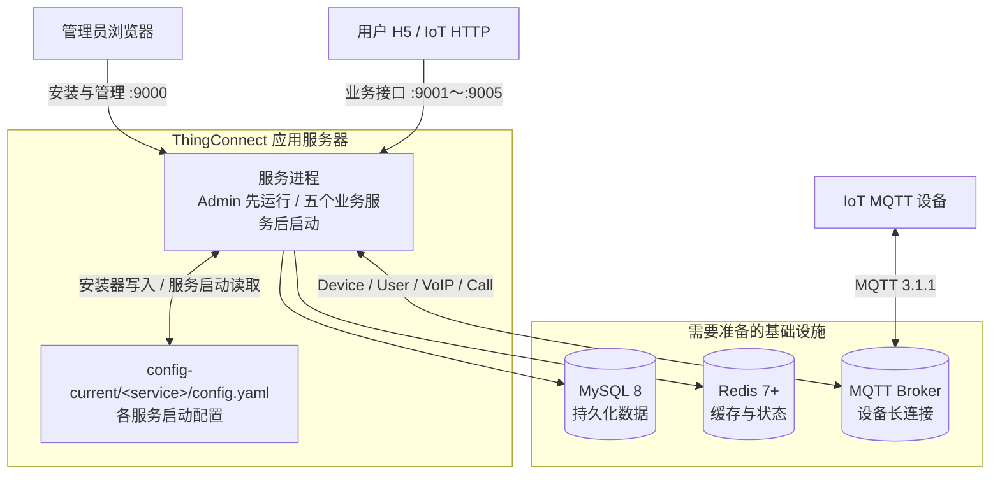

# ThingConnect 安装指南

这份指南适用于 Ubuntu 22.04/24.04，涵盖首次安装、服务验收、业务配置、进程托管、HTTPS、安全收尾和版本更新。默认安装目录为 `/opt/thing-connect`。

浏览器访问地址默认使用 `127.0.0.1`，表示安装服务器本机；从其他电脑访问时，只需把浏览器 URL 中的 `127.0.0.1` 替换为服务器实际 IP。命令中的其他 `127.0.0.1` 表示同机依赖，应按实际部署调整。`thing.example.com`、账号和密码是占位值；任一步失败都应停止并处理错误。

## 整体架构



各组件的职责和依赖关系：

- MySQL 保存用户、设备、Admin、业务数据、动态配置和安装状态。安装器使用迁移账号创建数据库与表；所有已安装服务共用一个独立于迁移账号的 DML 运行账号。
- Redis 保存会话、验证码、限频、设备在线状态、短期任务状态和分布式协调数据。Admin 与已启用业务服务都需要访问同一个 Redis 实例和 DB。
- MQTT Broker 承载设备长连接和实时指令。User、VoIP、Call 服务连接 Broker；Admin、Device、AI 不直接连接 MQTT。各服务的 MQTT 账号在 Admin 中分别发布，不属于首次安装依赖。
- `config-current/<service>/config.yaml` 由首次安装器生成，只保存进程启动的基础配置和共享密钥。MQTT、TiRTC 及普通业务配置在 Admin 中发布并存入 MySQL；业务服务启动时读取阻断配置，运行期配置按注册表的 reload 策略应用。
- 首次安装只启动 Admin。管理员在 Admin 完成各服务必填配置后，必须登录服务器执行页面给出的 `service-local.sh` 命令；Admin 不执行主机命令或进程控制。Nginx、HTTPS 和生产进程托管都不是首次安装页面运行的前置条件。

开始安装前，请准备一台能够构建和运行 Go/Node.js 的 Linux 应用服务器、一个 MySQL 8 实例及迁移和运行两个账号、一个 Redis 7+ 实例，以及首个管理员的邮箱和密码。MQTT、TiRTC、SMTP、人机验证、微信、AI 资源、Nginx 和证书均在 Admin 安装完成后配置。

## 1. 服务与端口

| 服务 | 默认 HTTP 端口 | 安装要求 |
|---|---:|---|
| `admin-server` | 9000 | 必装，管理后台和配置中心 |
| `device-server` | 9001 | 生成基础配置，安装后由服务器命令启动 |
| `user-server` | 9002 | 生成基础配置，完成 MQTT、TiRTC 后启动，同时提供用户 H5 |
| `voip-server` | 9003 | 生成基础配置，完成 MQTT、TiRTC 后启动 |
| `ai-server` | 9004 | 生成基础配置，完成 TiRTC 后启动 |
| `call-server` | 9005 | 生成基础配置，完成 MQTT、TiRTC 后启动 |

首次安装会构建服务清单中的全部服务，并为 Admin 与五个业务服务生成基础配置。安装结束时只有 Admin 运行；安装器和 Admin 都不会自动启动业务服务。管理员可以逐个完成配置并启动，也可以全部配置完成后执行 `start-all`。

应用端口使用上表默认值。安装页面只填写 MySQL、Redis 及部署访问地址，不在首次安装中任意重排应用端口。业务服务必须在 Admin 就绪且启动前检查通过后启动。

服务清单的事实源是 [`internal/installer/service_catalog.tsv`](internal/installer/service_catalog.tsv)。构建脚本、首次安装、本地进程控制、日常发布和安装页面都读取这份清单；安装时还会把清单和加载器发布到部署根目录。增加业务服务时，在清单中登记名称、HTTP 端口、必装/可选、MQTT 依赖、静态资源目录和显示名称，并提供同名 Go 构建入口及可由安装器生成和校验的配置。服务有专用跨服务配置、动态配置或生产进程托管要求时，仍需同步实现对应 adapter、注册表和托管配置，不能只登记名称。

## 2. 安装前准备

### 2.1 安装构建工具

首次安装只需准备构建工具和外部依赖；反向代理与生产进程托管在安装成功后配置。安装基础工具：

```bash
(
  set -Eeuo pipefail
  sudo apt-get update
  sudo apt-get install -y \
    ca-certificates curl default-mysql-client git \
    redis-tools snapd util-linux
  sudo systemctl enable --now snapd.socket
  sudo snap install go --classic
  sudo snap install node --classic --channel=24/stable
)
```

使用企业软件源或已有工具链时可跳过 `snap install`，但必须满足 Go 1.21+、Node.js 20.19+ 或 22.12+、npm 10+。验证：

```bash
(
  set -Eeuo pipefail
  go version
  node --version
  npm --version
  GO_VERSION="$(go env GOVERSION)"
  awk -v version="${GO_VERSION#go}" '
    BEGIN {
      split(version, part, ".")
      exit !(part[1] > 1 || (part[1] == 1 && part[2] >= 21))
    }
  ' || {
    echo "Go 版本不满足 1.21+: $GO_VERSION" >&2
    exit 1
  }
  node -e '
    const [major, minor] = process.versions.node.split(".").map(Number);
    if (!((major === 20 && minor >= 19) ||
          (major === 22 && minor >= 12) || major > 22)) {
      console.error(`Node.js 版本不满足要求: ${process.versions.node}`);
      process.exit(1);
    }
  '
  NPM_MAJOR="$(npm --version | cut -d. -f1)"
  [ "$NPM_MAJOR" -ge 10 ] || {
    echo "npm 版本不满足 10+: $(npm --version)" >&2
    exit 1
  }
  command -v \
    cp curl flock git go mv mysql mysqldump \
    node npm redis-cli setsid
)
```

安装服务器需要访问 Git 仓库、Go Module 源和 npm Registry。`install.sh` 会自行拉取源码并在服务器上构建二进制、用户 H5 和 Admin Web。

### 2.2 准备依赖和网络

准备以下信息：

- MySQL 8.0+ 地址、端口、目标数据库名和两个账号。
- Redis 7+ 地址、端口、密码和 DB 编号。
- 应用服务器 IP；生产反向代理还需提前确定最终域名和 HTTPS 方案。
- 首个管理员邮箱和密码。密码至少 8 位，且必须包含英文大写字母、英文小写字母和数字；允许同时使用中文和特殊字符。

首次安装时只需允许管理员来源访问 TCP 9000。完成后按实际启用服务允许受信网络访问 9000～9005。MySQL 和 Redis 不应对公网开放；MQTT 仅在公网设备确需连接时开放启用 TLS、强认证和 Topic ACL 的设备接入端口，Broker 管理端口不得开放公网。

直接暴露业务端口会同时暴露该进程的路由面，只适合可信网络或验收。公网部署应使用第 4 节的 Nginx 单一入口，并禁止代理 `/v1/internal/*` 及各业务服务的 `/internal/*`。

### 2.3 准备 MySQL 账号

安装页面要求两个不同账号：

- 迁移账号：创建目标数据库、建表并执行版本化迁移。
- 运行账号：所有已启用服务共用，只授予 DML 权限。

安装器不创建 MySQL 用户、不执行 `GRANT`，因此迁移账号不需要 `GRANT OPTION`。先以 DBA 账号登录：

```bash
export MYSQL_HOST=127.0.0.1
export MYSQL_PORT=3306
mysql -h "$MYSQL_HOST" -P "$MYSQL_PORT" -u root -p
```

在 MySQL 客户端中执行。先替换两个密码；`thing_connect` 必须与安装页面填写的数据库名一致。生产环境应把 `%` 改成应用服务器来源地址：

```sql
CREATE USER IF NOT EXISTS 'thingconnect_migrator'@'%';
ALTER USER 'thingconnect_migrator'@'%'
  IDENTIFIED BY 'replace-with-migration-password';

CREATE USER IF NOT EXISTS 'thingconnect_runtime'@'%';
ALTER USER 'thingconnect_runtime'@'%'
  IDENTIFIED BY 'replace-with-runtime-password';

GRANT CREATE, ALTER, INDEX, SELECT, INSERT, UPDATE, DELETE
ON thing_connect.* TO 'thingconnect_migrator'@'%';

GRANT SELECT, INSERT, UPDATE, DELETE
ON thing_connect.* TO 'thingconnect_runtime'@'%';

EXIT;
```

首次安装只接受不存在或完全无表的专用数据库。迁移账号的库级 `CREATE` 权限允许安装器创建不存在的库；运行账号只有 DML 权限。如果数据库必须由 DBA 创建，在授权前执行：

```sql
CREATE DATABASE thing_connect
  CHARACTER SET utf8mb4 COLLATE utf8mb4_0900_ai_ci;
```

验证账号可以登录；此时不需要选择目标数据库：

```bash
(
  set -Eeuo pipefail
  export MYSQL_HOST=127.0.0.1
  export MYSQL_PORT=3306
  mysql -h "$MYSQL_HOST" -P "$MYSQL_PORT" \
    -u thingconnect_migrator -p -e "SELECT CURRENT_USER()"
  mysql -h "$MYSQL_HOST" -P "$MYSQL_PORT" \
    -u thingconnect_runtime -p -e "SELECT CURRENT_USER()"
)
```

不要手工导入 `scripts/schema.sql`。首次安装对已有表的数据库只执行识别和结构读取，随后停止，不会建表、迁移、补数据、清空或覆盖。旧版 ThingConnect 数据库也必须先做可恢复备份，再通过第 4.6 节的显式升级流程处理，不能交给首次安装入口。Web 预检会在不选择目标数据库的情况下验证运行账号可以登录，避免账号密码或来源 Host 错误进入数据库认领阶段；表结构就绪后再以不写入业务数据的零行语句逐表验证 DML 权限。

### 2.4 验证 Redis

```bash
(
  set -Eeuo pipefail
  export REDIS_HOST=127.0.0.1
  export REDIS_PORT=6379
  read -srp "Redis 密码（无密码直接回车）: " REDISCLI_AUTH
  echo
  export REDISCLI_AUTH
  redis-cli -h "$REDIS_HOST" -p "$REDIS_PORT" PING
  unset REDISCLI_AUTH
)
```

MQTT 凭据在 Admin 安装完成后按 User、VoIP、Call 三个服务分别配置。Username 模式下实际 ClientID 会结合各进程的 `SERVICE_INSTANCE_ID` 生成；固定 ClientID 模式不能被多个服务或副本共享。生产 MQTT 使用 `mqtts://` 时，应用服务器的系统信任库必须能够验证 Broker 证书链。服务端启动脚本会执行不订阅、不写 Redis的连接认证检查，失败时保持服务停止。

TiRTC App ID、Access Key ID 和 Secret Key ID 同样没有可运行默认值。User、VoIP、AI、Call 在启动前要求该配置已经由 Admin 发布。

## 3. 首次安装

### 3.1 下载并运行安装脚本

以下命令只下载首次安装入口。脚本会把完整仓库克隆到 `/opt/thing-connect/tirtc-server-example`：

```bash
(
  set -Eeuo pipefail
  curl -fsSLo /tmp/thing-connect-install.sh \
    https://raw.githubusercontent.com/tangeai/tirtc-server-example/main/thing-connect/scripts/install.sh
  bash -n /tmp/thing-connect-install.sh
  chmod 0755 /tmp/thing-connect-install.sh
  sudo env \
    PATH=/usr/local/sbin:/usr/local/bin:/usr/sbin:/usr/bin:/sbin:/bin:/snap/bin \
    /tmp/thing-connect-install.sh
)
```

使用其他工具链目录时，把它显式加入上述受控 `PATH`，不要把未经检查的用户 `PATH` 整体传给 `sudo`。

私有镜像仓库或自定义目录使用环境变量，不要修改脚本：

```bash
sudo env \
  PATH=/usr/local/sbin:/usr/local/bin:/usr/sbin:/usr/bin:/sbin:/bin:/snap/bin \
  REPO_URL=git@example.com:team/tirtc-server-example.git \
  DEPLOY_ROOT=/opt/thing-connect \
  /tmp/thing-connect-install.sh
```

`install.sh` 依次执行：

1. 检查目标不是已安装实例，并取得部署锁。
2. 克隆仓库；已有干净工作树时只允许 `git pull --ff-only`。
3. 按服务清单完整构建所有服务和 Web 静态资源。
4. 发布首次运行所需的二进制、静态资源、服务清单和本地服务脚本。
5. 生成只显示一次的安装令牌，通过本地启动脚本启动 Admin 安装模式。

脚本不配置反向代理、HTTPS、开机自启或日志轮转，也不复制示例配置。检测到正式配置、激活配置或安装完成标记时会拒绝重新安装。

### 3.2 完成 Web 安装

在安装服务器本机的浏览器打开：

```text
http://127.0.0.1:9000/admin/
```

从其他电脑访问时，把 `127.0.0.1` 替换为安装服务器实际可达的局域网或公网 IP。

安装端口默认监听所有网卡，但所有写操作都要求终端输出的一次性令牌。安装完成前仍应通过安全组或防火墙把 9000 限制到管理员来源，不要把令牌发送到聊天、工单或监控系统。

安装页面依次填写：

1. MySQL 主机、端口、专用数据库名、迁移账号和 DML 运行账号。
2. Redis 主机、端口、密码和 DB。
3. 首个管理员账号。
4. 统一对外访问地址、可信代理和 HTTPS Cookie。生产环境即使稍后才配置 Nginx，也应填写最终的 `https://` 地址并勾选 HTTPS Cookie；只做本机或可信内网直连验收时可以留空并关闭 HTTPS Cookie。同机 Nginx 使用默认可信代理 `127.0.0.1`。

页面不要求 MQTT、TiRTC 或业务服务选择。安装器始终生成五个业务服务的基础配置，但只启动 Admin。

先执行“连接检查并生成安装计划”，核对数据库动作，再确认安装：

| 数据库状态 | 安装器行为 |
|---|---|
| 不存在 | 创建数据库并初始化表 |
| 已存在且无表 | 初始化表 |
| 本机同一操作标识的中断任务 | 只恢复该未完成任务，不接管其他数据库 |
| 其他任何已有表的数据库 | 只读识别后拒绝，不建表、迁移、补数据、清空或覆盖 |

预检或安装失败时，页面持续显示失败阶段、具体依赖和“处理建议”，不需要打开浏览器开发者工具。按页面建议修复地址、账号授权或 TLS 后再重试。服务端日志保留脱敏后的原始原因，页面不显示密码、内网连接串或上游客户端原始错误。

安装器会生成共享业务 JWT、已安装服务共享的 `internal.key`、Admin JWT 和 MFA 加密密钥，以 `0600` 权限写入带摘要校验的一次性配置 revision。数据库提交和配置激活具有可恢复记录；中断后使用同一部署目录和数据库继续，不要删除表或手工改写 `config-current`。

令牌丢失且尚未提交配置时，可重新运行：

```bash
sudo env \
  PATH=/usr/local/sbin:/usr/local/bin:/usr/sbin:/usr/bin:/sbin:/bin:/snap/bin \
  /opt/thing-connect/install.sh
```

配置已经激活但安装未结束时，重启 Admin 会自动完成本机同一安装任务的对账，但不会拉起业务服务。返回安装页面，输入一次性令牌并完成 Admin 安装。不要删表、删配置或重新安装。

## 4. 安装后必须完成

### 4.1 在 Admin 发布启动必需配置

首次登录 Admin Web 时绑定 TOTP，并把恢复码离线保存。然后在配置中心发布：

- User、VoIP、AI、Call 共享的 `common / tirtc`。
- User、VoIP、Call 各自的 `mqtt.connection`，每个服务使用独立账号或 ClientID。
- Device 没有 MQTT 和 TiRTC 启动阻断配置，可以直接通过服务器预检。

MQTT 配置表单提供“测试连接”。测试使用当前尚未发布的表单值，从 Admin 服务器检查 Broker 网络、TLS 和账号认证；固定 ClientID 模式使用临时连接 ID，避免测试挤掉正在运行的同名客户端。“测试并发布”会在写入数据库前自动执行同一检查，失败时不发布，并在页面显示 Broker 可达性、证书、凭据和来源授权的排查建议。业务服务启动预检仍使用正式 ClientID 做最终检查。

Admin 的服务状态页显示每个服务缺少的配置及原因；配置齐全时显示可复制的服务器启动或重启命令。Admin 只提供状态和指引，不执行主机进程命令。

普通运行时配置在发布后热加载；MQTT 和 TiRTC 在页面标记为“需重启”，发布后按页面给出的重启命令操作。TiRTC 只做字段完整性和格式校验，业务服务启动预检负责确认该配置可被服务读取；当前没有可证明凭据有效且无业务副作用的通用在线测试。SMTP、人机验证、微信应用和 AI 资源按实际业务需求发布。

动态配置没有数据库记录时使用后端注册表默认值。MQTT 和 TiRTC 没有可运行默认值，必须显式发布。普通配置和密钥以明文 JSON 存储在 MySQL；Admin Web 对密钥默认显示 `*`，具备权限的管理员可查看原值。必须限制数据库与备份访问，并启用审计。

### 4.2 在服务器预检并启动业务服务

需要的配置发布后，在安装服务器执行：

```bash
sudo /opt/thing-connect/service-local.sh start-all
```

`start-all` 先确认 Admin readiness，再对五个业务服务统一执行基础 YAML、Admin 阻断配置、MySQL 连接和 schema 版本、Redis 连接以及对应 MQTT 账号的实际认证检查。任一预检失败时五个服务都保持停止，终端直接显示原因和处理建议。检查不执行数据库迁移或业务数据修改。

也可以逐个启动：

```bash
sudo /opt/thing-connect/service-local.sh start thing-connect:device-server
sudo /opt/thing-connect/service-local.sh start thing-connect:user-server
sudo /opt/thing-connect/service-local.sh start thing-connect:voip-server
sudo /opt/thing-connect/service-local.sh start thing-connect:ai-server
sudo /opt/thing-connect/service-local.sh start thing-connect:call-server
```

启动完成后检查全部进程和直接端口：

```bash
(
  set -Eeuo pipefail
  sudo /opt/thing-connect/service-local.sh status-all
  curl -fsS http://127.0.0.1:9000/health/ready
  curl -fsS http://127.0.0.1:9001/health/ready
  curl -fsS http://127.0.0.1:9002/health/ready
  curl -fsS http://127.0.0.1:9003/health/ready
  curl -fsS http://127.0.0.1:9004/health/ready
  curl -fsS http://127.0.0.1:9005/health/ready
)
```

安装服务器本机的直接入口：

- Admin Web：`http://127.0.0.1:9000/admin/`
- 用户 H5：`http://127.0.0.1:9002/`
- Device API 基础地址：`http://127.0.0.1:9001/v1/device`，验收时调用 API Reference 中的具体接口。
- VoIP、AI、Call API：分别使用 9003、9004、9005。

从其他电脑验收时，把上述 `127.0.0.1` 替换为服务器实际 IP。

`/health/live` 只表示进程存活；`/health/ready` 才表示必需依赖和数据库版本满足要求。

安装器使用的本地服务脚本可用于首次验收、故障排查，以及未接入独立进程管理器时的本机运行：

```bash
sudo /opt/thing-connect/service-local.sh status-all
sudo /opt/thing-connect/service-local.sh start-all
sudo /opt/thing-connect/service-local.sh stop-all
sudo /opt/thing-connect/service-local.sh restart thing-connect:admin-server
```

该脚本不注册开机服务，也不提供日志轮转。持续使用时，运维环境需另外负责开机启动、日志收集与轮转；需要这些能力时可按 4.3 节接入现有进程托管方式。

本地脚本以进程存活接口区分 `RUNNING` 和 `STARTING`；只有守护脚本存在但服务未监听时显示 `STARTING`。同一服务的守护进程使用独占锁，PID 文件丢失时会扫描并接管原守护进程，不会再启动一份。`CONFLICT` 表示检测到历史遗留的多个守护进程，应先执行对应服务的 `stop` 清理，再根据页面提示检查端口和日志。

### 4.3 可选：接入生产进程托管

不要求安装 Supervisor。可以继续用 `service-local.sh` 手动管理服务；需要异常拉起、开机自启、集中日志或自动发布验收时，再接入 systemd、Supervisor、容器平台或其他现有编排系统。托管配置必须满足以下约束：

- 切换前执行 `sudo /opt/thing-connect/service-local.sh stop-all`，确认本地脚本管理的进程已停止，再启动新的进程管理器。
- Admin 先启动并达到 `/health/ready`，再预检并启动五个业务服务。
- 每个进程使用安装器生成的对应 `config-current/<service>/config.yaml`，不要复制或手工拆分配置 revision。
- 每个进程设置稳定且唯一的 `SERVICE_INSTANCE_ID`；Username MQTT 模式依赖它生成不冲突的连接 ClientID。
- 向进程发送 `SIGTERM` 并留出优雅退出时间，不使用强制终止作为正常重启方式。
- 对全部业务服务执行 readiness 检查；`/health/live` 不能替代 `/health/ready`。
- 部署环境负责异常重启、开机自启、日志收集和日志轮转，且同一服务同一实例不能同时被两个进程管理器拉起。
- 安装产物默认归 `root` 所有。改用非 `root` 运行账号时，只调整该账号必需的配置读取、日志和任务目录权限，并继续保护 `0600` 配置中的数据库与服务密钥。

### 4.4 可选：配置 Nginx 单一入口

直接端口已经可以使用，Nginx 不是首次安装条件。需要域名、统一 80 端口或公网隔离内部路由时再安装：

```bash
(
  set -Eeuo pipefail
  export THING_DOMAIN=thing.example.com
  [ "$THING_DOMAIN" != "thing.example.com" ] || {
    echo "请先替换 THING_DOMAIN" >&2
    exit 1
  }
  sudo apt-get update
  sudo apt-get install -y nginx
  cd /opt/thing-connect/tirtc-server-example/thing-connect
  sudo install -m 0644 deploy/nginx/thing-connect.nginx.conf \
    /etc/nginx/conf.d/thing-connect.conf
  sudo sed -i "s/thing\.example\.com/$THING_DOMAIN/g" \
    /etc/nginx/conf.d/thing-connect.conf
  sudo nginx -t
  sudo systemctl enable --now nginx
  sudo systemctl reload nginx
)
```

[Nginx 模板](deploy/nginx/thing-connect.nginx.conf)把 `/admin/` 和 `/v1/admin/` 转发到 Admin，把各业务 API 转发到对应服务，其余路径转发到 User H5，并显式拒绝所有内部接口。模板属于运维配置，不由 `install.sh` 写入系统。Nginx 与服务同机时，安装页面中的 `trusted_proxies` 使用默认值 `127.0.0.1`，不要使用 `0.0.0.0/0`。

模板只监听 80，不申请或管理证书。已有证书时自行增加 443、证书路径和 HTTP 跳转，再执行 `sudo nginx -t && sudo systemctl reload nginx`。安装页面填写的统一对外访问地址和 HTTPS Cookie 必须与最终入口一致，不能只改 Nginx。

HTTP 会明文传输管理员登录信息和会话 Cookie。公网生产环境应在 Nginx 或上游负载均衡器启用 HTTPS。

### 4.5 完成安全与运维收尾

正式开放服务前逐项确认：

- 公网只开放反向代理入口和确有需要的 MQTT TLS 设备接入端口；MySQL、Redis、Broker 管理端口、应用服务直连端口和各服务内部接口不直接暴露公网。
- 公网入口启用 HTTPS，Admin 配置中的 `cookie_secure` 与实际协议一致。
- 安装期间使用过的临时令牌、高权限数据库凭据和初始密码不进入聊天、工单、Shell 历史或监控；发生暴露时立即轮换。
- `config-releases`、`config-current`、`var/installer`、Admin 任务目录和数据库备份只允许受信运维账号读取。
- 为 MySQL 数据、激活配置和安装状态建立定期备份，并在隔离环境验证恢复；配置备份包含明文密钥，必须加密和限制访问。
- 监控全部服务的 `/health/ready`、进程重启次数、磁盘空间、MySQL/Redis/MQTT 可用性，并配置日志收集和轮转。
- 使用非管理员账号完成一次用户注册、设备接入和已启用业务能力的端到端验收，不能只以进程存活作为安装完成标准。

完成以上检查后，首次安装流程结束。

### 4.6 版本更新与数据库升级

`install.sh` 是开发者首次安装部署的入口。`deploy-prod.sh` 是 ThingConnect 维护者在既定生产目录、服务清单和进程管理约定下使用的持续发布工具；其他部署环境可以参考其构建、迁移和发布流程，但应按自身目录、权限和服务管理方式调整，不能把它当作通用安装器。

在符合该生产目录约定的环境中执行维护发布：

```bash
sudo /opt/thing-connect/deploy-prod.sh update
```

每次 `deploy-prod.sh update` 完整发布成功后，脚本在部署根目录原子记录完整 Git commit 和当时已安装的服务集合。再次更新时先快进拉取源码；待发布 commit 和已安装服务集合均未变化时，输出“当前已发布版本与待发布版本一致”，不检查 Supervisor 或停服状态，不安装依赖、不构建、不备份、不检查数据库，也不重启服务。首次使用该发布工具、发布状态缺失或损坏、已安装服务集合变化、辅助发布文件未完整刷新时执行完整更新，不根据目录时间或运行中进程猜测版本。

需要在同一 commit 下重新构建或修复发布文件时显式执行：

```bash
sudo env FORCE_UPDATE=1 /opt/thing-connect/deploy-prod.sh update
```

进入完整更新后，脚本构建新版本，再使用迁移账号执行只读所有权、完整结构和待迁移版本检查。数据库已经是当前版本时，输出“数据库已是当前版本”，跳过数据库备份门槛和 DDL；代码与静态资源继续正常发布。

存在待执行迁移时，脚本在 DDL 前停止并要求可恢复的数据库备份。使用 `mysqldump` 生成完整备份，在隔离 MySQL 实例完成恢复演练，再把绝对路径和恢复验证声明传给更新命令：

```bash
sudo env \
  DATABASE_BACKUP_FILE=/secure/backups/thing-connect-before-update.sql \
  DATABASE_BACKUP_RESTORE_VERIFIED=1 \
  /opt/thing-connect/deploy-prod.sh update
```

待迁移时，脚本要求备份文件已存在、非空、可读，并记录 SHA-256；缺少备份或未声明恢复验证时，在执行任何 DDL 前停止。只读迁移检查失败也会直接停止发布。`SKIP_MIGRATIONS=1` 只用于 DBA 已通过独立受控流程执行了同一版本迁移的环境，不能用来绕过备份。

该命令取得部署锁后快进拉取源码，重新加载新版本服务清单，构建全部服务，备份当前文件，并按嵌入迁移目录执行缺失数据库版本。迁移版本从 `core/NNN_*.sql` 和 `admin/NNN_*.sql` 自动发现；增加表或修改表时不需要改安装脚本中的版本号。数据库迁移不能随旧二进制自动回滚。

`deploy-prod.sh` 自动识别服务管理方式：已安装服务在 Supervisor 中都有完整条目时，按 Admin 优先顺序逐服务发布、重启并检查 readiness；没有 `supervisorctl`，或 Supervisor 中没有任何 ThingConnect 条目时，进入手动模式。手动模式不控制服务进程，更新前必须先停止本地服务：

```bash
sudo /opt/thing-connect/service-local.sh stop-all
sudo /opt/thing-connect/deploy-prod.sh update
sudo /opt/thing-connect/service-local.sh start-all
sudo /opt/thing-connect/service-local.sh status-all
```

手动模式检测到待迁移版本时，同样先完成数据库备份和恢复演练，再使用带 `DATABASE_BACKUP_FILE` 与 `DATABASE_BACKUP_RESTORE_VERIFIED=1` 的更新命令重试；服务在整个过程中保持停止。

脚本在手动模式下检测到 `RUNNING`、`STARTING`、`CONFLICT`，或已安装服务端口仍在监听时，会在拉取、迁移和发布前停止更新，并显示准确的 `stop-all` 命令；更新完成后显示 `start-all` 和 `status-all`。Supervisor 只配置部分已安装服务时脚本拒绝发布，避免 Supervisor 与本地脚本同时管理同一服务。可用 `SERVICE_MANAGER=supervisor` 或 `SERVICE_MANAGER=manual` 明确指定模式；显式手动模式也不能跳过已有的 ThingConnect Supervisor 条目，必须先停止并移除这些条目。

新版本增加服务时，同步更新服务清单、可生成和校验的基础配置、Admin 动态配置注册表、服务器预检、进程托管和 readiness。表结构变更同步增加有序可重入迁移并更新 `scripts/schema.sql`。Supervisor 部署还需在发布前执行 `supervisorctl reread` 和 `supervisorctl update`；缺少部分已安装服务的进程定义时发布会在修改文件和数据库前停止。使用手动模式、systemd、容器平台或其他编排系统时，由对应运维流程完成同等的显式迁移、Admin 优先启动和 readiness 门槛。

## 5. 相关文档

Admin 功能、RBAC、配置中心和任务说明见 [Admin Server README](admin/admin-server/README.md)。业务接口见 [API Reference](api-reference.md)，设备接入流程见 [设备接入指南](device-integration.md)。
