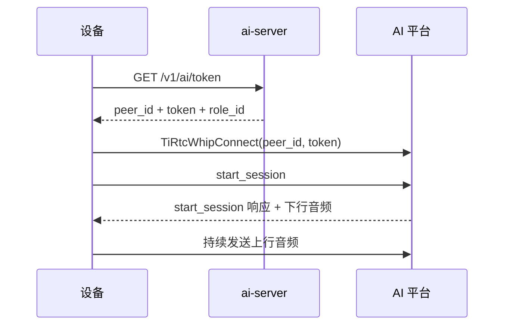

# AI 对讲设备接入

AI 对讲由设备主动发起。设备先向 AI 平台获取会话凭证，再通过 WHIP（WebRTC HTTP Ingestion Protocol）建立连接，并发送 `start_session` 开始对话。

> 这里说明设备侧的 AI 对讲链路。设备上线和 MQTT 规范见 [device-integration.md](device-integration.md)，HTTP 字段和角色管理接口见 [api-reference.md#ai-server](api-reference.md#ai-server)。一台设备同时运行 AI、VoIP 和设备互呼时，还需要遵守 [device-session-model.md](device-session-model.md) 中的状态切换规则。

**文档导航：** [返回总览](README.md) | [返回设备入口](device-integration.md) | [H5 实时](device-h5-live.md) | [微信 VoIP](device-voip.md) | [设备呼设备](device-call.md) | [统一状态机](device-session-model.md)

## 目录

- [快速接入](#快速接入)
- [链路概览](#链路概览)
- [获取 AI 凭证](#获取-ai-凭证)
- [建立会话](#建立会话)
- [事件处理](#事件处理)
- [协议速查](#协议速查)
- [角色与设备绑定](#角色与设备绑定)
- [问题排查](#问题排查)

---

## 快速接入

AI 对讲是设备主动发起的业务。

设备侧按以下顺序接入：

1. 按 [device-integration.md](device-integration.md) 上线，拿到 `mqtt_token`
2. 调 [`GET /v1/ai/token`](api-reference.md#get-v1aitoken)
3. 用返回的 `peer_id + token` 调 <a href="https://docs.tange.ai/products/tirtc/api-reference/c.html#tirtcwhipconnect" target="_blank" rel="noopener">`TiRtcWhipConnect(peer_id, token, callback, NULL);`</a>
4. WHIP 建连成功后，通过 <a href="https://docs.tange.ai/products/tirtc/api-reference/c.html#tirtcsendcommand" target="_blank" rel="noopener">`TiRtcSendCommand(hconn, 0x2100, ...)`</a> 发送 JSON-RPC `start_session`，通知平台开始本次对话。
   - `0x2100` 是 AI 命令通道的命令码。
   - 成功响应会带回会话 ID 和最终音频格式，详见[建立会话](#建立会话)。
5. 收到 `start_session` 响应后开始本地音频上行，接收 AI 下行音频

AI 通过 WHIP 上行，也就是由设备向服务端推流，建连接口为 <a href="https://docs.tange.ai/products/tirtc/api-reference/c.html#tirtcwhipconnect" target="_blank" rel="noopener">`TiRtcWhipConnect`</a>。

联调时分别检查三端结果：

- **Linux C 参考实现**：`ai_poll` 持续无错；`on_audio` 收到 AI 下行音频并异步写入文件。
- **产品设备**：除上述协议结果外，还要确认下行音频经过有界队列、解码并由扬声器连续播放。
- **对端（AI 平台）**：返回 `start_session` 成功响应，且能持续收到设备上行音频，多轮对话正常。

---

## 链路概览



图中涉及的 TiRTC SDK 接口：<a href="https://docs.tange.ai/products/tirtc/api-reference/c.html#tirtcwhipconnect" target="_blank" rel="noopener">`TiRtcWhipConnect`</a>。

---

## 获取 AI 凭证

调用：

- [`GET /v1/ai/token`](api-reference.md#get-v1aitoken)

鉴权头直接复用：

- `Authorization: Bearer <mqtt_token>`

返回值里关键字段：

- `peer_id`（实际是 WHIP 上行端点地址，形如 `whips://ai?x_role_id=...`）
- `token`
- `role_id`

**完整字段说明、枚举值与错误码见：** [api-reference.md#get-v1aitoken](api-reference.md#get-v1aitoken)

`role_id` 不是设备自己传入的，而是服务端根据设备绑定关系决定：

1. 先查这台设备是否绑定了专属角色
2. 没绑定则回落到 `default_role_id`

设备端无需维护角色选择规则，直接使用接口返回的角色即可。

**HTTP 请求：**

```http
GET /v1/ai/token
Authorization: Bearer <mqtt_token>
```

**成功返回：**

```json
{
  "code": 200,
  "msg": "ok",
  "data": {
    "peer_id": "whips://ai?x_role_id=fin63bby1og0&...",
    "token": "v1.eyJ...",
    "role_id": "fin63bby1og0"
  }
}
```

---

## 建立会话

### 1. 建立 WHIP 连接

设备拿到 `peer_id + token` 后：

接口说明见 <a href="https://docs.tange.ai/products/tirtc/api-reference/c.html#tirtcwhipconnect" target="_blank" rel="noopener">`TiRtcWhipConnect`</a>。

```c
TiRtcWhipConnect(peer_id, token, connect_cb, user_data);
```

注意：

- 返回 `0` 表示请求已提交，不代表连接已经成功
- 真正结果要看 `connect_cb(error, hconn, ...)`

连接结果来自 SDK 回调，不是 HTTP 响应：

- `error == 0`：WHIP 连接建立成功
- `error != 0`：建连失败，不能继续发 `start_session`

### 2. 发送 `start_session`

WHIP 连接建立后，通过 <a href="https://docs.tange.ai/products/tirtc/api-reference/c.html#tirtcsendcommand" target="_blank" rel="noopener">`TiRtcSendCommand(hconn, 0x2100, ...)`</a> 发送 JSON-RPC：

```json
{
  "jsonrpc": "2.0",
  "id": "start-session-001",
  "method": "start_session",
  "params": {
    "device_id": "TIRZ00000001",
    "role_id": "fin63bby1og0",
    "input_audio": { "codec": "opus", "sample_rate": 16000, "channels": 1 },
    "output_audio": { "codec": "opus", "sample_rate": 16000, "channels": 1 }
  }
}
```

`params` 关键字段：

| 字段 | 必填 | 说明 |
|------|------|------|
| `device_id` | 是 | 设备 ID |
| `role_id` | 是 | 角色 ID，来自 [`GET /v1/ai/token`](api-reference.md#get-v1aitoken) 返回 |
| `input_audio` | 否 | 设备上行音频格式；推荐显式传入，避免两端不一致 |
| `output_audio` | 否 | 平台下行音频格式；推荐显式传入，避免两端不一致 |

`input_audio` / `output_audio` 各含 `codec`、`sample_rate`、`channels`，支持组合：

| codec | 采样率（Hz） | 声道 |
|------|------|------|
| `opus` | `16000` | `1` |
| `pcm` | `16000`、`8000` | `1` |
| `alaw` | `16000`、`8000` | `1` |
| `amr` | `8000`（NB）、`16000`（WB） | `1` |

G.711 A-law 对外统一使用 `alaw`。兼容解析可接受同义值 `g711a`，新请求、配置和示例使用 `alaw`。

> **会话实际格式以 `start_session` 成功响应中的 `input_audio` / `output_audio` 为准。** 设备上行发送（`fi.media` / `fi.flags`）和下行解码必须与响应一致，否则平台识别失败或解码异常。建议把 `id` 做成可追踪 UUID，便于对齐请求/响应。

**平台 -> 设备：JSON-RPC 响应**

成功时至少应包含：

- `id`：与请求对应
- `result.session_id`：本次会话 ID

失败时返回：

- `id`
- `error`

### 3. 收到响应后开始上行音频

收到 `start_session` 成功响应后，再启动本地采集/文件读流，把音频持续送给 AI。

AI 对讲媒体流 `stream_id`（与 H5 实时的 10/11 不同）：

| 媒体 | 方向 | `stream_id` |
|------|------|------|
| 麦克风音频 | 设备 → 平台 | `1` |
| 回复音频 | 平台 → 设备 | `1` |
| 摄像头视频（视觉理解，可选） | 设备 → 平台 | `0` |

> 视频上行（让智能体看懂画面）按 `stream_id = 0` 发 H.264/H.265 关键帧，详见 [AI Chat 设备端集成 · 上行设备视频](https://docs.tange.ai/products/ai-chat/guides/device-integration.html#上行设备视频)。

**发送一帧上行音频**：按响应的 `input_audio` 填 `TIRTCFRAMEINFO`，调用 <a href="https://docs.tange.ai/products/tirtc/api-reference/c.html#tirtcsendaudiostream" target="_blank" rel="noopener">`TiRtcSendAudioStream`</a>：

```c
/* hconn 来自 WHIP 连接回调；格式按 start_session 响应的 input_audio */
TIRTCFRAMEINFO fi = {0};
fi.stream_id = 1;                           /* AI 音频固定 stream_id = 1 */
fi.media     = TIRTC_AUDIO_OPUS;            /* 与 input_audio.codec 对齐：PCM/ALAW/AAC/OPUS/AMR */
fi.flags     = TIRTC_AUDIOSAMPLE_16K16B1C;  /* 与 input_audio.sample_rate / channels 对齐 */
fi.ts        = pts_ms;                      /* 单调递增毫秒时间戳 */
fi.length    = frame_bytes;
TiRtcSendAudioStream(hconn, &fi, audio_frame);
```

> `start_session.input_audio`、`fi.media`、`fi.flags` 三者必须完全对齐，否则平台识别失败或解码异常。

当前 Linux C 参考实现的行为是：

- `start_session` 成功前，不启动上行推流线程
- 成功后再开始送音频（`stream_id = 1`，格式对齐响应的 `input_audio`）
- 下行音频由 `on_audio` 回调接收（`stream_id = 1`）并先提交 `DeviceMediaSinkOps`；Linux 默认无 sink 时才复制后异步写入接收目录，它不解码或驱动扬声器

> 上行单帧时长建议不超过 100ms。下行音频应流式播放，不要等整句 TTS 结束；收到 `interrupt` 或 `end_session` 时立即清空播放缓冲。

相关代码：

- C 会话状态与完整实现：[device-sim/device-sim-c/src/tirtc_ai.c](device-sim/device-sim-c/src/tirtc_ai.c)
- C 方法声明：[device-sim/device-sim-c/src/tirtc_ai.h](device-sim/device-sim-c/src/tirtc_ai.h)
- C 主循环调用点：[device-sim/device-sim-c/src/main.c](device-sim/device-sim-c/src/main.c)

### 4. 结束会话

AI 会话结束时，设备应：

1. 先将当前 AI 业务代次标记为失效，阻止新的回调进入
2. 停止本地音频采集/发送线程
3. 由控制任务在 SDK 回调栈外调用 <a href="https://docs.tange.ai/products/tirtc/api-reference/c.html#tirtcdisconnect" target="_blank" rel="noopener">`TiRtcDisconnect`</a>，等待媒体线程和当前业务回调退出并清理 session 状态
4. 恢复空闲实时流；进程级 TiRTC SDK 保持运行

只有设备进程退出时才执行 `TiRtcStop` / `TiRtcUninit`。顺序不要反过来，否则容易出现“采集线程还在送音频，但连接句柄已经释放”的问题。

### 5. Linux C 参考实现调用顺序

Linux AI 模块将 HTTP、WHIP 回调、`0x2100` JSON-RPC 和已编码文件音频发送封装在 `tirtc_ai.c`。下面的代码展示这些 Linux API 的调用顺序。`need_hangup` 和 `platform_sleep_ms()` 只用于说明控制循环，不是参考实现 API。

产品应保留协议顺序和回调约束，并用自己的网络、采集、播放、任务和超时实现替换 Linux 模块。函数声明见 [tirtc_ai.h](device-sim/device-sim-c/src/tirtc_ai.h)，实际调用点见 [main.c](device-sim/device-sim-c/src/main.c)。

~~~c
#include "tirtc_ai.h"
#include "tirtc_runtime.h"

/* 设备上线完成后已有：device_id、device_key、client_id、mqtt_token、
   ai_server 和 TiRTC endpoint。进程启动时注册一次回调并启动一次 SDK。
   同时支持其他业务时，须在 tirtc_runtime_start() 前注册全部业务。 */
AiState *ai = ai_create_ex(ai_server, device_id, mqtt_token,
                           "/data/ai_input_16k.pcm",
                           "pcm_s16le_16khz", "pcm_s16le_16khz");
if (ai == NULL) return -1;

if (ai_service_register() != 0 ||
    tirtc_runtime_start(device_id, device_key, client_id, endpoint) != 0) {
    ai_destroy(ai);
    return -1;
}

/* SessionCoordinator 切入 AI 时激活新代次并启动业务状态。 */
uint64_t generation = tirtc_runtime_activate(TIRTC_SERVICE_AI);
if (generation == 0 || ai_service_start(ai) != 0) {
    if (generation != 0)
        tirtc_runtime_deactivate(TIRTC_SERVICE_AI, generation);
    tirtc_runtime_stop();
    ai_destroy(ai);
    return -1;
}

char peer_id[1024] = {0}; /* WHIP URL 可能很长，不能用 256 字节缓冲区 */
char token[1024] = {0};
char role_id[64] = {0};
if (ai_get_token(ai_server, mqtt_token, device_id,
                 peer_id, sizeof(peer_id), token, sizeof(token),
                 role_id, sizeof(role_id)) != 0) {
    goto leave_ai;
}

/* 内部调用 TiRtcWhipConnect()；成功回调后发送 0x2100
   start_session。返回 0 只表示异步请求已提交。 */
if (ai_start_session(ai, peer_id, token, "/data/ai_input_16k.pcm",
                     device_id, role_id) != 0) {
    goto leave_ai;
}

while (!need_hangup) {
    ai_poll(ai);
    /* 同一循环/任务还应处理 UI、采集控制和会话协调器事件（见 device-session-model.md，管 STREAM/VOIP/AI/CALL 四类会话互斥）。 */
    platform_sleep_ms(10);
}

leave_ai:
tirtc_runtime_deactivate(TIRTC_SERVICE_AI, generation);
/* ai_service_stop() 先停止推流，再发送 end_session、断开 hconn。 */
ai_service_stop(ai);

/* Coordinator 此时恢复 STREAM，设备继续运行；这里不能停止或反初始化 SDK。 */

/* 以下两行属于整个设备进程的统一退出路径，不属于 AI 会话结束路径。 */
tirtc_runtime_stop();
ai_destroy(ai);
~~~

ai_poll() 必须在非 SDK 回调上下文的主循环或业务任务中持续执行：它负责在 WHIP 成功后发送 start_session，并在收到成功响应后创建推流任务。这样可避免在 TiRTC 回调线程里阻塞、休眠或创建任务。

---

## 事件处理

AI 对讲的控制消息、字幕和设备能力调用都通过命令通道传输，发送和接收分别使用 <a href="https://docs.tange.ai/products/tirtc/api-reference/c.html#tirtcsendcommand" target="_blank" rel="noopener">`TiRtcSendCommand`</a> 与 `on_command`，命令码为 `cmdw = 0x2100`。

payload 使用 JSON-RPC 2.0。完整字段和示例见 [AI Chat 事件协议](https://docs.tange.ai/products/ai-chat/api-reference/events.html)。

### JSON-RPC 两类消息

| 类型 | 特征 | 说明 |
|------|------|------|
| Request | 带 `id` | 需要对方返回成功/失败响应，如 `start_session`、`update_config`、`device_action` |
| Notification | 不带 `id` | 单向通知，不要求响应，如 `caption`、`round_start`、`interrupt` |

平台返回的响应**不带 `method`**，设备端用响应里的 `id` 匹配原始请求。

### 事件总览

设备端至少要处理这 9 个事件：

| method | 方向 | 类型 | 设备侧处理 |
|------|------|------|------|
| <a href="https://docs.tange.ai/products/ai-chat/api-reference/events.html#start-session" target="_blank" rel="noopener">`start_session`</a> | 设备 → 平台 | Request | 启动会话，处理成功/失败响应（见[建立会话](#建立会话)） |
| <a href="https://docs.tange.ai/products/ai-chat/api-reference/events.html#caption" target="_blank" rel="noopener">`caption`</a> | 平台 → 设备 | Notification | 接收字幕，按 `caption_type + utterance_id` 分组合并 |
| <a href="https://docs.tange.ai/products/ai-chat/api-reference/events.html#round-start" target="_blank" rel="noopener">`round_start`</a> | 平台 → 设备 | Notification | 一轮回复开始：切换 UI（点亮"正在说话"） |
| <a href="https://docs.tange.ai/products/ai-chat/api-reference/events.html#round-end" target="_blank" rel="noopener">`round_end`</a> | 平台 → 设备 | Notification | 一轮回复结束：恢复等待输入状态 |
| <a href="https://docs.tange.ai/products/ai-chat/api-reference/events.html#interrupt" target="_blank" rel="noopener">`interrupt`</a> | 设备 → 平台 | Notification | 主动打断当前回复，发后立即停止本地播放 |
| <a href="https://docs.tange.ai/products/ai-chat/api-reference/events.html#submit-speech" target="_blank" rel="noopener">`submit_speech`</a> | 设备 → 平台 | Notification | 手动提交当前上行语音（按键发送 / 半双工） |
| <a href="https://docs.tange.ai/products/ai-chat/api-reference/events.html#update-config" target="_blank" rel="noopener">`update_config`</a> | 设备 → 平台 | Request | 运行时更新 `extra_params`，按 `id` 处理响应 |
| <a href="https://docs.tange.ai/products/ai-chat/api-reference/events.html#device-action" target="_blank" rel="noopener">`device_action`</a> | 平台 → 设备 | Request | 平台请求执行设备能力，保留 `id` 并回同 `id` 响应 |
| <a href="https://docs.tange.ai/products/ai-chat/api-reference/events.html#end-session" target="_blank" rel="noopener">`end_session`</a> | 双向 | Notification | 结束会话，幂等清理采集/播放/连接 |

### `caption`：字幕合并

`caption` 下发 ASR（用户语音）或 TTS（平台回复）字幕，可能是增量也可能是全量：

| 字段 | 说明 |
|------|------|
| `caption_type` | `0` = ASR 用户字幕，`1` = TTS 回复字幕 |
| `utterance_id` | 话语 ID，同一段话共享 |
| `seq_num` | 段内序号 |
| `mode` | `0` = 全量（替换当前分组），`1` = 增量（追加） |
| `is_final` | 该段最终字幕 |

合并规则：用 `caption_type + utterance_id` 作分组键；`mode=1` 追加、`mode=0` 替换；`is_final=true` 标记该段完成。

### 设备主动：`interrupt` / `submit_speech` / `update_config`

- **`interrupt`**：用户按键/唤醒词打断时发送；**发后设备立即停止本地缓存的旧回复播放**，不要等平台确认。
- **`submit_speech`**：半双工或按键发送场景，把当前上行语音标记为已提交；只依赖云端 VAD（语音活动检测）自动断句时不需要发。它**不**用于打断正在播放的回复（打断用 `interrupt`）。
- **`update_config`**：运行中更新动态上下文，当前仅支持 `extra_params`（如位置）；是 Request，按响应 `id` 确认，其它字段会被拒。

### 平台主动：`device_action`

当角色声明了设备能力，平台可能下发 `device_action`（Request）。设备**必须保留 `id`**，执行后返回同一个 `id` 的成功（`result.ok=true`）或失败（`error`）响应。

### 结束：`end_session`

`end_session` 是双向 Notification（设备或平台都可发起）。收到或发出后：停止采集、停止播放、释放会话状态；流程要**幂等**，重复事件不能崩溃或泄漏资源。本地资源释放后再断开 TiRTC 连接。

### `on_command` 分发骨架

```c
/* cmdw == 0x2100，data 是 UTF-8 JSON-RPC 字符串 */
static void on_command(tirtc_conn_t hconn, uint32_t cmdw, const void *data, uint32_t len) {
    if (cmdw != 0x2100 || data == NULL || len == 0) return;
    /* 用 JSON 库解析 method / id / params，分发到各事件处理函数。
       注意：回调在 SDK 线程，重活（合并字幕、执行 device_action）应投递到业务任务。 */
}
```

> 设备端事件接入自检清单见 [AI Chat 事件协议 · 自检清单](https://docs.tange.ai/products/ai-chat/api-reference/events.html#自检清单)；完整设备端集成流程（含视频上行、最小跑通路径）见 [AI Chat 设备端集成](https://docs.tange.ai/products/ai-chat/guides/device-integration.html)。

---

## 协议速查

### HTTP 请求 / 成功返回

| 接口 | 请求方 | 用途 | 成功返回 |
|------|--------|------|---------|
| [`GET /v1/ai/token`](api-reference.md#get-v1aitoken) | 设备 | 获取本次 AI 会话凭证 | `{code:200,data:{peer_id,token,role_id}}` |

### 设备 -> 平台请求 / 平台 -> 设备响应

| 方向 | 载体 | 内容 | 成功结果 |
|------|------|------|---------|
| 设备 -> AI 平台 | <a href="https://docs.tange.ai/products/tirtc/api-reference/c.html#tirtcwhipconnect" target="_blank" rel="noopener">`TiRtcWhipConnect`</a> | 建立 WHIP 连接 | 连接回调 `error == 0` |
| 设备 -> AI 平台 | <a href="https://docs.tange.ai/products/tirtc/api-reference/c.html#tirtcsendcommand" target="_blank" rel="noopener">`TiRtcSendCommand(0x2100)`</a> | `start_session` JSON-RPC 请求 | 返回 `result.session_id` |
| AI 平台 -> 设备 | `on_audio` | 下行语音 | 设备播放/保存 |

## 角色与设备绑定

AI 的角色管理属于 H5 管理端职责，不在设备侧处理，但设备需要理解服务端的绑定逻辑：

- H5 可通过 [`PUT /v1/ai/device/:device_id/role`](api-reference.md#put-v1aidevicedevice_idrole) 给某台设备绑角色
- 解绑后设备回退到默认角色
- 设备每次调 [`GET /v1/ai/token`](api-reference.md#get-v1aitoken) 时，服务端都会重新计算当前生效角色

设备端按以下方式处理角色：

- 每次开启 AI 对话前都重新调一次 [`/v1/ai/token`](api-reference.md#get-v1aitoken)
- 不要长期缓存 `peer_id` / `role_id`

---

## 问题排查

- [`GET /v1/ai/token`](api-reference.md#get-v1aitoken) 返回 401：通常是 `mqtt_token` 失效，先按 [device-integration.md](device-integration.md#token-生命周期) 刷新 token
- <a href="https://docs.tange.ai/products/tirtc/api-reference/c.html#tirtcwhipconnect" target="_blank" rel="noopener">`TiRtcWhipConnect`</a> 返回 0 但没进会话：以连接回调为准，不以函数返回值判断是否建连成功
- `start_session` 发了没响应：确认 WHIP 连接回调 `error == 0`（`TiRtcWhipConnect` 返回 0 只代表请求已提交）
- AI 没有说话但设备已经开始上行：建议按参考实现，收到 `start_session` 成功响应后再启动采集
- 角色不对：检查 H5 管理端是否给该设备做了角色绑定；设备侧下一次重新调 [`/v1/ai/token`](api-reference.md#get-v1aitoken) 才会看到新角色

> 使用 Linux C 参考实现联调：启动 [device-sim/device-sim-c/README.md](device-sim/device-sim-c/README.md) 后，在终端输入 `aicall`；它调用 `ai_get_token()`、`ai_start_session()`，并由 `ai_poll()` 在业务线程里完成延迟信令和文件音频发送。需要可用账号、服务和 TiRTC SDK；仓库单元测试本身不证明外部端到端链路已通过。
