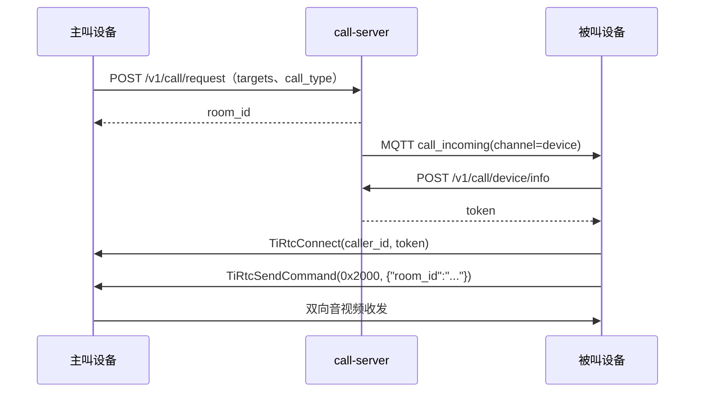
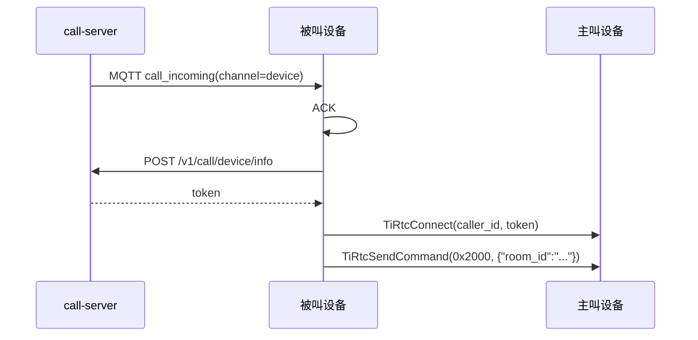

# 设备呼设备接入

本指南说明两台设备如何建立音视频通话，内容包括联系人、房间、MQTT 来电通知、<a href="https://docs.tange.ai/products/tirtc/api-reference/c.html#tirtcconnect" target="_blank" rel="noopener">`TiRtcConnect`</a> P2P 建连、接听、拒接、挂断和崩溃恢复。

> 这里说明设备互呼链路。设备上线和 MQTT 规范见 [device-integration.md](device-integration.md)，HTTP 字段和错误码见 [api-reference.md#call-server](api-reference.md#call-server)。一台设备同时运行设备互呼、VoIP 和 AI 时，还需要遵守 [device-session-model.md](device-session-model.md) 中的状态切换规则。

**文档导航：** [返回总览](README.md) | [返回设备入口](device-integration.md) | [H5 实时](device-h5-live.md) | [微信 VoIP](device-voip.md) | [AI 对讲](device-ai.md) | [统一状态机](device-session-model.md)

## 目录

- [快速接入](#快速接入)
- [前提与模型](#前提与模型)
- [主叫流程](#主叫流程)
- [被叫流程](#被叫流程)
- [房间通知与异常恢复](#房间通知与异常恢复)
- [联系人与 VoIP 联系人的区别](#联系人与-voip-联系人的区别)
- [协议速查](#协议速查)
- [问题排查](#问题排查)

---

## 快速接入

设备互呼通过 <a href="https://docs.tange.ai/products/tirtc/api-reference/c.html#tirtcconnect" target="_blank" rel="noopener">`TiRtcConnect`</a> 建立 P2P 连接。

VoIP 和 AI 使用 <a href="https://docs.tange.ai/products/tirtc/api-reference/c.html#tirtcwhipconnect" target="_blank" rel="noopener">`TiRtcWhipConnect`</a>，设备互呼不使用这个接口。

最小流程如下：

1. 按 [device-integration.md](device-integration.md) 上线，拿到 `mqtt_token`
2. 确认双方已是“已接受”的设备联系人
3. 主叫调 [`POST /v1/call/request`](api-reference.md#post-v1callrequest)
4. 被叫收到 MQTT `call_incoming(channel=device)` 后决定接/拒
5. 被叫接听时调 [`POST /v1/call/device/info`](api-reference.md#post-v1calldeviceinfo)
6. 被叫用返回 token 调 <a href="https://docs.tange.ai/products/tirtc/api-reference/c.html#tirtcconnect" target="_blank" rel="noopener">`TiRtcConnect(caller_id, token)`</a>
7. 建连成功后，被叫发 `0x2000` 表示接通

联调时检查以下结果：

- **设备侧（被叫）**：<a href="https://docs.tange.ai/products/tirtc/api-reference/c.html#tirtcconnect" target="_blank" rel="noopener">`TiRtcConnect`</a> 回调 `error == 0`、`0x2000` 接通确认发送无错。
- **对端（主叫）**：收到被叫的 `0x2000` 接通确认后，双方 `on_audio` / `on_video` 才开始收发媒体（`on_conn_accepted` 只是 P2P 建连，媒体要等 `0x2000`）。

---

## 前提与模型

### 1. 一台设备同一时刻只在一个房间

服务端用 `room:lock:{device_id}` 约束：

- 一台设备同一时刻只能占用一个房间
- 房间状态要么 `active`，要么 `answered`

设备侧需要维护明确的状态机，至少区分：

- 空闲
- 呼出等待中
- 来电等待中
- 已接通

### 2. 呼叫前先建立联系人关系

呼叫前双方必须是已接受联系人。

设备联系人接口：

- [`GET /v1/call/device/contacts`](api-reference.md#get-v1calldevicecontacts)
- [`GET /v1/call/device/contacts/pending`](api-reference.md#get-v1calldevicecontactspending)
- [`POST /v1/call/device/contacts/request`](api-reference.md#post-v1calldevicecontactsrequest)
- [`POST /v1/call/device/contacts/respond`](api-reference.md#post-v1calldevicecontactsrespond)
- [`PUT /v1/call/device/contacts/remark`](api-reference.md#put-v1calldevicecontactsremark)
- [`DELETE /v1/call/device/contacts`](api-reference.md#delete-v1calldevicecontacts)

完整字段说明、枚举值与错误码见：

- [api-reference.md#get-v1calldevicecontacts](api-reference.md#get-v1calldevicecontacts)
- [api-reference.md#post-v1calldevicecontactsrequest](api-reference.md#post-v1calldevicecontactsrequest)
- [api-reference.md#post-v1calldevicecontactsrespond](api-reference.md#post-v1calldevicecontactsrespond)
- [api-reference.md#put-v1calldevicecontactsremark](api-reference.md#put-v1calldevicecontactsremark)

如果 `targets` 中有任意一个不是“已接受”联系人，[`POST /v1/call/request`](api-reference.md#post-v1callrequest) 会整单失败。

### 3. MQTT 通知类型

设备呼设备复用 device-server 已有 topic：

| type | topic | 说明 |
|------|-------|------|
| `call_incoming` | `device/sn_{device_id}/cmd` | 来电 |
| `room_cancel` | `device/sn_{device_id}/notify` | 房间解散 |
| `call_reject` | `device/sn_{device_id}/notify` | 某个被叫拒接 |
| `callers_update` | `device/sn_{device_id}/notify` | call-server 发出的联系人变化；payload 包含 `action=request/accept/reject/delete/remark`、`contact_type=device/voip` 和 `peer_id`。voip-server 的授权刷新事件仍使用空 payload，见 `device-voip.md` |

`cmd` topic 的 `call_incoming` 仍然要回 ACK。

---

## 主叫流程

主叫先通过 HTTP 创建房间，再等待被叫连接。



图中涉及的 TiRTC SDK 接口：<a href="https://docs.tange.ai/products/tirtc/api-reference/c.html#tirtcconnect" target="_blank" rel="noopener">`TiRtcConnect`</a>、<a href="https://docs.tange.ai/products/tirtc/api-reference/c.html#tirtcsendcommand" target="_blank" rel="noopener">`TiRtcSendCommand`</a>。

### 1. 发起呼叫

调用：

- [`POST /v1/call/request`](api-reference.md#post-v1callrequest)

请求体：

- `targets`
- `call_type`（`audio` 或 `video`）

成功后返回：

- `room_id`
- `online`
- `offline`

**完整字段说明、枚举值与错误码见：** [api-reference.md#post-v1callrequest](api-reference.md#post-v1callrequest)

**HTTP 请求：**

```http
POST /v1/call/request
Authorization: Bearer <mqtt_token>
Content-Type: application/json
```

```json
{
  "targets": ["TIRZ00000002"],
  "call_type": "video"
}
```

**成功返回：**

```json
{
  "code": 200,
  "msg": "ok",
  "data": {
    "room_id": "d_roomid_c5b745c0bf61494e84a8432b199a693e",
    "online": { "TIRZ00000002": true },
    "offline": []
  }
}
```

设备应立刻进入“呼出等待中”状态，并保存 `room_id`。

### 2. 等待结果

主叫之后不会主动 <a href="https://docs.tange.ai/products/tirtc/api-reference/c.html#tirtcconnect" target="_blank" rel="noopener">`TiRtcConnect`</a>。它要等待两类事件：

1. 某个被叫成功接听，主动 <a href="https://docs.tange.ai/products/tirtc/api-reference/c.html#tirtcconnect" target="_blank" rel="noopener">`TiRtcConnect`</a> 过来
2. MQTT `call_reject` / `room_cancel` 告知本次呼叫失败或结束

主叫一侧的典型信号：

- `on_conn_accepted`：至少有一个被叫接听（P2P 建连成功；真正接通要看随后的 `0x2000`）
- `call_reject`：某个被叫明确拒接
- `room_cancel{reason:"all_rejected"}`：所有被叫都拒接或离线预拒接
- `room_cancel{reason:"cancel"}`：主叫自己取消后，服务端通知其他成员

**主叫侧 MQTT 通知：**

| topic | type | 说明 |
|------|------|------|
| `device/sn_{device_id}/notify` | `call_reject` | 某个被叫拒接 |
| `device/sn_{device_id}/notify` | `room_cancel` | 房间被取消、挂断或全拒绝 |

### 3. 挂断或取消

主叫可调用：

- [`POST /v1/call/hangup`](api-reference.md#post-v1callhangup)：已接通后挂断
- [`POST /v1/call/cancel`](api-reference.md#post-v1callcancel)：等待中取消

**完整字段说明、枚举值与错误码见：** [api-reference.md#post-v1callhangup](api-reference.md#post-v1callhangup)、[api-reference.md#post-v1callcancel](api-reference.md#post-v1callcancel)

**HTTP 请求：**

```http
POST /v1/call/hangup
Authorization: Bearer <mqtt_token>
Content-Type: application/json
```

```json
{ "room_id": "d_roomid_xxx", "reason": "hangup" }
```

或：

```http
POST /v1/call/cancel
Authorization: Bearer <mqtt_token>
Content-Type: application/json
```

```json
{ "room_id": "d_roomid_xxx" }
```

**成功返回：**

```json
{ "code": 200, "msg": "ok" }
```

本地也应同时发：

- <a href="https://docs.tange.ai/products/tirtc/api-reference/c.html#tirtcsendcommand" target="_blank" rel="noopener">`TiRtcSendCommand(0x2001, ...)`</a> 通知对端媒体层结束

服务端释放房间后，还会向对端推送 MQTT `room_cancel`（reason 为 `hangup` 或 `cancel`）；对端收到后的处理见 [房间通知与异常恢复](#房间通知与异常恢复)。

---

## 被叫流程

被叫先从 MQTT 收到来电，再换取 token，并主动调用 <a href="https://docs.tange.ai/products/tirtc/api-reference/c.html#tirtcconnect" target="_blank" rel="noopener">`TiRtcConnect`</a> 连接主叫。



图中涉及的 TiRTC SDK 接口：<a href="https://docs.tange.ai/products/tirtc/api-reference/c.html#tirtcconnect" target="_blank" rel="noopener">`TiRtcConnect`</a>、<a href="https://docs.tange.ai/products/tirtc/api-reference/c.html#tirtcsendcommand" target="_blank" rel="noopener">`TiRtcSendCommand`</a>。

### 1. 收到来电

`call_incoming(channel="device")` 的 payload 里关键字段：

- `room_id`
- `caller_id`
- `call_type`

**MQTT 下行通知：**

topic:

```text
device/sn_{device_id}/cmd
```

payload:

```json
{
  "type": "call_incoming",
  "channel": "device",
  "payload": {
    "room_id": "d_roomid_xxx",
    "caller_id": "TIRZ00000001",
    "call_type": "video"
  }
}
```

设备动作：

1. 回 ACK
2. 保存 `room_id`、`caller_id`
3. 根据当前状态决定接听或拒接

**MQTT 上行 ACK：**

topic:

```text
device/sn_{device_id}/ack
```

payload:

```json
{ "ack": true }
```

### 2. 接听

接听时调用：

- [`POST /v1/call/device/info`](api-reference.md#post-v1calldeviceinfo)

请求体固定带：

- `device_id = caller_id`
- `room_id`
- `purpose = "call"`

**完整字段说明、枚举值与错误码见：** [api-reference.md#post-v1calldeviceinfo](api-reference.md#post-v1calldeviceinfo)

**HTTP 请求：**

```http
POST /v1/call/device/info
Authorization: Bearer <mqtt_token>
Content-Type: application/json
```

```json
{
  "device_id": "TIRZ00000001",
  "room_id": "d_roomid_xxx",
  "purpose": "call"
}
```

成功后会拿到：

- `token`
- `device_id`（主叫 ID）

**成功返回：**

```json
{
  "code": 200,
  "msg": "ok",
  "data": {
    "token": "v1.eyJ...",
    "device_id": "TIRZ00000001"
  }
}
```

然后设备主动：

- <a href="https://docs.tange.ai/products/tirtc/api-reference/c.html#tirtcconnect" target="_blank" rel="noopener">`TiRtcConnect(caller_id, token, ...)`</a>

连接成功后，再发：

- <a href="https://docs.tange.ai/products/tirtc/api-reference/c.html#tirtcsendcommand" target="_blank" rel="noopener">`TiRtcSendCommand(0x2000, {"room_id":"..."})`</a>

`0x2000` 是接通确认。没有这一步，对端虽然可能已经建立底层连接，但业务上仍不知道你已真正接听。

### 3. 拒接

不想接时调用：

- [`POST /v1/call/reject`](api-reference.md#post-v1callreject)

请求体：

- `room_id`
- `reason`（`busy` 或 `decline`）

**完整字段说明、枚举值与错误码见：** [api-reference.md#post-v1callreject](api-reference.md#post-v1callreject)

**HTTP 请求：**

```http
POST /v1/call/reject
Authorization: Bearer <mqtt_token>
Content-Type: application/json
```

```json
{ "room_id": "d_roomid_xxx", "reason": "busy" }
```

**成功返回：**

```json
{ "code": 200, "msg": "ok" }
```

如果所有 target 都拒绝，主叫会收到：

- `room_cancel{reason:"all_rejected"}`

---

### 4. C 参考实现调用骨架

设备互呼的 HTTP 请求和房间状态由 `call_session.c` 封装，P2P 连接、媒体收发和 `0x2000` 接通确认由 `tirtc_call.c` 封装。应用层不应自行拼接连接 token，也不要跳过 `call_session_do_accept()`。

~~~c
#include "tirtc_call.h"
#include "call_session.h"
#include "tirtc_runtime.h"

CallState *call = call_create(call_server, device_id, mqtt_token,
                              "/data/up.g711a", "/data/up.h264", "/data/recv");
if (!call) return -1;

/* 进程启动时执行一次；同时支持其他业务时，先注册全部业务回调。 */
if (call_service_register() != 0 ||
    tirtc_runtime_start(device_id, device_key, client_id, endpoint) != 0) {
    call_destroy(call);
    return -1;
}

/* SessionCoordinator 发起或接听设备互呼前激活本业务代次。 */
uint64_t generation = tirtc_runtime_activate(TIRTC_SERVICE_CALL);
if (generation == 0 || call_service_start() != 0) {
    if (generation != 0)
        tirtc_runtime_deactivate(TIRTC_SERVICE_CALL, generation);
    tirtc_runtime_stop();
    call_destroy(call);
    return -1;
}

/* 主叫：内部 POST /v1/call/request，保存 room_id 并等待被叫 TiRtcConnect。 */
if (call_session_do_call(call, "TIRZ00000002", "video") != 0) {
    /* 建房失败；不要调用 TiRtcConnect。 */
}

/* MQTT 的 channel=device 来电回调。它只保存 room_id/caller_id/pending 状态。 */
void on_mqtt_device_call(const cJSON *payload) {
    call_on_device_call_incoming(call, payload);
    /* cmd topic ACK 由 device_flow.c 在分发前发送。 */
}

/* 被叫用户选择接听：
   内部 POST /v1/call/device/info -> TiRtcConnect(caller_id, token)
   -> 成功后 TiRtcSendCommand(0x2000, {"room_id":...}) -> 启动媒体任务。 */
if (call_session_do_accept(call) != 0) {
    /* 接听失败；call_session 内部恢复 pending/idle，并可提示重试。 */
}

/* 被叫拒绝、主叫取消或任一侧已接通后挂断。 */
call_session_do_reject(call, "busy");  /* pending 被叫才调用 */
call_session_do_cancel(call);          /* 呼出等待中才调用 */
call_session_do_hangup(call);          /* 已接通时调用，内部发 HTTP 和 0x2001 */

/* 结束本次业务并归还代次；Coordinator 随后恢复 STREAM。 */
tirtc_runtime_deactivate(TIRTC_SERVICE_CALL, generation);
call_service_stop();

/* Coordinator 此时恢复 STREAM，设备继续运行；这里不能停止或反初始化 SDK。 */

/* 以下两行属于整个设备进程的统一退出路径，不属于设备互呼会话结束路径。 */
tirtc_runtime_stop();
call_destroy(call);
~~~

关键方法职责如下：

| 方法 | 内部调用/作用 | 允许调用的状态 |
|---|---|---|
| call_session_do_call | [`POST /v1/call/request`](api-reference.md#post-v1callrequest)，记录 room_id，启动振铃超时 | IDLE |
| call_session_do_accept | [`POST /v1/call/device/info`](api-reference.md#post-v1calldeviceinfo)，随后调用 TiRtcConnect，成功后发 0x2000 | PENDING |
| call_session_do_reject | [`POST /v1/call/reject`](api-reference.md#post-v1callreject) | PENDING |
| call_session_do_cancel | [`POST /v1/call/cancel`](api-reference.md#post-v1callcancel) | OUTGOING |
| call_session_do_hangup | [`POST /v1/call/hangup`](api-reference.md#post-v1callhangup)，并通过 call_hangup 停止媒体、TiRtcDisconnect 通知对端 | IN_CALL |
| call_on_device_room_cancel | 收到 MQTT room_cancel 后停止本地媒体并清空 room_id | OUTGOING / PENDING / IN_CALL |

---

## 房间通知与异常恢复

### 1. `room_cancel`

`room_cancel` 代表房间已经被服务端释放，设备必须立刻退出当前通话状态。

常见 reason：

- `hangup`
- `cancel`
- `caller_left`
- `accepted_by_other`
- `all_rejected`

**MQTT 下行通知：**

topic:

```text
device/sn_{device_id}/notify
```

payload:

```json
{
  "type": "room_cancel",
  "channel": "device",
  "payload": {
    "room_id": "d_roomid_xxx",
    "reason": "hangup"
  }
}
```

设备侧动作：

1. 校验 `room_id` 是否是当前房间
2. 停止本地音视频线程
3. <a href="https://docs.tange.ai/products/tirtc/api-reference/c.html#tirtcdisconnect" target="_blank" rel="noopener">`TiRtcDisconnect`</a>
4. 清理本地状态

### 2. `call_reject`

主叫会收到 `call_reject`，用于更新 UI 或本地呼叫列表，但它本身不代表整个房间结束。

**MQTT 下行通知：**

```json
{
  "type": "call_reject",
  "channel": "device",
  "payload": {
    "room_id": "d_roomid_xxx",
    "reason": "busy"
  }
}
```

只有当所有 target 都拒绝时，才会进一步收到：

- `room_cancel{reason:"all_rejected"}`

### 3. 崩溃恢复

进程重启、本地状态丢失时，可调用：

- [`GET /v1/call/room`](api-reference.md#get-v1callroom)

**完整字段说明、返回字段与错误码见：** [api-reference.md#get-v1callroom](api-reference.md#get-v1callroom)

**HTTP 请求：**

```http
GET /v1/call/room
Authorization: Bearer <mqtt_token>
```

**成功返回：**

```json
{
  "code": 200,
  "msg": "ok",
  "data": {
    "room_id": "d_roomid_xxx",
    "status": "answered",
    "caller": "TIRZ00000001",
    "call_type": "video",
    "role": "callee"
  }
}
```

该接口用于恢复服务端记录的房间状态。

推荐在设备重启后做一次：

1. 若 `data == null`，说明当前无房间，直接回空闲态
2. 若还有房间，按 `role` 和 `status` 恢复本地状态机

---

## 联系人与 VoIP 联系人的区别

[`GET /v1/call/device/contacts`](api-reference.md#get-v1calldevicecontacts) 会同时返回两种联系人：

- `type:"device"`：设备联系人，可用于设备互呼
- `type:"voip"`：微信授权联系人，只能用于 [`POST /v1/voip/device/call`](api-reference.md#post-v1voipdevicecall)

完整字段说明见 [api-reference.md#get-v1calldevicecontacts](api-reference.md#get-v1calldevicecontacts)。

设备端必须按 `type` 分流：

- `type:"device"` -> [`POST /v1/call/request`](api-reference.md#post-v1callrequest)
- `type:"voip"` -> [`POST /v1/voip/device/call`](api-reference.md#post-v1voipdevicecall)

服务端不会帮你自动路由。

---

## 协议速查

### HTTP 请求 / 成功返回

| 接口 | 请求方 | 用途 | 成功返回 |
|------|--------|------|---------|
| [`POST /v1/call/request`](api-reference.md#post-v1callrequest) | 主叫设备 | 建房间、发起呼叫 | `{code:200,data:{room_id,online,offline}}` |
| [`POST /v1/call/device/info`](api-reference.md#post-v1calldeviceinfo) | 被叫设备 | 接听并换取 connect token | `{code:200,data:{token,device_id}}` |
| [`POST /v1/call/reject`](api-reference.md#post-v1callreject) | 被叫设备 | 拒接 | `{code:200,msg:"ok"}` |
| [`POST /v1/call/hangup`](api-reference.md#post-v1callhangup) | 主叫/已接通方 | 挂断 | `{code:200,msg:"ok"}` |
| [`POST /v1/call/cancel`](api-reference.md#post-v1callcancel) | 主叫设备 | 等待中取消 | `{code:200,msg:"ok"}` |
| [`GET /v1/call/room`](api-reference.md#get-v1callroom) | 当前设备 | 崩溃恢复 | `{code:200,data:null|room}` |

### MQTT 下行通知

| topic | type | 设备动作 |
|------|------|---------|
| `device/sn_{device_id}/cmd` | `call_incoming` | ACK -> 接听或拒接 |
| `device/sn_{device_id}/notify` | `call_reject` | 更新本地呼叫状态 |
| `device/sn_{device_id}/notify` | `room_cancel` | 释放房间、清理本地会话 |
| `device/sn_{device_id}/notify` | `callers_update` | 刷新联系人和待审批申请缓存 |

## 问题排查

- [`POST /v1/call/request`](api-reference.md#post-v1callrequest) 返回 `40205`：至少一个 target 不是已接受联系人
- 被叫收到了 `call_incoming` 但 [`device/info`](api-reference.md#post-v1calldeviceinfo) 返回 `40400`：房间已取消或超时
- [`device/info`](api-reference.md#post-v1calldeviceinfo) 返回 `40210`：房间已被别人抢接
- 被叫接听后主叫没反应：确认被叫在 <a href="https://docs.tange.ai/products/tirtc/api-reference/c.html#tirtcconnect" target="_blank" rel="noopener">`TiRtcConnect`</a> 成功后发送了 `0x2000`
- 旧通话被新来电顶掉：服务端默认允许新来电切换房间；若不想切换，应主动调用 [`/v1/call/reject`](api-reference.md#post-v1callreject)
- 进程崩溃重启后状态乱：启动时调用 [`GET /v1/call/room`](api-reference.md#get-v1callroom) 做房间恢复

> 使用 Linux C 默认适配联调时，按 [device-sim-c README](device-sim/device-sim-c/README.md) 启动两台实例。通过 `call <设备ID> [video|audio]` 发起呼叫，通过 `accept` 或 `reject` 响应。
>
> HTTP 封装位于 [call_session.c](device-sim/device-sim-c/src/call_session.c)，P2P 建连与 `0x2000` 确认位于 [tirtc_call.c](device-sim/device-sim-c/src/tirtc_call.c)。默认上行来自文件，下行 sink 只记录后丢弃；产品可通过 `DeviceAdapterV1` 替换。
>
> 单元测试通过不代表真实服务的端到端链路已经验证。
