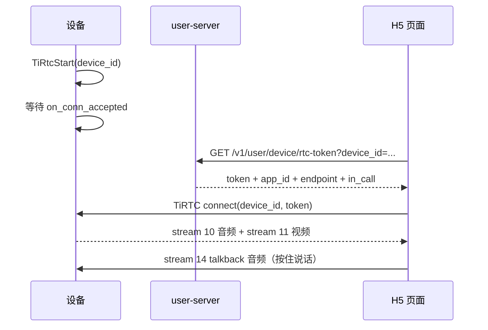

# H5 实时查看与按住说话

设备持续推送实时音视频，H5 通过 `user-server` 换取 TiRTC token 后直连设备；H5 按住说话时，音频通过 TiRTC 音频流回到设备。

> 本文只描述“设备 <-> H5”这条实时预览链路。设备上线与 MQTT 规范见 [device-integration.md](device-integration.md)；HTTP 字段定义见 [api-reference.md#user-server](api-reference.md#user-server)。**这条链路不走 `call-server /v1/call/device/info`。** 一台设备同时接入 VoIP / AI / 设备呼设备时，状态切换见 [device-session-model.md](device-session-model.md)。

**文档导航：** [返回总览](README.md) | [返回设备入口](device-integration.md) | [微信 VoIP](device-voip.md) | [AI 对讲](device-ai.md) | [设备呼设备](device-call.md) | [统一状态机](device-session-model.md)

## 目录

- [快速接入](#快速接入)
- [媒体格式与默认约定](#媒体格式与默认约定)
- [链路概览](#链路概览)
- [HTTP 接口与返回](#http-接口与返回)
- [H5 端接入](#h5-端接入)
- [TiRTC 连接与媒体流](#tirtc-连接与媒体流)
- [设备侧接入](#设备侧接入)
- [H5 按住说话](#h5-按住说话)
- [与其他业务的关系](#与其他业务的关系)
- [问题排查](#问题排查)

---

## 快速接入

H5 实时查看只需要设备完成两件事：

1. 按 [device-integration.md](device-integration.md) 完成设备上线，拿到 `device_id`、`device_key`、`mqtt_token`
2. 使用 `device_id + device_key` 启动 TiRTC 常驻监听，等待 H5 连接后持续发送实时媒体

当前 H5 页面约定如下：

| 方向 | stream_id | 说明 |
|------|-----------|------|
| 设备 → H5 音频 | `10` | H5 订阅设备实时音频 |
| 设备 → H5 视频 | `11` | H5 订阅设备实时视频 |
| H5 → 设备 talkback | `14` | H5 “按住说话”上行音频 |

当前 H5 talkback 约定：

- 编码仅支持 `G.711A`
- 采样率支持 `8000` 或 `16000`
- 默认采样率为 `8000`

H5 自己会调用 [`GET /v1/user/device/rtc-token?device_id=...`](api-reference.md#get-v1userdevicertc-token) 获取 token，然后 `connect({ deviceId, token })` 直连设备。设备侧**不需要**再额外调 `device/info` 之类的接口。

**完成标志：**

- **设备侧**：H5 连入后推流线程持续运行；按住说话时 `on_audio` 收到 stream 14 的 G.711A。
- **对端（H5）**：页面 video/audio 元素有画面和声音，浏览器控制台无 stream 10/11 的 subscribe 错误。

---

## 媒体格式与默认约定

当前 H5 实时预览链路**不做运行时能力协商**。设备如果要接入当前 H5 页面，应按下面这组**当前仅支持的音视频格式**实现收发：

| 方向 | 媒体 | stream_id | 编码/封装 | 采样率/说明 |
|------|------|-----------|-----------|------------|
| 设备 -> H5 | 音频 | `10` | `G.711A` | 仅支持 `8000` 或 `16000` |
| 设备 -> H5 | 视频 | `11` | `H.264` | 当前仅支持 `H.264`，参考实现使用 `Annex-B` 裸流 |
| H5 -> 设备 | talkback 音频 | `14` | `G.711A` | 仅支持 `8000` 或 `16000`，默认 `8000` |

接入侧需要注意：

- 当前 H5 页面把“支持什么格式”视为固定契约，不会先向设备拉取媒体能力
- 当前链路只支持上表中的 `G.711A` / `H.264` 组合；设备侧如果不是上述格式，不能直接复用当前 H5 页面，需要同时调整前端和设备实现
- H5 talkback 的默认采样率目前在前端代码里固定为 `8000`，如需切到 `16000`，应同步确认设备解码链路与浏览器端配置

---

## 链路概览



[`GET /v1/user/device/rtc-token`](api-reference.md#get-v1userdevicertc-token) 的职责只有两件：

- 校验这台设备是否属于当前登录用户
- 用该设备的 `device_key` 构造 TiRTC connect token

它返回的 `in_call` 只是给 H5 做提示用。即使设备正在设备间通话，接口仍然会签发 token，是否允许用户继续预览由前端自己决定。

---

## HTTP 接口与返回

H5 实时预览链路里，设备侧只涉及一个 HTTP 接口，但**调用方是 H5，不是设备**：

### `GET /v1/user/device/rtc-token`

**请求方：** H5 页面  
**设备是否主动调用：** 否

**完整字段说明、返回字段与错误码见：** [api-reference.md#get-v1userdevicertc-token](api-reference.md#get-v1userdevicertc-token)

**请求：**

```http
GET /v1/user/device/rtc-token?device_id=TIRZ00000001
Authorization: Bearer <user_jwt>
```

**成功返回：**

```json
{
  "code": 200,
  "data": {
    "token": "v1.eyJ...",
    "app_id": "2818153",
    "endpoint": "https://api-tirtc.tange365.com",
    "in_call": false
  }
}
```

| 字段 | 说明 |
|------|------|
| `token` | H5 直连设备使用的 TiRTC connect token |
| `app_id` | TiRTC App ID |
| `endpoint` | TiRTC API 地址 |
| `in_call` | 设备当前是否在通话中，仅用于前端提示 |

**设备侧需要知道的事实：**

- 这个 token 由 user-server 代 H5 申请，设备端不参与签发
- 设备端不需要实现任何“预览开始”HTTP 回调
- H5 拿到 token 后直接通过 TiRTC 连接设备

---

## H5 端接入

这一节描述的是**浏览器端**如何接当前实时预览页面，不是设备端如何推流。

当前仓库可直接参考：

- 页面实现：[user-server/static/player.html](user-server/static/player.html)

### 1. 前置条件

H5 页面开始拉流前，至少要满足：

1. 用户已通过 `user-server` 登录，拿到 `user_jwt`
2. 当前 `device_id` 已绑定在这个登录用户名下
3. 设备已经按本文档完成 TiRTC 常驻监听，能够接受 H5 连接

### 2. 拉取 rtc-token

H5 先调用：

- [`GET /v1/user/device/rtc-token?device_id=...`](api-reference.md#get-v1userdevicertc-token)

请求头带：

- `Authorization: Bearer <user_jwt>`

拿到返回值里的：

- `token`
- `app_id`
- `endpoint`
- `in_call`

其中：

- `token` 用于本次浏览器直连设备
- `app_id` 用于初始化 Web SDK
- `endpoint` 是 TiRTC 服务地址
- `in_call` 只是提示字段，不是服务端拒绝条件

### 3. 初始化 Web SDK 并建立连接

当前页面的最小流程是：

1. 用返回的 `app_id` 调 `TiRtc.initialize(...)`
2. 创建 `TiRtcConn`
3. 创建音频输出 `TiRtcAudioOutput({ streamId: 10 })`
4. 创建视频输出 `TiRtcVideoOutput({ streamId: 11 })`
5. 创建 talkback 输入 `TiRtcAudioInput({ streamId: 14 })`
6. 对 talkback 输入设置采样率，当前默认 `8000`
7. 调 `connection.connect({ deviceId, token })`
8. 连接成功后 `attach()` 音频/视频输出，并订阅 `stream 10/11`

对应的参考代码形态如下：

```js
const { rtcToken, appId } = await fetchRtcToken();

TiRtc.initialize(TiRtcInitOptions({ appId }));
await TiRtc.videoOutputReady();

const connection  = new TiRtcConn();
const audioOutput = TiRtcAudioOutput({ connection, streamId: 10 });
const videoOutput = TiRtcVideoOutput({ connection, streamId: 11 });
const audioInput  = new TiRtcAudioInput({ connection, streamId: 14 });

audioInput.setOptions({ sampleRate: 8000 });

await connection.connect({ deviceId, token: rtcToken });
videoOutput.attach();
audioOutput.attach();
connection.subscribeVideo({ streamId: 11 });
connection.subscribeAudio({ streamId: 10 });
```

### 4. 关闭页面时释放资源

H5 页面离开时，至少应做：

1. `connection.disconnect()`
2. `audioOutput.detach()`
3. `videoOutput.detach()`
4. `audioInput.stop()`

否则容易出现浏览器麦克风没释放、页面销毁后仍保留连接对象等问题。

---

## TiRTC 连接与媒体流

H5 实时预览没有 MQTT 请求/通知，设备侧面对的是 **TiRTC 连接** 和固定的音视频 stream 约定。

### H5 -> 设备：TiRTC connect

**发起方：** H5 页面  
**设备侧对应事件：** `on_conn_accepted`

H5 拿到 `token` 后执行：

```js
connection.connect({ deviceId, token })
```

设备侧不需要解析 token；`on_conn_accepted` 只需投递“实时预览连接已建立”事件，
由设备控制任务在回调返回后保存句柄并启动媒体。

### 设备 -> H5：实时媒体流

| 方向 | stream_id | 类型 | 设备动作 |
|------|-----------|------|---------|
| 设备 -> H5 | `10` | 音频 | 持续调用 <a href="https://docs.tange.ai/products/tirtc/api-reference/c.html#tirtcsendaudiostream" target="_blank" rel="noopener">`TiRtcSendAudioStream`</a> |
| 设备 -> H5 | `11` | 视频 | 持续调用 <a href="https://docs.tange.ai/products/tirtc/api-reference/c.html#tirtcsendvideostream" target="_blank" rel="noopener">`TiRtcSendVideoStream`</a> |

**设备侧发送开始条件：**

1. <a href="https://docs.tange.ai/products/tirtc/api-reference/c.html#tirtcstart" target="_blank" rel="noopener">`TiRtcStart(...)`</a> 已成功
2. 收到 `on_conn_accepted` 并成功投递应用事件
3. 控制任务在回调栈外启动推流线程

**设备侧发送结束条件：**

1. H5 主动断开
2. 设备调用 <a href="https://docs.tange.ai/products/tirtc/api-reference/c.html#tirtcdisconnect" target="_blank" rel="noopener">`TiRtcDisconnect`</a>
3. 设备切换到 VoIP / AI / 设备呼设备前台会话

### H5 -> 设备：talkback 音频

| 方向 | stream_id | 类型 | 设备动作 |
|------|-----------|------|---------|
| H5 -> 设备 | `14` | 麦克风音频（`G.711A`，`8000/16000Hz`） | 在 `on_audio` 中识别并播放/处理 |

这一路不是 MQTT 消息，不需要 ACK，也没有单独的 HTTP 回调。

---

## 设备侧接入

### 1. 初始化 TiRTC 常驻监听

实时预览模式下，设备不是主动外连，而是先本地 <a href="https://docs.tange.ai/products/tirtc/api-reference/c.html#tirtcstart" target="_blank" rel="noopener">`TiRtcStart(...)`</a>，等待 H5 连接进来。`TiRtcStart` 只传 `device_id`，`device_key` 通过 <a href="https://docs.tange.ai/products/tirtc/api-reference/c.html#tirtcsetoption" target="_blank" rel="noopener">`TiRtcSetOption(TIRTC_OPT_DEVICE_SECRET_KEY, ...)`</a> 预先设置。

典型步骤：

1. <a href="https://docs.tange.ai/products/tirtc/api-reference/c.html#tirtcinit" target="_blank" rel="noopener">`TiRtcInit()`</a>
2. <a href="https://docs.tange.ai/products/tirtc/api-reference/c.html#tirtcsetoption" target="_blank" rel="noopener">`TiRtcSetOption(TIRTC_OPT_SERVICE_ENDPOINT, ...)`</a>
3. <a href="https://docs.tange.ai/products/tirtc/api-reference/c.html#tirtcsetoption" target="_blank" rel="noopener">`TiRtcSetOption(TIRTC_OPT_DEVICE_SECRET_KEY, device_key, ...)`</a>
4. <a href="https://docs.tange.ai/products/tirtc/api-reference/c.html#tirtcstart" target="_blank" rel="noopener">`TiRtcStart(device_id, &callbacks)`</a>
5. 等待 `on_conn_accepted`
6. 在连接建立后启动实时音频/视频发送线程

> 顺序不可调换：<a href="https://docs.tange.ai/products/tirtc/api-reference/c.html#tirtcsetoption" target="_blank" rel="noopener">`TiRtcSetOption(TIRTC_OPT_DEVICE_SECRET_KEY, ...)`</a> 必须先于 <a href="https://docs.tange.ai/products/tirtc/api-reference/c.html#tirtcstart" target="_blank" rel="noopener">`TiRtcStart`</a>——后者执行后设备即用 `device_key` 向平台鉴权。

Linux C 参考实现见：

- C 进程级生命周期与统一回调：[device-sim/device-sim-c/src/tirtc_runtime.c](device-sim/device-sim-c/src/tirtc_runtime.c)
- C 实时流会话与媒体发送：[device-sim/device-sim-c/src/tirtc_stream.c](device-sim/device-sim-c/src/tirtc_stream.c)
- 完整可编译调用链：[device-sim/device-sim-c/README.md#各业务模块调用](device-sim/device-sim-c/README.md#各业务模块调用)

### 2. H5 连上后开始推流

当前实时预览页面的默认流约定是：

- 音频：`stream_id = 10`
- 视频：`stream_id = 11`

设备在 `on_conn_accepted` 中投递连接事件，由控制任务在回调返回后启动推流线程，循环调用：

- <a href="https://docs.tange.ai/products/tirtc/api-reference/c.html#tirtcsendaudiostream" target="_blank" rel="noopener">`TiRtcSendAudioStream`</a>
- <a href="https://docs.tange.ai/products/tirtc/api-reference/c.html#tirtcsendvideostream" target="_blank" rel="noopener">`TiRtcSendVideoStream`</a>

H5 在 `connect()` 完成后才挂载并订阅输出，设备在连接接入时发送的首个 IDR
可能已经错过。因此设备除了处理 `on_request_key_frame`，还应在视频订阅回调中请求新关键帧；
`TiRtcSendVideoStream` 返回 `TIRTC_E_BUSY` 后也应尽快补关键帧，避免持续丢弃非关键帧。

预编码文件源不能在当前位置即时编码 IDR，只能前进到下一个关键帧。发生这种跳转时，
音频文件读取位置也必须移动到相同媒体时间，输出时间戳继续单调递增，避免恢复画面后音画内容错位。

### 3. 设备端不需要感知 H5 token 细节

H5 token 是 `user-server` 用设备 `device_key` 构造的 connect token，scope 对应 `connect:device://{device_id}`。设备只负责：

- 常驻等待连接
- 连上后按约定 stream 发送媒体
- 断开后清理本地推流状态

---

## H5 按住说话

当前 H5 播放页支持“按住说话”反向发音频给设备。

从协议上看，这一段只有“浏览器开始发送音频”和“设备收到 talkback 音频帧”两个事件，没有额外 HTTP / MQTT 包。

设备侧需要做两件事：

1. 在音频回调 `on_audio` 中按“H5 来源连接 + 音频 stream”处理 talkback 数据
2. 把这一路音频交给本地播放或业务处理

当前前端实现的约定是：

- H5 麦克风输入走 `stream_id = 14`
- 编码固定为 `G.711A`
- 采样率支持 `8000` 或 `16000`
- 默认采样率为 `8000`
- 由浏览器端按住按钮时 `start()`，松开时 `stop()`

**对设备来说，可观察到的行为是：**

- 按下按钮后：开始持续收到 `stream_id = 14` 的音频帧
- 松开按钮后：`stream_id = 14` 停止送帧
- 浏览器静音、页面离开或连接断开：同样停止送帧

Linux C 参考实现的 `tirtc_stream.c::_on_audio()` 会校验当前连接并调用 `DeviceMediaSinkOps.submit`；Linux 默认适配没有 sink，所以只做限频日志后丢弃，不包含扬声器播放。产品应实现 sink，在回调内把 payload 复制到有界播放队列并立即返回；独立媒体任务再解码并驱动扬声器。SDK 回调返回后 `data` 即失效，且回调内不得阻塞。

### 4. 产品侧 C 调用示例

下面的代码只说明 TiRTC 调用顺序，不是可直接编译的 Linux C 参考实现。`stream_event_push()`、`ring_buffer_write()`、`talkback_queue` 和 `encoder_request_idr()` 都是伪代码占位符；实际 Linux 代码见 `tirtc_runtime.c`、`tirtc_stream.c`、`device_adapter.c` 和 Linux 默认的 `linux_device_adapter.c`。

```c
#include <string.h>
#include "tirtc/tiRTC.h"

#define STREAM_AUDIO     10
#define STREAM_VIDEO     11
#define STREAM_TALKBACK  14

static tirtc_conn_t s_h5_conn;

static void on_event(int event, const void *data, int len) {
    (void)data; (void)len;
    if (event == TIRTC_EVENT_SYS_STARTED) {
        /* 此时才允许等待/处理连接。 */
    }
}

static void on_conn_accepted(tirtc_conn_t hconn) {
    stream_event_push(STREAM_EVENT_CONNECTED, hconn, 0);
}

static void on_disconnected(tirtc_conn_t hconn) {
    stream_event_push(STREAM_EVENT_DISCONNECTED, hconn, 0);
}

static void on_audio(tirtc_conn_t hconn, const TIRTCFRAMEINFO *fi, void *data) {
    (void)hconn;
    if (fi->stream_id == STREAM_TALKBACK &&
        fi->media == TIRTC_AUDIO_ALAW &&
        (fi->flags == TIRTC_AUDIOSAMPLE_8K16B1C ||
         fi->flags == TIRTC_AUDIOSAMPLE_16K16B1C)) {
        /* data 的有效长度是 fi->length；回调内只入队。 */
        ring_buffer_write(&talkback_queue, data, fi->length);
    }
}

static void on_request_key_frame(tirtc_conn_t hconn, uint8_t stream_id) {
    (void)hconn;
    if (stream_id == STREAM_VIDEO) encoder_request_idr();
}

static void on_conn_error(tirtc_conn_t hconn, int error) {
    stream_event_push(STREAM_EVENT_CONN_ERROR, hconn, error);
}
static void on_frame_ignore(tirtc_conn_t h, const TIRTCFRAMEINFO *f, void *d)
{ (void)h; (void)f; (void)d; }
static void on_command_ignore(tirtc_conn_t h, uint32_t c, const void *d, uint32_t n)
{ (void)h; (void)c; (void)d; (void)n; }
static void on_unsubscribe_ignore(tirtc_conn_t h, uint8_t stream)
{ (void)h; (void)stream; }
static int on_subscribe_accept(tirtc_conn_t h, uint8_t stream)
{ (void)h; (void)stream; return 0; }

/* 进程启动时调用一次；H5 会话切换不能再次调用此函数。 */
int process_rtc_start(const char *device_id, const char *device_key,
                      const char *client_id, const char *endpoint) {
    static TIRTCCALLBACKS cbs;  /* SDK 仅保存指针，不能是栈变量。 */
    uint32_t max_send_buffer = 1024 * 1024;
    memset(&cbs, 0, sizeof(cbs));
    cbs.on_event = on_event;
    cbs.on_conn_accepted = on_conn_accepted;
    cbs.on_conn_error = on_conn_error;
    cbs.on_disconnected = on_disconnected;
    cbs.on_audio = on_audio;
    cbs.on_video = on_frame_ignore;
    cbs.on_message = on_frame_ignore;
    cbs.on_command = on_command_ignore;
    cbs.on_request_key_frame = on_request_key_frame;
    cbs.on_subscribe_video = on_subscribe_accept;
    cbs.on_unsubscribe_video = on_unsubscribe_ignore;
    cbs.on_subscribe_audio = on_subscribe_accept;
    cbs.on_unsubscribe_audio = on_unsubscribe_ignore;

    int rc = TiRtcSetOption(TIRTC_OPT_MAX_SEND_BUFFER,
                            &max_send_buffer, sizeof(max_send_buffer));
    if (rc != 0) return rc;
    rc = TiRtcInit();
    if (rc != 0) return rc;
    if (endpoint && endpoint[0] &&
        (rc = TiRtcSetOption(TIRTC_OPT_SERVICE_ENDPOINT, endpoint, strlen(endpoint))) != 0) goto fail;
    if ((rc = TiRtcSetOption(TIRTC_OPT_DEVICE_SECRET_KEY, device_key, strlen(device_key))) != 0) goto fail;
    if ((rc = TiRtcSetOption(TIRTC_OPT_CLIENT_ID, client_id, strlen(client_id))) != 0) goto fail;
    if ((rc = TiRtcStart(device_id, &cbs)) != 0) goto fail;
    return 0;
fail:
    TiRtcUninit();
    return rc;
}

/* 由采集/编码任务调用；首次视频帧必须是 SPS/PPS + IDR 关键帧。 */
int h5_send_audio(const uint8_t *alaw, uint32_t len, uint32_t pts_ms) {
    TIRTCFRAMEINFO fi = {0};
    fi.stream_id = STREAM_AUDIO;
    fi.media = TIRTC_AUDIO_ALAW;
    fi.flags = TIRTC_AUDIOSAMPLE_8K16B1C;
    fi.ts = pts_ms;
    fi.length = len;
    return s_h5_conn ? TiRtcSendAudioStream(s_h5_conn, &fi, (void *)alaw) : TIRTC_E_INVALID_HANDLE;
}

int h5_send_h264(const uint8_t *annexb_au, uint32_t len, uint32_t pts_ms, int is_idr) {
    TIRTCFRAMEINFO fi = {0};
    fi.stream_id = STREAM_VIDEO;
    fi.media = TIRTC_VIDEO_H264;
    fi.flags = is_idr ? TIRTC_FRAME_FLAG_KEY_FRAME : 0;
    fi.ts = pts_ms;
    fi.length = len;
    return s_h5_conn ? TiRtcSendVideoStream(s_h5_conn, &fi, (void *)annexb_au) : TIRTC_E_INVALID_HANDLE;
}
```

上例的 `process_rtc_start()` 属于进程级 runtime，只能在进程启动时调用一次；同时支持多个业务时，传给 `TiRtcStart` 的必须是按“连接归属 + 会话代次”分发的统一回调表，不能让每个业务各自启动 SDK。`stream_event_push()` 是应用固定队列抽象，不是 TiRTC API。控制任务处理 `CONNECTED` 时保存句柄并启动采集，处理 `DISCONNECTED` 时停止采集，处理 `CONN_ERROR` 时清除匹配句柄并在回调栈外调用 `TiRtcDisconnect`。

结束 H5 实时会话时只需：停止采集/编码任务并等待退出 → 在控制任务调用 `TiRtcDisconnect(s_h5_conn)` → 等待该会话的回调和延后动作退出。随后可以直接激活 VoIP、AI 或设备互呼业务，进程级 SDK 保持运行。

只有进程退出时才执行：停止当前业务媒体并断开连接 → 等待全部业务回调和延后动作退出 → `TiRtcStop()` → 等待 `TIRTC_EVENT_SYS_STOPPED` → 再次确认无回调或媒体任务存活 → `TiRtcUninit()`。可直接对照「C 参考实现」的 `tirtc_runtime.c`、`tirtc_stream.c` 和 `session_coordinator.c`；不要在任何 SDK 回调中调用 `TiRtcDisconnect`、`TiRtcStop` 或 `TiRtcUninit`。

---

## 与其他业务的关系

H5 实时查看本质上是“设备常驻监听，H5 被动连入”。它和 VoIP、AI、设备互呼是不同业务会话，但共用同一个进程级 TiRTC SDK runtime；切换业务不重新初始化 SDK。

现有服务端约束：

- [`GET /v1/user/device/rtc-token`](api-reference.md#get-v1userdevicertc-token) 不会因为设备正在通话而拒绝签发 token
- H5 侧只收到 `in_call` 提示，由前端决定是否继续连接

设备侧必须明确业务优先级。Linux C 参考实现当前策略是：

- 程序默认启动实时推流
- VoIP / AI / 设备呼设备开始后，暂停实时流
- 业务会话结束后，再恢复实时流

如果产品要允许“实时预览 + 业务会话”并行，需要自行评估：

- 编码器/带宽是否够用
- 麦克风/扬声器是否允许多路复用
- 摄像头是否能同时供两条链路使用

---

## 问题排查

- H5 能登录但看不到画面：先确认设备已经 <a href="https://docs.tange.ai/products/tirtc/api-reference/c.html#tirtcstart" target="_blank" rel="noopener">`TiRtcStart`</a> 成功，并且 `on_conn_accepted` 后确实开始发 `stream 10/11`
- H5 连接成功但首帧慢：确认视频订阅回调会请求新关键帧，并检查 `TIRTC_E_BUSY` 后是否补发关键帧；不能只依赖连接接入时发送的首个 IDR
- 文件媒体恢复后音画错位：确认跳到下一个视频 IDR 时，音频文件读取位置也跳到相同媒体时间，音视频输出时间戳仍保持单调递增
- H5 有画面没声音：确认设备上行音频确实走 `stream 10`，H5 已订阅音频
- 按住说话设备没收到：确认设备 `on_audio` 回调里处理了来自 H5 连接的 `stream_id == 14` 音频帧，并按 `G.711A`、`8000/16000Hz` 解码
- `rtc-token` 返回 `40300`：说明这台设备不属于当前 H5 登录用户
- H5 提示 `in_call=true`：是状态提示，不是服务端拒绝；是否允许继续预览要看前端和设备自己的策略

> 二次开发验收与 Linux C 参考实现命令见 [device-porting.md](device-porting.md) 和 [device-sim/device-sim-c/README.md](device-sim/device-sim-c/README.md)。
