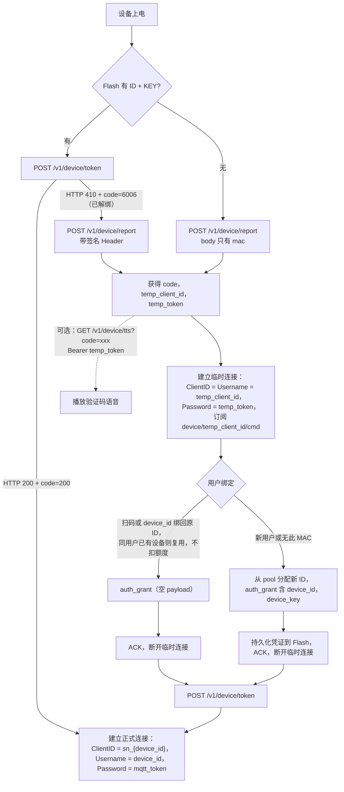

# 设备上线与 MQTT 接入

设备从上电到建立 MQTT 长连接的完整流程：两条上线路径、临时/正式连接、Topic 与消息规范、Token 生命周期。

> 设备上线流程以本文档为准。嵌入式实现只参考 [device-sim-c](device-sim/device-sim-c/README.md)（C）；HTTP 接口字段定义见 [api-reference.md#device-server](api-reference.md#device-server)。

**文档导航：** [返回总览](README.md) | [H5 实时](device-h5-live.md) | [微信 VoIP](device-voip.md) | [AI 对讲](device-ai.md) | [设备呼设备](device-call.md) | [统一状态机](device-session-model.md) | [API Reference](api-reference.md)

## 目录

- [快速接入](#快速接入)
- [上线全流程](#上线全流程)
- [凭证与连接](#凭证与连接)
- [临时 MQTT 连接](#临时-mqtt-连接)
- [正式连接与 MQTT 规范](#正式连接与-mqtt-规范)
- [上线后业务接入](#上线后业务接入)
- [Token 生命周期](#token-生命周期)
- [错误码与问题排查](#错误码与问题排查)

---

## 快速接入

默认接入方式是不带 `device_id` 和 `device_key`，设备按验证码流程上线：

1. 调 [`POST /v1/device/report`](api-reference.md#post-v1devicereport)（请求体只带 `mac` 一个字段）→ 拿到 `code`、`temp_client_id`、`temp_token`
2. 如需语音播报，调 [`GET /v1/device/tts?code=xxx`](api-reference.md#get-v1devicetts)，Bearer 使用同一次 Report 返回的 `temp_token`
3. 建立临时 MQTT 连接：`ClientID = Username = temp_client_id`，`Password = temp_token`
4. 订阅 `device/{temp_client_id}/cmd`，等待服务端下发 `auth_grant`
5. 收到 `auth_grant` 后持久化 `device_id + device_key`，再调 [`POST /v1/device/token`](api-reference.md#post-v1devicetoken) 换 `mqtt_token`
6. 建立正式 MQTT 连接：`ClientID = sn_{device_id}`，`Username = device_id`，`Password = mqtt_token`
7. 订阅 `device/sn_{device_id}/cmd` 和 `device/sn_{device_id}/notify`，收到 `cmd` 后向 `device/sn_{device_id}/ack` 回 `{"ack":true}`

如果设备已预烧 `device_id + device_key`，可直接从 [`POST /v1/device/token`](api-reference.md#post-v1devicetoken) 开始，跳过验证码和临时连接。

---

## 上线全流程

设备上电后根据 Flash 中是否已持久化 `device_id + device_key` 选择路径，**两条路径独立，不允许交叉**：

| 路径 | 触发条件 | 第一接口 | 凭证来源 |
|------|---------|---------|---------|
| 验证码 | Flash 无 ID+Key | [`POST /v1/device/report`](api-reference.md#post-v1devicereport) | 扫码后从 device_pool 分配（`assign=dynamic`） |
| 预烧凭证 | Flash 有 ID+Key | [`POST /v1/device/token`](api-reference.md#post-v1devicetoken) | 出厂烧录（`assign=preburn`） |

无论走哪条路径，最终都收敛到同一步：用 `device_id + device_key` 调 [`/v1/device/token`](api-reference.md#post-v1devicetoken) 换 `mqtt_token`，建立正式连接。上线完成后设备才进入 VoIP / AI / 设备间通话等业务流程。

> **返回约定（device-server）：** 成功返回 `HTTP 200` 且 body `code=200`；失败返回对应的 HTTP 状态码，body 携带业务 `code`（如 `HTTP 410 + code=6006`）。

> **路径选择规则：**
> 1. Flash 有凭证 → 先调 [`POST /v1/device/token`](api-reference.md#post-v1devicetoken)；返回 `HTTP 200 + code=200` → 直接建立正式连接。
> 2. Token 返回 `HTTP 410 + code=6006`（设备已被解绑）→ 调 Report 时**必须携带签名 Header**（`X-Device-Id` / `X-Timestamp` / `X-Nonce` / `X-Signature`，用本地 `device_key` 签名，算法同 [`/v1/device/token`](api-reference.md#post-v1devicetoken)），服务端才会将设备绑回原 ID，而非从 pool 分配新 ID；绑定成功后下发的 `auth_grant` 为空 payload，设备继续使用本地凭证（见 [api-reference.md#post-v1devicereport](api-reference.md#post-v1devicereport)）。
> 3. Flash 无凭证 → 调 [`POST /v1/device/report`](api-reference.md#post-v1devicereport)（不带签名 Header，body 只有 `mac` 一个字段），走验证码流程从 pool 分配新 ID。



> Report 带签名 Header 时（设备已持有 `device_key`），服务端跳过限频层，仅校验签名和 MAC 一致性，详见 [api-reference.md#post-v1devicereport](api-reference.md#post-v1devicereport)。用 device_id 绑定/绑回原 ID 且该设备当前无主时，服务端要求设备已建立临时 MQTT 连接，否则返回 6002，详见 [api-reference.md#post-v1userdevicebind-by-id](api-reference.md#post-v1userdevicebind-by-id)。

### C 参考实现的完整上线调用顺序

「C 参考实现」已把 HTTP、HMAC、临时 MQTT 和正式 MQTT 封装在 device_flow.c。以下代码是板端启动任务应保留的控制流；替换 Flash 读写、平台停止标志和 MQTT 业务回调即可。函数声明见 [device_flow.h](device-sim/device-sim-c/src/device_flow.h)，完整实现见 [device_flow.c](device-sim/device-sim-c/src/device_flow.c)。

~~~c
#include <string.h>
#include "device_flow.h"

DeviceServices svc = {0};
ReportResult report = {0};
char device_id[64] = {0};
char device_key[256] = {0};
char mqtt_token[512] = {0};

if (fetch_services(&svc, NULL) != 0) return -1;
set_mqtt_ca_cert("/data/ca-certificates.crt");

/* 从 Flash 读取。返回 0 表示已有完整的 ID + Key。 */
int has_credentials = flash_load_credentials(device_id, sizeof(device_id),
                                             device_key, sizeof(device_key)) == 0;
if (has_credentials) {
    int rc = get_mqtt_token(svc.device_server, device_id, device_key, mac,
                            mqtt_token, sizeof(mqtt_token));
    if (rc == -2) has_credentials = 0; /* 6006：走“签名 Report 后重新绑定” */
    else if (rc != 0) return -1;
}

if (!has_credentials) {
    /* 若 device_key 非空，这是已解绑设备的签名 Report；否则是首次裸 Report。 */
    const char *signed_id = device_id[0] ? device_id : NULL;
    const char *signed_key = device_key[0] ? device_key : NULL;
    if (report_device(svc.device_server, mac, signed_id, signed_key, &report) != 0)
        return -1;

    char granted_id[64] = {0};
    char granted_key[256] = {0};
    if (connect_temp_mqtt(svc.mqtt_host, svc.mqtt_port,
                          report.temp_client_id, report.temp_token, 190,
                          svc.mqtt_tls, granted_id, sizeof(granted_id),
                          granted_key, sizeof(granted_key)) != 0)
        return -1;

    /* 新分配设备才带 payload；空 payload 表示沿用本地凭证。 */
    if (granted_id[0] && granted_key[0]) {
        strcpy(device_id, granted_id);
        strcpy(device_key, granted_key);
        if (flash_save_credentials(device_id, device_key) != 0) return -1;
    }
    if (!device_id[0] || !device_key[0]) return -1;
    if (get_mqtt_token(svc.device_server, device_id, device_key, mac,
                       mqtt_token, sizeof(mqtt_token)) != 0)
        return -1;
}

MqttMsgHandler handlers = {
    .on_call_incoming = on_voip_incoming,
    .on_call_cancel = on_voip_cancel,
    .on_callers_update = on_voip_callers_update,
    .on_device_call_incoming = on_device_call_incoming,
    .on_device_room_cancel = on_device_room_cancel,
    .on_device_call_reject = on_device_call_reject,
};
/* 此调用阻塞；断线、Token 刷新后由外层重新获取 mqtt_token 再重连。 */
return connect_mqtt_blocking(svc.mqtt_host, svc.mqtt_port,
                             device_id, mqtt_token, &handlers, runtime,
                             &g_stop, svc.mqtt_tls);
~~~

`get_mqtt_token()` 返回 `-2` 是 「C 参考实现」对业务码 6006 的专用映射，表示必须进入签名 Report 流程；不要把它当作普通网络失败无限重试。`connect_temp_mqtt()` 收到 `auth_grant` 会自动 ACK 并断开临时连接；`connect_mqtt_blocking()` 负责订阅正式 Topic、ACK cmd 消息和 30 秒心跳，但不会自动刷新过期的 mqtt_token。

---

## 凭证与连接

设备上线涉及两类凭证、两种 MQTT 连接：

| 凭证 | 来源 | 用途 |
|------|------|------|
| `device_id` + `device_key` | **探鸽平台统一签发**，预烧或绑定后下发 | 设备永久身份，HMAC 签名换 token |
| `mqtt_token` | [`POST /v1/device/token`](api-reference.md#post-v1devicetoken) 签发（JWT） | MQTT 正式连接的密码 |

| 连接 | ClientID | Username | Password | 用途 |
|------|---------|----------|----------|------|
| 临时 | `tmp_{8位hex}`（Report 响应中的 `temp_client_id`） | 同 ClientID | `temp_token`（JWT，`device_id` claim = ClientID） | 仅接收 `auth_grant` |
| 正式 | `sn_{device_id}` | `device_id` | `mqtt_token`（JWT，有效期 `token_expiry`） | VoIP / AI / 设备间通话等所有业务通信 |

> 两种连接的填法不同，注意不要混：
>
> - **临时连接**：ClientID 和 Username 填同一个值——Report 返回的 `temp_client_id`；Password 填 `temp_token`。
> - **正式连接**：ClientID 填 `sn_{device_id}`（带前缀），Username 填 `device_id`（不带前缀）；Password 填 `mqtt_token`。
>
> 关键约束在 Username 上：EMQX 做 JWT 认证时拿 Username 去比对 token 里的 `device_id` claim，所以 Username 一律不带前缀。ClientID 的 `tmp_` / `sn_` 前缀与认证无关，是服务端的寻址约定——在线状态（Redis `online:{clientID}`）、踢线、下行 Topic 都按带前缀的 ClientID 找设备，不能省。

---

## 临时 MQTT 连接

Report 成功后，设备从 **HTTP 响应** 中拿到 `temp_client_id`（格式 `tmp_{8位hex}`，如 `tmp_a1b2c3d4`）和 `temp_token`，按 [凭证与连接](#凭证与连接) 中的临时连接参数**立即建立连接**，订阅 `device/{temp_client_id}/cmd` 等待 `auth_grant` 下发。连接有效期与验证码相同（`code_ttl`），服务端通过 Redis key `online:{temp_client_id}` 判断设备是否在线。

临时连接只用于接收 `auth_grant`，处理方式如下：

| 消息 | 设备动作 |
|------|---------|
| `auth_grant`（有 payload） | 裸设备分配到新凭证：持久化 `device_id` + `device_key` 到 Flash，ACK，断开临时连接，用新凭证调 Token 上线 |
| `auth_grant`（空 payload） | 已解绑设备绑回原 ID：ACK，断开临时连接，沿用 Flash 中已有凭证调 Token 上线 |

---

## 正式连接与 MQTT 规范

连接参数见 [凭证与连接](#凭证与连接)，本节定义连接建立后的 Topic 与消息格式。

**下行 Topic（服务端→设备）：**

| Topic | 用途 | QoS |
|---|---|---|
| `device/sn_{device_id}/cmd` | 正式指令（需设备回 ACK） | 1 |
| `device/sn_{device_id}/notify` | 通知（无需 ACK） | 1 |
| `device/{temp_client_id}/cmd` | 绑定流程临时连接下发（`temp_client_id` = Report 响应中的值） | 1 |

**下行消息类型（`type` 字段）：**

| type | topic | channel | payload | 触发时机 |
|---|---|---|---|---|
| `auth_grant` | `{temp_client_id}/cmd` | — | `{"device_id":"...","device_key":"..."}` 或空 payload | 绑定成功，处理见 [临时 MQTT 连接](#临时-mqtt-连接) |
| `unbind` | `sn_{device_id}/cmd` | — | — | 用户解绑设备时，通知设备清除本地状态 |

正式连接（topic: `device/sn_{device_id}/cmd`、`device/sn_{device_id}/notify`）的常见下行消息如下（`channel=wx`，来自 voip-server）：

| type | topic | 触发时机 |
|---|---|---|
| `call_incoming` | `cmd` | 微信用户发起 VoIP 呼叫时 |
| `call_cancel` | `notify` | 微信用户挂断或取消时 |
| `callers_update` | `notify` | 授权列表变更时（用户 report-auth / delete-auth） |

**`call_incoming`** — 设备用 `peer_id` + `token` 调 <a href="https://docs.tange.ai/products/tirtc/api-reference/c.html#tirtcwhipconnect" target="_blank" rel="noopener">`TiRtcWhipConnect`</a> 接听：

```json
{
  "type": "call_incoming",
  "channel": "wx",
  "payload": {
    "wx_app_id": "wx1234567890abcdef",
    "wx_model_id": "HRHY_xxxxxxxx",
    "wx_room_id": "wxf830863afde621ebWmpfVoip123456",
    "wx_user_openid": "oAbCdEfGhIjKlMnOp",
    "wx_user_remark": "客厅联系人",
    "wx_user_nickname": "客厅联系人",
    "wx_server_token": "server-token-xxx",
    "wx_session_key": "session-key-xxx",
    "wx_payload": "payload-xxx",
    "peer_id": "peer-xxx",
    "token": "tirtc-token-xxx"
  }
}
```

- `wx_user_remark` 是设备联系人列表中该微信身份的统一备注名；未设置时为空串
- `wx_user_nickname` 当前与 `wx_user_remark` 相同，供旧设备字段兼容
- 微信回调携带 call_id 时，payload 额外包含 `wx_call_id`、`wx_from` 两个字段
- `wx_*` 字段在设备拒接时按拒接接口要求回传，字段映射见 [device-voip.md#拒接与取消](device-voip.md#拒接与取消)

**`call_cancel`** — 对方已取消/拒接，设备清理本地等待状态、断开对应会话：

```json
{ "type": "call_cancel", "channel": "wx", "payload": { "wx_room_id": "wxf830863afde621ebWmpfVoip123456" } }
```

**`callers_update`** — 授权列表有变化，设备按需刷新本地缓存：

```json
{ "type": "callers_update", "channel": "wx", "payload": {} }
```

`cmd` topic 的消息设备需向 `device/sn_{device_id}/ack` 回复 `{"ack":true}`；`notify` topic 无需 ACK。

**上行 Topic（设备→服务端）：**

| Topic | 用途 |
|---|---|
| `device/sn_{device_id}/ack` | 确认收到 cmd |
| `device/sn_{device_id}/up` | 心跳等上行消息 |

---

## 上线后业务接入

完成本文档的“正式连接”后，设备已经具备持久身份（`device_id + device_key`）、正式 MQTT 长连接和 `mqtt_token`，后续业务按场景拆分阅读：

| 文档 | 内容 | 什么时候看 |
|------|------|-----------|
| [device-h5-live.md](device-h5-live.md) | H5 实时查看与按住说话：设备持续推流、H5 拉流、talkback 回传 | 做监控预览、H5 双向语音 |
| [device-voip.md](device-voip.md) | 微信小程序 VoIP：来电、外呼、授权列表、拒接/取消 | 做“小程序呼设备”或“设备呼小程序” |
| [device-ai.md](device-ai.md) | AI 对讲：获取 AI token、WHIP 建连、`start_session` | 做本地语音助手、设备侧 AI 会话 |
| [device-call.md](device-call.md) | 设备呼设备：联系人、房间、P2P 建连、接听/拒接/挂断 | 做设备间音视频通话 |
| [device-session-model.md](device-session-model.md) | 统一状态机、消息路由、业务抢占规则 | 一台设备同时做多类业务 |

**推荐阅读顺序：**

1. 先按本文档完成设备上线、正式 MQTT 连接和 `mqtt_token` 获取。
2. 需要实时预览时看 [device-h5-live.md](device-h5-live.md)。
3. 需要微信 VoIP 时看 [device-voip.md](device-voip.md)。
4. 需要 AI 对讲时看 [device-ai.md](device-ai.md)。
5. 需要设备呼设备时看 [device-call.md](device-call.md)。
6. 一台设备要同时接多类业务时，再看 [device-session-model.md](device-session-model.md)。

---

## Token 生命周期

`mqtt_token` 有效期由 `service.token_expiry` 控制（默认 168h = 7 天）。设备有两种推荐策略：

- **缓存**：持久化存储 token，每次重连复用，到期前提前刷新。
- **上电即取**：每次上电调一次 [`/v1/device/token`](api-reference.md#post-v1devicetoken)，简单可靠，适合不在意启动耗时的场景。

**Token 过期断连：** EMQX 在 JWT 过期时主动断开设备，`onDisconnect` 收到原因码 `0x98`（认证过期）或 `0x99`（ACL 拒绝）。设备应以此作为触发信号，重新调用 [`/v1/device/token`](api-reference.md#post-v1devicetoken) 换取新 token 后重连。

---

## 错误码与问题排查

### HTTP 业务码

上线流程涉及两个 HTTP 接口，完整错误码表在 api-reference.md 维护：

- [`POST /v1/device/report`](api-reference.md#post-v1devicereport) → [错误码表](api-reference.md#post-v1devicereport)：6005 换 MAC、6008 签名失败、40901 验证码进行中、429 限频
- [`POST /v1/device/token`](api-reference.md#post-v1devicetoken) → [错误码表](api-reference.md#post-v1devicetoken)：6006 已解绑、6008 签名失败

### MQTT 断连原因码

设备 MQTT 客户端 `onDisconnect` 回调中的 `rc` 参数：

| 原因码 | 含义 | 设备动作 |
|--------|------|---------|
| `152` | 认证失败（MQTT CONNECT 被拒） | 检查 token 是否有效，重试 |
| `153` | 认证失败（MQTT CONNECT 被拒） | 同上 |
| `0x98` | JWT 认证过期（EMQX `auth_expired`） | 重新调 [`POST /v1/device/token`](api-reference.md#post-v1devicetoken) 换取新 token 后重连 |
| `0x99` | ACL 拒绝（EMQX `acl_denied`） | 检查 token 中的 `device_id` claim 是否匹配 ClientID |

> 「C 参考实现」的重连、心跳与 MQTT 消息分发实现在 [device-sim/device-sim-c/src/device_flow.c](device-sim/device-sim-c/src/device_flow.c)。

### TiRTC SDK 返回值约定

> 完整函数签名见 <a href="https://docs.tange.ai/products/tirtc/api-reference/c.html#tirtcinit" target="_blank" rel="noopener">TiRTC C API 文档</a>

| 函数 | 返回值含义 |
|------|----------|
| <a href="https://docs.tange.ai/products/tirtc/api-reference/c.html#tirtcwhipconnect" target="_blank" rel="noopener">`TiRtcWhipConnect`</a> | 返回 0 = 请求已提交（异步回调通知结果）；返回负数 = 调用失败，<a href="https://docs.tange.ai/products/tirtc/api-reference/c.html#tirtcgeterrorstr" target="_blank" rel="noopener">`TiRtcGetErrorStr(rc)`</a> 获取描述 |
| `TiRtcWhipConnect` 回调 `err` | `err == 0` = 连接成功；`err != 0` = 连接失败 |
| <a href="https://docs.tange.ai/products/tirtc/api-reference/c.html#tirtcsendcommand" target="_blank" rel="noopener">`TiRtcSendCommand`</a> | 返回正数 = 发送字节数（成功）；返回负数 = 错误码 |
| <a href="https://docs.tange.ai/products/tirtc/api-reference/c.html#tirtcsendaudiostream" target="_blank" rel="noopener">`TiRtcSendAudioStream`</a> | 返回正数 = 发送字节数（成功）；返回负数 = 错误码 |
| <a href="https://docs.tange.ai/products/wxvoip/api-reference/api-for-service-request.html#wxvoip-reject" target="_blank" rel="noopener">`TiRtcServiceRequest`</a> | 返回负数 = 服务请求失败（含拒接 <a href="https://docs.tange.ai/products/wxvoip/api-reference/api-for-service-request.html#wxvoip-reject" target="_blank" rel="noopener">`/v1/wxvoip/reject`</a>） |
| <a href="https://docs.tange.ai/products/tirtc/api-reference/c.html#tirtcdisconnect" target="_blank" rel="noopener">`TiRtcDisconnect`</a> | 返回 0 = 成功 |

> 「C 参考实现」的 SDK 初始化、回调与停止顺序见 [device-sim-c/README.md#TiRTC SDK 核心 API](device-sim/device-sim-c/README.md#tirtc-sdk-核心-api)。
