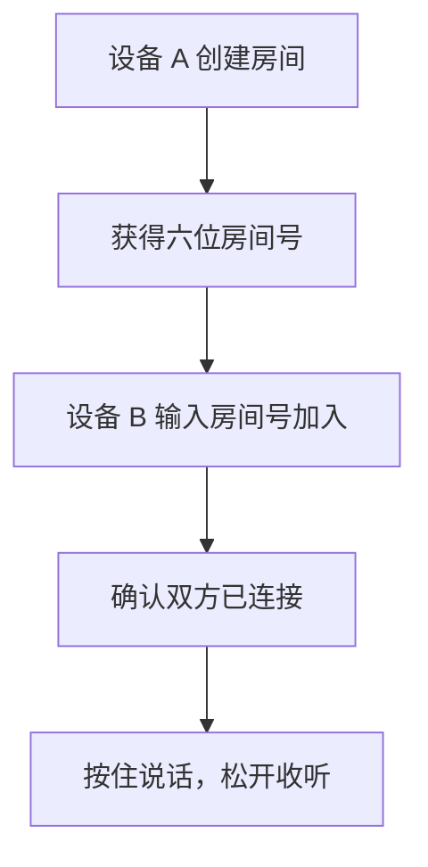
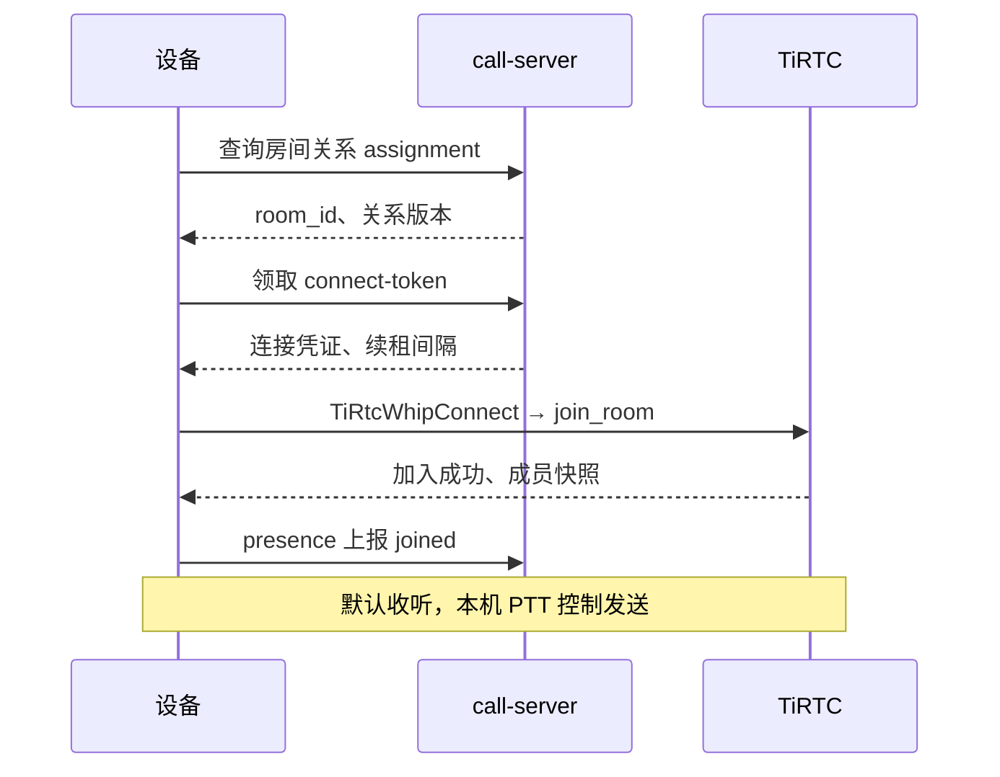

# 设备多人对讲

多台设备加入同一个房间后，按住说话，松开收听。call-server 管理房间，TiRTC 负责音频传输和混音。

**文档导航：** [返回总览](README.md) | [设备上线](device-integration.md) | [HTTP API](api-reference.md#多人对讲call-server) | [设备状态机](device-session-model.md)

## 1. 准备设备

准备至少两台已上线、已绑定的设备，每台使用独立的设备身份。

- **Windows Python 模拟器**：使用 `--with-mic` 启动，可通过本机麦克风和扬声器对讲。安装方法见 [Python 示例](device-sim/device-sim-py/README.md)。
- **Linux C 示例**：默认发送音频文件；播放声音需要通过 `DeviceAdapterV1` 接入播放 sink。接入方法见 [C 示例](device-sim/device-sim-c/README.md)。

## 2. 创建和加入房间



1. 登录 Web，在设备列表中打开设备 A 的“多人对讲”。

2. 点击“创建房间”，记下六位房间号。密码可留空，设置时为四位数字。

3. 打开设备 B 的“多人对讲”，输入房间号和密码，加入同一房间。

4. 确认两台设备实际加入成功。模拟器可输入 `room status` 查看房间号、在线人数和成员列表。

> 创建或加入成功表示请求已保存。离线设备上线后才会连接；正在进行其他通话的设备，会在通话结束后恢复对讲。

Web 页面不定时刷新，需要时手动刷新。“返回首页”回到设备列表，设备仍在房间；确认“退出房间”才会退出。

## 3. 开始对讲

### 使用设备按键

1. 在设备 A 上按住说话键，向麦克风说话。
2. 设备 B 默认收听，无需按键。
3. 松开 A 的说话键，再由 B 按住说话，验证另一个方向。

多人可以同时发言，由 TiRTC 混音。

### 使用模拟器命令

1. 在 A 端输入以下命令，然后说话，确认 B 端能听清：

   ```text
   room ptt down
   ```

2. 说完后，在 A 端停止发送：

   ```text
   room ptt up
   ```

3. 交换 A、B 的操作，验证双向声音。

文件模式下，PTT 开启后发送配置的音频文件。Windows 麦克风模式默认使用系统输入和输出设备，启动日志会显示实际设备名称。

### 常用命令

| 命令 | 用途 |
|---|---|
| `room create [四位密码]` | 创建并加入房间 |
| `room join 六位房间号 [四位密码]` | 加入房间 |
| `room status` | 查看房间、人数和成员状态 |
| `room ptt down` / `room ptt up` | 开始 / 停止发送音频 |
| `room leave` | 退出房间 |

## 4. 房间规则

| 项目 | 规则 |
|---|---|
| 房间号 | 六位数字，保留前导零；密码可选，为四位数字 |
| 设备归属 | 一台设备只保留一个房间关系，加入新房间会离开旧房间 |
| 容量 | 默认最多 100 个有效连接，连接中的预占也计入容量 |
| 在线人数 | 只统计租约有效且已报告加入成功的设备 |
| 其他通话 | 微信 VoIP、设备互呼或 AI 对话期间暂停对讲，结束后同步并恢复 |
| 断线与重启 | 自动同步原房间；旧连接未释放时，等待租约到期后重连 |
| 空房关闭 | 默认连续无人连接 24 小时后关闭，房间号冷却 24 小时后可复用 |

内部 `room_id` 使用 `group_room_` 前缀，既有 ID 仍有效且不会复用。客户端应原样传递 ID，不按前缀判断业务。

## 5. 设备接入流程

页面和 `/v1/call/room/*` 接口由 call-server 提供。统一域名部署时，网关按路径转发到 call-server。请求字段、鉴权和错误码见 [HTTP API](api-reference.md#多人对讲call-server)。



1. **同步关系**：启动、MQTT 重连、收到房间通知及周期同步时，读取 `assignment`。以服务端关系版本为准。

2. **申请连接**：当 `desired_state=joined` 且本机空闲时，生成新的 `session_id`，携带房间 ID 和关系版本领取凭证。

3. **加入 TiRTC**：用返回的 `peer_id`、`token` 调用 `TiRtcWhipConnect`，连接成功后通过 `0x2200` 发送 `join_room`。上下行格式必须与协商结果一致。

4. **报告状态**：收到加入成功确认后上报 `joined`，按返回的间隔续租，默认每 15 秒一次、45 秒失效。上报始终携带当前房间 ID、关系版本和会话 ID，避免旧回调影响新连接。

5. **收发音频**：使用流 ID `1`，校验协商后的 `media`、`flags`。本机 PTT 控制音频发送，`set_mic_state` 只同步发言状态。松键、断开或业务抢占时停止发送。

6. **同步成员**：处理 `room_snapshot`、成员加入、退出、麦克风变化和房间关闭事件。重连后重新获取快照；收到带命名空间的房间 ID 时，校验业务 ID 并固定当前连接的命名空间，上报仍用原始业务 ID。

TiRTC 音频字段见[设备集成说明](https://docs.tange.ai/products/room/guides/device-integration.html)，业务抢占和迟到回调处理见[设备状态机](device-session-model.md)。

MQTT 通知发送到 `device/sn_<device_id>/cmd`，仅用于提醒设备读取最新关系，不控制麦克风，也不携带密码或连接凭证：

```json
{
  "type": "room_assignment_changed",
  "request_id": "<事件ID>",
  "assignment_version": 3,
  "expires_at": 1900000000
}
```

## 6. 部署与验收

1. 按[部署与运维](deployment.md)完成数据库迁移，配置 MySQL、Redis、MQTT 和 TiRTC，再启动 call-server。运行账号只需 DML 权限，迁移需要 DDL 权限；开发环境可使用同一账号。

2. 按需配置 `room.policy`，未发布动态配置时使用 YAML `room` 值。租约须大于两倍心跳间隔，token 超时须小于租约；容量调整只用于新建房间。

3. 用三台设备验证加入、成员列表、双向声音和同时发言，再检查松键停止、其他通话结束后恢复、断线和重启恢复。

4. 接入验收还需覆盖错误密码、容量限制、重复通知、旧会话回调及空房关闭。真实混音、回声和弱网表现需要在设备上测试。

## 7. 问题排查

| 现象 | 处理 |
|---|---|
| 已保存加入请求，人数为 0 | 确认设备完成 TiRTC 加入，再手动刷新页面；MQTT 在线不代表已加入房间 |
| 一直等待成员同步 | 输入 `room status`；检查是否收到并处理 `room_snapshot` |
| 重启后返回 `40921` | 重新同步关系，等待旧租约释放后重试，无需反复退出和加入 |
| 没有声音 | 检查发言端 PTT、麦克风或音频文件，再检查收听端扬声器；C 示例需要播放 sink |
| Windows 声音发闷或嗡嗡响 | 核对输入输出设备，用系统录音检查麦克风，并关闭 Voice Clarity 或音频增强做对比 |
| 其他通话结束后未恢复 | 检查资源是否释放、房间关系是否有效；房间已关闭时需重新建房或加入 |

Python 详细日志按需开启：

1. 输入 `room debug on`。
2. 复现问题，同时收集发言端和收听端日志。
3. 输入 `room debug off`，关闭详细日志。
