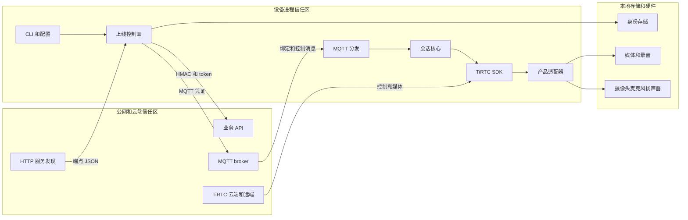

# device-sim-c 威胁模型

## 执行摘要

`device-sim-c` 若作为直连公网的量产设备基线，首要风险来自默认的明文 HTTP 服务发现。发现结果决定设备后续连接的 HTTP、MQTT 和 TiRTC 目标，一旦被在途攻击者篡改，设备可能降级到明文 MQTT、接受伪造的绑定消息，或把控制面连接到恶意服务。由此可形成设备身份接管、远程会话操纵和媒体隐私泄露的完整攻击链。

root 权限会进一步放大明文凭证文件、可预测临时文件、录音路径和动态库替换等问题。远端 MQTT JSON、TiRTC 控制消息和媒体帧也会持续触碰资源耗尽与 C/codec 内存安全边界。

参考实现包含 HMAC、默认 TLS 校验、密码学随机数、有界回调与录音队列、固定缓冲区和会话代次隔离等基础控制。用于量产前，还需要为 HTTP 引导结果增加独立的密码学真实性校验，禁止生产环境降级，使用硬件密钥存储并降低进程权限，同时限制远端消息和落盘数据的大小、速率、路径与配额。

## 范围与假设

- 范围：`thing-connect/device-sim/device-sim-c/src/`、`examples/`、`tests/`、`Makefile`，以及运行时链接的仓库内 TiRTC SDK 边界。
- 目标场景：将 Linux C 参考实现作为量产设备基线，而非仅在隔离开发机运行。
- 部署假设：设备主动直连公网云端；默认 HTTP 服务发现因产品约束必须保留。
- 权限假设：按保守解释，设备进程可能以 root 运行，同机可能存在不可信进程；若实际部署保证专用非 root 用户、只读程序目录和无不可信共驻，TM-006、TM-007、TM-010 的可能性可下调。
- 数据敏感性：`device_key`、临时/MQTT/会话 token、联系人标识、通话控制数据、音视频和 AI 录音均视为敏感。
- 外部服务假设：云端 API、MQTT ACL、token 受众/有效期、TiRTC 服务端鉴权和 SDK 内部实现不在本仓库中；其控制只能按客户端证据确认，未知部分不视为已有缓解。
- 不在范围：云端服务源代码、MQTT broker 配置、TiRTC 闭源库内部、目标板驱动/codec/OTA 实现和物理防拆设计；这些仍作为外部依赖或信任边界纳入风险。

以下问题会直接影响风险排序：量产系统是否具备安全启动和签名 OTA，程序与 SDK 目录是否只读，设备密钥是否存入 TPM、TEE 或安全芯片，云端 MQTT 是否对每个发布者和设备 topic 执行严格 ACL。没有证据确认的控制，统一按“未实现或未验证”处理。

## 系统模型

### 主要组件

- **进程入口与本地控制**：`device_reference_run()` 解析 CLI、环境变量、凭证路径、CA、媒体文件和 `--insecure`，随后驱动完整运行时。Linux 默认产品入口从 `stdin` 接收命令。证据：[`src/main.c`](src/main.c) 的 `device_reference_run`，[`src/linux_device_adapter.c`](src/linux_device_adapter.c) 的 `_linux_poll_action`。
- **上线与控制面**：[`device_flow.c`](src/device_flow.c) 完成 HTTP 服务发现、HMAC 设备上报、token 换取、临时 MQTT 绑定和永久 MQTT 消息分发。
- **会话控制**：[`session_arbiter.c`](src/session_arbiter.c) 与 [`session_coordinator.c`](src/session_coordinator.c) 管理唯一活动会话、待接票据、代次和 STREAM/VOIP/AI/CALL 资源切换。
- **TiRTC 边界**：[`tirtc_runtime.c`](src/tirtc_runtime.c) 是闭源 SDK 生命周期和回调的单一所有者，各业务模块接收远端控制和媒体数据。
- **产品适配器**：[`device_adapter.h`](src/device_adapter.h) 暴露身份、媒体、产品动作、资源、恢复和安全接口；生产实现将该边界连接到摄像头、麦克风、扬声器、安全存储和 UI。
- **本地持久化**：Linux 默认适配器将设备凭证写入 JSON；[`audio_recorder.c`](src/audio_recorder.c) 将 AI 下行音频及格式元数据写入文件。
- **构建与供应链**：[`Makefile`](Makefile) 链接系统 libcurl/libmosquitto/cJSON 和仓库内 `libTiRTC.so`，支持警告升级和 sanitizer，但未定义量产二进制加固或依赖验签流程。

### 数据流与信任边界

- **公网 → 服务发现客户端**：服务端 JSON 经 HTTP GET 进入固定 4096 字节缓冲区；客户端检查必需字段、长度、MQTT scheme 和端口，但不验证响应签名、主机白名单，也允许 `mqtt://`。证据：`src/device_flow.c` 的 `_write_cb`、`device_services_parse_json`、`fetch_services`。
- **设备 → 设备/VoIP/AI/Call API**：HMAC 头或 Bearer token 经 libcurl 发送；HTTPS 时默认校验证书并支持指定 CA，但目标 URL 来自服务发现且 `--insecure` 可关闭校验。证据：`src/http_tls.c` 的 `http_tls_apply`，`src/device_flow.c` 的 `report_device`/`get_mqtt_token`，各业务模块的 HTTP helper。
- **MQTT broker → 临时绑定处理器**：broker 使用临时用户名/token 鉴权，`auth_grant` 可携带新的 `device_id` 和 `device_key`；TLS 是否启用完全由发现结果的 scheme 决定。消息在解析前没有应用层大小上限或签名/重放校验。证据：`src/device_flow.c` 的 `_temp_on_message`、`connect_temp_mqtt`。
- **MQTT broker → 永久消息分发器**：broker 使用 `device_id`/`mqtt_token` 鉴权，客户端订阅两个设备 topic，并按 `type`/`channel` 触发解绑、来电、取消和联系人更新。客户端不验证消息级签名、签发者、时间戳或 nonce。证据：`src/device_flow.c` 的 `_perm_on_connect`、`_perm_on_message`。
- **TiRTC 云端/远端 peer → SDK → 业务模块**：控制 JSON 和音视频帧由闭源 SDK 回调进入 C 代码。延迟控制队列限制为 32 项、单项复制上限 2048 字节；但通用产品 media sink 仅拒绝空帧，没有统一最大帧长。证据：`src/sdk_callback_guard.h`，`src/device_adapter.c` 的 `device_media_sink_submit`。
- **本地操作者/进程 → CLI、环境与文件**：设备身份、端点、CA、媒体、输出目录和不安全模式可由 CLI/环境设置；Linux 默认命令入口没有额外鉴权，依赖 OS 权限边界。证据：`src/main.c` 的选项解析，`src/linux_device_adapter.c` 的 `_linux_poll_action`。
- **核心 → 身份存储**：凭证以 JSON 明文写入 `<path>.tmp` 后 rename，目标模式为 `0600`；路径来自 CLI/环境，打开时会跟随符号链接。证据：`src/linux_device_adapter.c` 的 `_linux_identity_load`、`_linux_identity_save`。
- **远端媒体 → 本地录音文件**：AI 音频进入 64 项有界队列，单帧最大 4096 字节，再持续写 raw/wav/JSON；目录由本地配置和 `device_id` 拼接，没有目录遍历规范化、符号链接防护、总大小或保留期限。证据：`src/audio_recorder.h`、`src/audio_recorder.c` 的 `_mkdir_p`、`audio_recorder_open`、`audio_recorder_submit`。
- **构建产物 → root 运行时**：动态加载器通过相对 `$ORIGIN` RUNPATH 查找仓库内 TiRTC SDK，同时加载系统网络/JSON 库；安装目录完整性决定进入 root 进程的代码完整性。证据：`Makefile` 的 `RPATH`、`SDK_LIB`、`CFLAGS` 和 `LDFLAGS`。

#### 架构图

## 资产与安全目标

| 资产 | 重要性 | 安全目标（C/I/A） |
|---|---|---|
| `device_key` 与设备身份 | 泄露后可冒充设备、换取 token，并可能长期控制设备身份 | C、I |
| 临时、MQTT、AI、VoIP、Call token | 在有效期内提供 broker、业务或会话访问能力 | C、I |
| 服务发现结果与 CA 配置 | 决定所有后续信任目标；被篡改可接管控制面 | I、A |
| MQTT 控制消息和会话状态 | 控制绑定、解绑、来电、取消、联系人和会话生命周期 | I、A |
| 音视频和 AI 对话内容 | 可能包含家庭/办公环境隐私和个人数据 | C、I |
| 联系人、设备 ID、房间 ID、openid | 可用于用户关联、骚扰、跟踪或会话劫持 | C、I |
| 设备算力、内存、磁盘和媒体硬件 | 资源耗尽会使设备离线；麦克风/摄像头滥用造成直接用户伤害 | C、I、A |
| 产品适配器、TiRTC SDK 与最终固件 | 任一被替换或利用都可能在高权限进程执行攻击者代码 | I、A |
| 安全日志和恢复信号 | 影响攻击检测、故障定位与批量事件响应 | I、A |

## 攻击者模型

### 攻击能力

- 位于设备与公网之间，可读取、阻断和修改明文 HTTP 服务发现流量，例如恶意 Wi-Fi、被攻陷网关或上游网络节点。
- 能控制或入侵某个发现端点、业务 API、MQTT 发布者/broker、远端通话 peer，或窃取一个有时效的 token。
- 能向其获准发布的 MQTT topic 发送任意大小、速率和结构的 JSON，或通过 TiRTC 会话发送畸形/高码率控制与媒体数据。
- 同机不可信进程可能读写共享目录、诱导服务使用攻击者准备的路径或影响启动配置；设备主进程可能以 root 运行。
- 可重复断网、重连、发起来电或填满队列，尝试触发竞态、资源耗尽和迟到回调路径。

### 不具备的能力

- 未假设攻击者可仅凭观测 HMAC-SHA256 签名恢复 `device_key`；随机数实现优先 `getrandom()` 并在失败时使用 `/dev/urandom`。
- 未假设攻击者已控制受信任 CA 私钥、量产签名密钥或云端数据库；若实际发生，此处客户端控制不足以独立恢复信任。
- 仓库未实现入站 HTTP/TCP 服务器，因此普通公网扫描者不能直接连接本进程；远端输入需经过发现、broker、业务 API 或 TiRTC/peer 信道。
- 未把闭源 `libTiRTC.so` 内部缺陷断言为已存在漏洞；只把它及其回调数据视为需隔离、验证和更新的高风险边界。

## 入口与攻击面

| 攻击面 | 入口 | 信任边界 | 说明 | 证据（仓库路径 / 符号） |
|---|---|---|---|---|
| HTTP 服务发现 | 设备启动时公网 GET | 公网 → 上线控制面 | 明文、无响应签名；结果决定全部后续端点 | `src/device_flow.c` / `fetch_services` |
| 设备 report/token API | 发现后的 HTTP(S) POST | 设备身份 → 云 API | 使用 HMAC、时间戳和 nonce；目标仍受发现结果控制 | `src/device_flow.c` / `report_device`, `get_mqtt_token` |
| 临时 MQTT `auth_grant` | 首次/重新绑定时 broker 下发 | broker → 身份存储 | 可直接下发长期 `device_key`；无消息级真实性和大小限制 | `src/device_flow.c` / `_temp_on_message` |
| 永久 MQTT 消息 | `/cmd` 与 `/notify` topic | broker → 会话核心 | 控制解绑、来电、取消和联系人；依赖 broker ACL | `src/device_flow.c` / `_perm_on_message` |
| 业务 API JSON | Bearer token 请求和响应 | 云 API → 业务模块 | 固定响应缓冲提供部分大小控制；字段级验证不一致 | `src/tirtc_ai.c`, `src/tirtc_voip.c`, `src/call_session.c` |
| TiRTC 控制 JSON | SDK command callback | SDK/远端 → 业务状态机 | 部分路径限制为 2048 字节并延后处理 | `src/sdk_callback_guard.h`, `src/tirtc_ai.c`, `src/tirtc_call.c` |
| TiRTC 音视频帧 | SDK audio/video callback | SDK/远端 → product sink/codec | 通用 sink 无统一最大帧长；生产 codec 扩大内存安全面 | `src/device_adapter.c` / `device_media_sink_submit` |
| CLI 和环境变量 | 本地启动参数、服务管理器配置 | OS 用户/进程 → root 进程 | 可设置密钥、CA、端点、输入输出路径和不安全模式 | `src/main.c` / `device_reference_run` |
| `stdin` 产品动作 | 本地终端/管道 | OS 用户/进程 → 会话核心 | 默认实现仅依赖文件描述符的 OS 权限 | `src/linux_device_adapter.c` / `_linux_poll_action` |
| 凭证 JSON | 启动加载、绑定后保存 | 文件系统 → 身份核心 | 明文 `0600`，可预测 `.tmp`，跟随符号链接 | `src/linux_device_adapter.c` / `_linux_identity_load`, `_linux_identity_save` |
| 上行媒体文件 | CLI/环境指定文件 | 文件系统 → 媒体解析器 | 最大 256 MiB并校验容器/帧格式，但仍解析攻击者文件 | `src/file_media_source.c` / `_read_file`, `file_media_source_open` |
| AI 录音目录 | 远端媒体持续写入 | 远端媒体/本地路径 → 文件系统 | 有界内存队列，无磁盘配额和安全目录遍历 | `src/audio_recorder.c` / `audio_recorder_open` |
| Product Adapter V1 | 产品在启动前安装函数表 | 产品代码/硬件 → 核心 | 回调所有权和非阻塞约束清晰，但由产品实现兑现 | `src/device_adapter.h` / `DeviceAdapterV1` |
| 动态库与依赖 | 启动时动态加载 | 安装/更新链 → root 进程 | 相对 RUNPATH；未见构建产物验签与量产加固目标 | `Makefile` / `RPATH`, `SDK_LIB` |

## 主要滥用路径

1. **接管引导控制面**：攻击者取得公网在途位置 → 修改明文 `/services` 响应 → 下发恶意设备 API、MQTT broker 与 TiRTC 端点 → 设备信任伪造响应并进入攻击者控制的会话路径 → 设备身份完整性、媒体隐私和可用性受损。
2. **伪造首次绑定并持久化攻击者身份**：攻击者篡改发现结果并提供恶意 `mqtt://` broker → 返回自选临时凭证和 `auth_grant` → 客户端接收并将 `device_id/device_key` 保存到本地 → 设备被永久绑定到攻击者控制身份。
3. **利用 MQTT 控制设备会话**：攻击者窃取 7 天 MQTT token、攻陷有发布权限的服务或利用过宽 broker ACL → 向设备 topic 发送无消息签名的 `call_incoming`/`unbind`/`cancel` → 触发骚扰来电、业务中断、联系人状态变化或会话切换。
4. **使用超大/高频 JSON 使设备离线**：恶意 broker/发布者反复发送大包或深层 JSON → libmosquitto 收包后由 cJSON 在网络回调分配和解析 → CPU/堆内存耗尽、心跳和控制处理延迟 → 看门狗重启或设备长期离线。
5. **攻击媒体解析和播放链**：恶意或被攻陷的 peer 建立合法会话 → 发送畸形 codec 帧或异常长度/码率 → 数据经闭源 SDK 到产品 decoder/sink → 触发内存破坏或资源耗尽 → 在 root 设备进程执行代码或控制摄像头/麦克风。
6. **窃取 root 进程写入的长期设备密钥**：本地低权限进程在可写目录预置 `<creds>.tmp` 符号链接 → root 进程以 `O_TRUNC` 跟随链接写入 JSON → 攻击者读取其控制的链接目标 → 冒充设备并长期获取业务 token。
7. **利用录音路径和无限增长破坏系统**：攻击者控制或影响 `device_id`/输出目录，或持续发送 AI 音频 → 未规范化路径被拼接且 `fopen` 跟随链接，文件无总量/时长限制 → root 在非预期位置创建内容或填满系统分区 → 其他服务故障、日志和更新失败。
8. **将测试降级带入量产**：启动配置被误设或同机攻击者影响服务参数 → Linux 默认安全适配器批准 `--insecure`，发现结果还可选择 `mqtt://` → 证书验证和 MQTT 加密被关闭 → token、绑定密钥、消息和媒体控制遭窃听或篡改。
9. **替换运行时 SDK 获取 root 执行**：攻击者获得程序/SDK 安装树写权限或更新链被污染 → 替换相对 RUNPATH 指向的 `libTiRTC.so` → 服务重启 → 恶意库在 root 进程加载并读取设备密钥、媒体和硬件。

## 威胁清单

| 威胁编号 | 威胁来源 | 前提 | 攻击行为 | 影响 | 受影响资产 | 现有控制（证据） | 缺口 | 建议缓解措施 | 检测思路 | 可能性 | 影响等级 | 优先级 |
|---|---|---|---|---|---|---|---|---|---|---|---|---|
| TM-001 | 公网在途攻击者 | 能修改设备的明文 HTTP；量产要求保留 HTTP 发现 | 篡改服务发现，替换全部后续 API、MQTT 和 RTC 端点 | 批量设备控制面接管、会话操纵、隐私泄露和离线 | 发现配置、身份、token、媒体、设备可用性 | 响应上限 4096 字节；必需字段、长度、MQTT scheme/端口检查（`device_services_parse_json`） | 无来源真实性、签名、过期/版本、主机白名单；允许 `mqtt://` | 保留 HTTP 但对 canonical JSON 使用 Ed25519/ECDSA 离线根密钥签名；固件固定验证公钥、产品/区域 audience、单调版本、签发/过期时间；只接受白名单 HTTPS/WSS/MQTTS 域和端口；验证失败 fail closed 并使用签名缓存 | 统计签名失败、端点变化、scheme 降级、版本回退；批量设备同时发现异常告警 | 高：公网在途能力现实，且每次启动进入此边界 | 高：可影响后续全部信道和大批设备 | **critical** |
| TM-002 | 在途攻击者或恶意绑定 broker | 可控制发现响应或临时 MQTT 路径，设备处于首次/重绑状态 | 降级到明文 MQTT并伪造 `auth_grant`，注入长期设备身份 | 永久错误绑定、身份接管、设备劫持或批量报废 | `device_key`、设备身份、绑定状态 | 临时用户名/token；TLS 可用；凭证日志隐藏（`connect_temp_mqtt`, `_temp_on_message`） | TLS 由不可信发现结果决定；`auth_grant` 无端到端签名/挑战绑定；解析前无大小限制 | 生产只接受 MQTTS；让 `auth_grant` 由绑定服务签名并绑定设备硬件 ID、一次性 challenge、发现版本和过期时间；将设备公钥/硬件证明纳入绑定；保存前二次校验 | 监控绑定来源、设备身份变化、重复验证码、broker 指纹、同批异常重绑 | 高：TM-001 成功后无需更多信任条件 | 高：持久身份被替换 | **critical** |
| TM-003 | token 窃取者、恶意发布者或被攻陷 broker | 获得有效 MQTT 凭证或 broker ACL 允许越权发布 | 伪造、重放或乱序发送会话/解绑/联系人控制消息 | 未授权会话、骚扰、隐私损害、业务中断 | 会话状态、联系人、媒体硬件、可用性 | MQTT 用户名/token；精确订阅两个设备 topic；会话仲裁与 generation 隔离（`_perm_on_connect`, `session_arbiter.c`） | 客户端无消息级签名、issuer/audience、timestamp/nonce、序列和重放缓存；topic ACK 判断使用子串 | 每条命令使用服务专用签名/MAC并绑定完整 topic、device ID、类型、payload hash、序列、签发/过期时间；严格 topic equality；云端最小发布 ACL；短 token 和轮换 | 记录签发者、命令 ID/序列、重放拒绝、跨 topic 尝试、异常来电率 | 中：依赖 token/服务/ACL 失守，但 token 有 7 天窗口 | 高：可远程操纵会话和设备状态 | **high** |
| TM-004 | 恶意 broker/发布者 | 可向已订阅 topic 发布消息 | 发送超大、高频或深层 JSON，在 MQTT 回调中消耗内存/CPU | 进程崩溃、心跳阻塞、看门狗重启、设备离线 | 内存、CPU、MQTT 可用性 | 后续拒接队列和 SDK 队列有界；无效 JSON被拒绝 | `msg->payloadlen` 在 `cJSON_ParseWithLength` 前无上限；无深度、速率和每类命令配额 | 在回调首行限制 payload，例如 8 KiB；配置 broker/client 最大包；限制 JSON 深度和字段长度；设备/类型令牌桶；过载时丢弃并断开退避；解析移出网络线程 | payload 大小直方图、解析耗时、拒绝/限流计数、堆高水位、回调延迟 | 中：需要 broker 发布能力，但一旦获得易利用 | 中到高：可稳定造成设备离线 | **high** |
| TM-005 | 恶意 peer、云端或媒体发送者 | 能建立或劫持合法 TiRTC 会话 | 发送畸形控制/codec 帧、异常帧长或码率攻击 SDK/产品 decoder | C 内存破坏、root RCE、媒体泄露或持续 DoS | 进程完整性、硬件、媒体、设备可用性 | SDK 控制复制上限 2048；回调队列 32；AI 录音帧上限 4096且队列 64；回调要求非阻塞（`sdk_callback_guard.h`, `audio_recorder.h`, `device_adapter.h`） | 闭源 SDK不可审计；通用 media sink 无全局帧长/码率上限；产品 decoder 未实现；进程可能 root | 在 SDK 边界按 codec/分辨率限制帧长、码率、时间戳和格式；codec 放入非 root seccomp 沙箱进程；对开源解析层做 libFuzzer/AFL++；要求 SDK SBOM、签名、CVE/SLA 和快速升级；启用 ASan/UBSan/TSan CI | codec 崩溃、异常帧长/码率、解码超时、沙箱退出、同 peer 重复错误告警 | 中：需会话权限或上游失守；媒体解析器通常复杂 | 高：root 场景可导致完全设备接管 | **high** |
| TM-006 | 同机低权限进程 | 可写凭证文件所在目录或影响 `--creds-file`，root 进程随后保存凭证 | 预置可预测 `.tmp` 符号链接，利用 `open(O_TRUNC)` 跟随链接窃取密钥或破坏 root 文件 | 长期设备冒充、本地文件破坏、权限提升链 | `device_key`、本地系统完整性 | JSON 长度上限 8192；目标模式 `0600`；写入后 `fsync` 再 `rename`（`_linux_identity_save`） | 明文密钥；无 `O_NOFOLLOW/O_EXCL/O_CLOEXEC`、`fstat`、安全目录 fd、随机临时名或目录 `fsync` | 量产使用 TPM/TEE/安全芯片且密钥不可导出；过渡方案使用 root-owned `0700` 固定目录、`openat2`/`openat`+`O_NOFOLLOW|O_EXCL|O_CLOEXEC`、随机临时名、`fstat` regular/owner/link count、`renameat2` 和父目录 `fsync`；加载同样拒绝 symlink | 凭证路径/owner/mode/inode 变化、异常重绑、密钥使用失败；启动自检目录权限 | 中：依赖本地目录/配置影响能力，量产布局可显著降低 | 高：密钥失窃可长期冒充，root 文件可被破坏 | **high** |
| TM-007 | 恶意媒体发送者或本地路径操纵者 | 能持续发送 AI 音频，或控制输出目录/device ID/符号链接 | 绕出预期目录、跟随链接写文件或无限增长录音 | 磁盘耗尽、非预期 root 文件创建/覆盖、隐私长期留存 | 文件系统、可用性、录音隐私 | 单帧 4096 字节；队列 64，满时丢帧；路径总长检查（`audio_recorder_submit`, `audio_recorder_open`） | `_mkdir_p` 接受 `..`/symlink；文件用普通 `fopen`；无会话时长、总字节、文件数、保留期、分区配额 | device ID 只允许固定字符集；基于可信 dirfd 用 `openat2(RESOLVE_BENEATH|NO_SYMLINKS)`；文件 `O_NOFOLLOW|O_EXCL|0600`；独立 noexec/nodev/nosuid 配额分区；按会话/日/设备限制字节和保留期；磁盘不足提前停止 | 磁盘水位、每会话字节、文件创建失败、路径拒绝、录音持续时间和异常 peer | 中：持续媒体容易，路径利用需额外本地或控制面能力 | 高：可使整机不可用并扩大 root 写路径 | **high** |
| TM-008 | 配置错误、维护人员或本地攻击者 | 能设置环境/CLI，或发现结果返回不安全 scheme | 使用 `--insecure`、自定义 CA/端点或 `mqtt://` 禁用认证/加密 | token/密钥泄露、控制消息篡改、中间人攻击 | 全部网络凭证、控制与媒体 | 默认 HTTP TLS 校验开启；产品适配器拥有审批 hook；启用时记录警告（`http_tls_apply`, `device_security_allow_insecure_transport`） | Linux 默认适配器无条件批准；生产/测试开关未编译隔离；MQTT 明文无需审批 hook | 量产 adapter 永远返回 false；量产构建移除 `--insecure` 与环境开关；只允许签名发现中的安全 scheme；CA 存储只读且支持双槽轮换；开发固件使用不同签名根和明显标识 | 启动证明中上报安全模式、CA hash、固件 flavor；发现任何 insecure 启动即阻断上线并告警 | 中：常见于部署失误，若本地配置可控则更高 | 高：直接移除信道真实性和保密性 | **high** |
| TM-009 | 远端消息/服务/peer | 能控制被日志记录的 type、channel、房间、联系人、ASR/TTS 或 URL 字符串 | 注入换行/ANSI 控制符、伪造安全日志，或让敏感元数据长期留存 | 误导运维、隐藏攻击、终端欺骗、隐私泄露 | 日志完整性、联系人和会话元数据 | 密钥/token 值大多隐藏；媒体日志限频；中央日志有锁（`common.c`, `media_rx_log.c`） | 未统一清除控制字符；debug 默认开启；远端文本和标识直接 `%s` 输出；缺少结构化事件 ID/脱敏政策 | 统一转义 CR/LF/ESC 和不可打印字符；量产默认 info；联系人/房间/设备 ID hash 或截断；结构化安全日志写入受保护 sink；敏感字段清单测试 | 告警控制字符、超长/截断字段、日志解析失败和日志量异常 | 中：多类远端字段可控 | 中：主要影响检测与隐私，通常需与其他攻击组合 | **medium** |
| TM-010 | 本地安装树攻击者或供应链攻击者 | 能写程序/SDK目录、污染构建依赖或更新包 | 替换 `libTiRTC.so`/系统库或投递未加固二进制，在 root 启动时执行 | 完全设备接管、密钥和媒体窃取、持久化 | 固件、SDK、密钥、硬件和更新链 | SDK 固定版本目录；严格警告和 sanitizer 可手动启用（`Makefile`） | 相对 RUNPATH；未见 artifact 签名/SBOM/哈希验证；默认构建缺少明确 PIE、stack protector、FORTIFY、RELRO/NOW、CFI；CI 未见强制 sanitizer/fuzz | 程序和 SDK 放只读 dm-verity/签名分区；OTA/启动链验证；生成 SBOM并验签第三方库；使用绝对受保护库路径或静态受控链接；启用 PIE、`-fstack-protector-strong`、FORTIFY、RELRO/NOW、noexecstack；CI 强制 sanitizer、静态分析和 fuzz | 启动度量/远程证明、库 hash 变化、签名失败、版本/CVE 清单、构建 provenance 告警 | 中：依赖本地写入或供应链失守；更新链规模放大风险 | 高：root 进程加载即完全失陷 | **high** |

## 风险等级说明

- **Critical**：无需已控制设备即可跨公网或局域网在途位置批量改变信任根、持久设备身份或获得等价控制。例：篡改无签名 HTTP 发现接管全部后续端点；伪造 `auth_grant` 将量产设备持久绑定到攻击者身份；可规模化窃取不可轮换的设备根密钥。
- **High**：需要一个重要但现实的前提（有效 token、broker/peer 权限、本地目录写入、更新链污染），成功后造成 root RCE、设备密钥泄露、未授权媒体会话或稳定离线。例：恶意 codec 帧利用 decoder；凭证 `.tmp` 符号链接窃密；无限录音填满系统盘。
- **Medium**：主要造成局部隐私泄露、审计受损或可恢复的单设备 DoS，通常需要与另一条攻击链组合。例：日志控制字符注入；短时队列填满并丢帧；暴露不含密钥的设备/房间元数据。
- **Low**：仅泄露低敏感调试信息、产生明显且容易恢复的噪声，或需要攻击者已经拥有更高权限。例：已具 root 后修改日志等级；触发一次无状态错误日志；让本地演示媒体文件校验失败。

## 安全审查重点路径

| 路径 | 重要性 | 相关威胁编号 |
|---|---|---|
| [`src/device_flow.c`](src/device_flow.c) | 明文发现、HMAC/token、临时与永久 MQTT 入口集中于此，是最高价值信任边界 | TM-001, TM-002, TM-003, TM-004, TM-008 |
| [`src/http_tls.c`](src/http_tls.c) | 统一控制所有 libcurl 证书验证，应承载生产 fail-closed、scheme 和 CA 策略 | TM-001, TM-008 |
| [`src/main.c`](src/main.c) | CLI/环境、端点、CA、凭证、媒体路径和不安全开关汇聚，决定量产配置攻击面 | TM-001, TM-006, TM-007, TM-008 |
| [`src/linux_device_adapter.c`](src/linux_device_adapter.c) | 明文身份文件、符号链接风险、随机源和不安全传输审批均在默认实现 | TM-006, TM-008 |
| [`src/device_adapter.h`](src/device_adapter.h) | 量产安全存储、媒体 sink、资源和恢复契约的公共边界 | TM-005, TM-006, TM-007, TM-008 |
| [`src/device_adapter.c`](src/device_adapter.c) | 通用媒体帧验证和安全 hook 执行点，适合增加全局硬限制 | TM-005, TM-008 |
| [`src/audio_recorder.c`](src/audio_recorder.c) | 处理不可信媒体到 root 文件系统的路径、队列和持续写入 | TM-005, TM-007 |
| [`src/sdk_callback_guard.c`](src/sdk_callback_guard.c) | 远端控制事件的有界复制、队列过载和关闭屏障实现 | TM-004, TM-005 |
| [`src/tirtc_runtime.c`](src/tirtc_runtime.c) | 闭源 SDK 生命周期、统一回调和 device secret 进入点 | TM-001, TM-005, TM-010 |
| [`src/tirtc_ai.c`](src/tirtc_ai.c) | 解析远端 AI 控制文本并保存下行音频，包含隐私、日志和文件风险 | TM-005, TM-007, TM-009 |
| [`src/tirtc_voip.c`](src/tirtc_voip.c) | 处理联系人、微信标识、来电控制和远端媒体 | TM-003, TM-005, TM-009 |
| [`src/tirtc_call.c`](src/tirtc_call.c) | 处理 peer 控制命令、room ID 和远端媒体回调 | TM-003, TM-005, TM-009 |
| [`src/call_session.c`](src/call_session.c) | 业务 API token、联系人/房间 JSON 与异步拒接队列 | TM-003, TM-004, TM-009 |
| [`src/file_media_source.c`](src/file_media_source.c) | 解析最高 256 MiB 的本地编码媒体，是本地文件驱动的 C 解析面 | TM-005, TM-010 |
| [`src/common.c`](src/common.c) | 所有远端文本最终进入中央日志，应统一转义和脱敏 | TM-009 |
| [`Makefile`](Makefile) | 动态库路径、编译加固、sanitizer 和供应链校验的落地点 | TM-005, TM-010 |
| [`examples/product_adapter_template.c`](examples/product_adapter_template.c) | 量产适配起点，必须防止演示 fallback 和未完成安全 TODO 被发布 | TM-005, TM-006, TM-007, TM-008 |
| [`tests/test_core.c`](tests/test_core.c) | 应增加签名发现、MQTT 上限/重放、symlink、路径遍历、磁盘配额和日志转义回归测试 | TM-001, TM-002, TM-003, TM-004, TM-006, TM-007, TM-009 |

## 完整性检查

- [x] 覆盖发现的公网入口：服务发现、业务 API、临时/永久 MQTT、TiRTC 控制和媒体。
- [x] 覆盖本地入口：CLI、环境变量、stdin、凭证/媒体/录音路径、动态库加载和 Product Adapter。
- [x] 每个主要信任边界至少映射到一个威胁；关键链路以 TM-001/TM-002 单独建模。
- [x] 区分量产运行时、外部云/SDK、构建供应链以及测试/示例代码。
- [x] 量产、公网、保留 HTTP、高权限运行和同机不可信进程均按保守假设纳入。
- [x] 对未提供证据的云端 ACL、硬件密钥、Secure Boot/OTA 和 SDK 内部控制保持开放问题，没有把它们误记为已有缓解。
