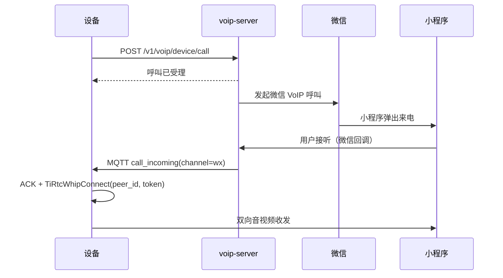

# 微信 VoIP 对讲设备接入

微信小程序与设备之间的 VoIP 对讲接入：授权列表、来电、外呼、拒接、取消，以及设备侧如何使用 <a href="https://docs.tange.ai/products/tirtc/api-reference/c.html#tirtcwhipconnect" target="_blank" rel="noopener">`TiRtcWhipConnect`</a> 建连。

> 本文只描述 VoIP 业务链路。设备上线与 MQTT 规范见 [device-integration.md](device-integration.md)；字段、错误码和微信回调格式见 [api-reference.md#voip-server](api-reference.md#voip-server)。如果一台设备同时跑 VoIP / AI / 设备呼设备，请同时看 [device-session-model.md](device-session-model.md)。

**文档导航：** [返回总览](README.md) | [返回设备入口](device-integration.md) | [H5 实时](device-h5-live.md) | [AI 对讲](device-ai.md) | [设备呼设备](device-call.md) | [统一状态机](device-session-model.md)

## 目录

- [快速接入](#快速接入)
- [设备侧前提](#设备侧前提)
- [小程序端接入](#小程序端接入)
- [小程序呼设备](#小程序呼设备)
- [设备呼小程序](#设备呼小程序)
- [授权列表与联系人](#授权列表与联系人)
- [拒接与取消](#拒接与取消)
- [协议速查](#协议速查)
- [问题排查](#问题排查)

---

## 快速接入

设备侧接入微信 VoIP，至少要完成这 4 步：

1. 按 [device-integration.md](device-integration.md) 上线，拿到 `mqtt_token`
2. 启动后调用 [`POST /v1/voip/device/profile`](api-reference.md#post-v1voipdeviceprofile)
3. 监听 MQTT `device/sn_{device_id}/cmd` 和 `device/sn_{device_id}/notify`
4. 收到 `call_incoming` 后，用 payload 里的 `peer_id + token` 调 <a href="https://docs.tange.ai/products/tirtc/api-reference/c.html#tirtcwhipconnect" target="_blank" rel="noopener">`TiRtcWhipConnect(peer_id, token, callback, NULL);`</a>：返回 `0` 只表示请求已提交，真正结果看连接回调 `callback(error, hconn, ...)`，`error == 0` 才算建连成功。完整流程见[小程序呼设备](#小程序呼设备)

VoIP 使用的是 **WHIP client -> server** 模式，核心 API 是：

- <a href="https://docs.tange.ai/products/tirtc/api-reference/c.html#tirtcwhipconnect" target="_blank" rel="noopener">`TiRtcWhipConnect`</a>

不是设备呼设备里用的 <a href="https://docs.tange.ai/products/tirtc/api-reference/c.html#tirtcconnect" target="_blank" rel="noopener">`TiRtcConnect`</a>。

**完成标志：**

- **设备侧**：MQTT 收到 `call_incoming` 且 payload 含 `peer_id` + `token`；接听后 <a href="https://docs.tange.ai/products/tirtc/api-reference/c.html#tirtcwhipconnect" target="_blank" rel="noopener">`TiRtcWhipConnect`</a> 回调 `error == 0`。
- **对端（小程序）**：<a href="https://developers.weixin.qq.com/miniprogram/dev/framework/device/voip/auth.html" target="_blank" rel="noopener">`wx.requestDeviceVoIP`</a> 成功、[`POST /v1/voip/user/report-auth`](api-reference.md#post-v1voipuserreport-auth) 返回 200；发起呼叫后设备端收到 MQTT 来电。

---

## 设备侧前提

### 1. 上报媒体能力

设备上线完成后，应尽快调用：

- [`POST /v1/voip/device/profile`](api-reference.md#post-v1voipdeviceprofile)

这是接 VoIP 前的硬前提。当前实现中，如果微信回调发生时服务端查不到设备 profile，推送 `call_incoming` 会失败。

**完整字段说明、枚举值与错误码见：** [api-reference.md#post-v1voipdeviceprofile](api-reference.md#post-v1voipdeviceprofile)

至少应上报：

- 音频采样率、声道数
- 是否有视频能力
- 上下行视频/音频编码能力
- 呼叫超时

参考实现：

- C VoIP 完整实现：[device-sim/device-sim-c/src/tirtc_voip.c](device-sim/device-sim-c/src/tirtc_voip.c)
- C 方法声明：[device-sim/device-sim-c/src/tirtc_voip.h](device-sim/device-sim-c/src/tirtc_voip.h)

**HTTP 请求：**

```http
POST /v1/voip/device/profile
Authorization: Bearer <mqtt_token>
Content-Type: application/json
```

```jsonc
{
  "screen_width": 1,          // 设备自身屏幕宽度（px）；纯语音设备传 1
  "screen_height": 1,         // 设备自身屏幕高度（px）；纯语音设备传 1
  "camera_rotation": 0,       // 设备视频顺时针旋转角度：0 / 90 / 180 / 270
  "aspect_ratio": 1.3333333333, // 设备视频宽高比，此处为 4:3
  "hor_mirror": false,        // 是否水平镜像设备视频
  "vert_mirror": false,       // 是否垂直镜像设备视频
  "object_fit": "contain",    // 视频缩放方式：fill / contain
  "audio_rate": 8000,         // 音频采样率：8000 / 16000 Hz
  "audio_channels": 1,        // 音频声道数：1 / 2
  "up_video_mt": "none",      // 设备→小程序不发送视频
  "down_video_mt": "none",    // 小程序→设备不发送视频
  "down_audio_mt": "alaw",    // 小程序→设备使用 G.711 A-law
  "no_video": true,           // 是否为无视频能力的纯语音设备
  "calling_timeout_sec": 30   // 呼叫超时时间（秒）
}
```

> 上述代码块使用注释辅助说明；实际 HTTP 请求体必须移除 `//` 注释，发送标准 JSON。

`camera_rotation`、`aspect_ratio`、`hor_mirror`、`vert_mirror`、`object_fit` 分别
控制设备视频的旋转角度、宽高比、水平镜像、垂直镜像和缩放方式。旋转只允许
`0/90/180/270`，宽高比必须大于 `0`，缩放方式只允许 `fill/contain`。这些值是设备
能力，应随 profile 上报，不需要每次呼叫重复传；均可省略，省略后微信插件使用默认值。
小程序在通话开始前通过微信插件
[`setUIConfig`](https://developers.weixin.qq.com/miniprogram/dev/framework/device/voip-plugin/api/setUIConfig.html)
配置通话页面。设备呼叫小程序时，设备是 caller，profile 中的视频 UI 值会同时用于
caller 和 listener 通话页面，但手机 listener 的 `cameraRotation` 固定为 `0`。
当 `object_fit=contain` 时，小程序使用手机 `screenHeight / screenWidth` 作为两端
`aspectRatio`，避免按设备视频比例创建容器后让 `contain` 与 `fill` 看起来相同。
小程序呼叫设备时，两路视频分别设置：
小程序是 caller，`callerUI.cameraRotation` 固定为 `0`；设备是 listener，
`listenerUI` 使用设备 profile 的旋转、镜像和缩放值，避免设备配置同时影响
小程序本机预览。设备主动外呼时，
voip-server 会把 profile 中已上报的值自动加入微信呼叫 query。小程序主动呼设备时，
设备视频的 `objectFit` 使用 profile 的 `object_fit`，小程序同时按手机
`screenHeight / screenWidth` 设置页面 `aspectRatio`，从而保持设备视频完整显示。
小程序启动时直接使用 query 中的视频 UI 参数并立即调用 `setUIConfig`。如果 query
中带有 `device_id`、`deviceId` 或微信入呼参数 `callerId`，参数缺失时也可读取设备
列表刷新时保存的本地 profile 缓存。每次设备列表刷新成功都会整体替换该缓存。

**成功返回：**

```json
{ "code": 0, "msg": "ok", "data": null }
```

### 2. 监听两类 MQTT 消息

VoIP 相关下行消息有三类：

| type | topic | 说明 |
|------|-------|------|
| `call_incoming` | `device/sn_{device_id}/cmd` | 来电 |
| `call_cancel` | `device/sn_{device_id}/notify` | 对方取消/挂断 |
| `callers_update` | `device/sn_{device_id}/notify` | 授权列表变化 |

其中 `cmd` topic 的消息要回 ACK。

---

## 小程序端接入

这一节描述的是**微信小程序端**如何接入当前 VoIP 链路，不是设备端如何接听。

当前仓库可直接参考：

- 小程序总体说明：[weixin-mini-program/README.md](weixin-mini-program/README.md)
- 设备列表页实现：[weixin-mini-program/pages/devices/index.js](weixin-mini-program/pages/devices/index.js)
- 小程序全局 VoIP 取消回调：[weixin-mini-program/app.js](weixin-mini-program/app.js)

### 1. 前置条件

小程序端要正常呼叫设备，至少要满足：

1. 用户已在小程序里登录，拿到 `user_jwt`
2. 当前设备已经绑定到这个登录用户
3. 小程序已配置 `wmpf-voip` 插件
4. 设备已完成 [`POST /v1/voip/device/profile`](api-reference.md#post-v1voipdeviceprofile)，否则微信回调到服务端后无法下发 `call_incoming`

### 2. 小程序初始化

当前实现里，设备列表页加载时会同步：

1. <a href="https://developers.weixin.qq.com/miniprogram/dev/api/open-api/login/wx.login.html" target="_blank" rel="noopener">`wx.login()`</a>，再调用 [`POST /v1/voip/user/wechat-mini-login`](api-reference.md#post-v1voipuserwechat-mini-login)
2. <a href="https://developers.weixin.qq.com/miniprogram/dev/api/open-api/device-voip/wx.getDeviceVoIPList.html" target="_blank" rel="noopener">`wx.getDeviceVoIPList()`</a>，同步当前微信侧已有的设备授权状态
3. [`GET /v1/voip/user/auth-list`](api-reference.md#get-v1voipuserauth-list)，读取服务端保存的授权名称快照

[`POST /v1/voip/user/wechat-mini-login`](api-reference.md#post-v1voipuserwechat-mini-login) 的完整字段说明、返回值与错误码见：

- [api-reference.md#post-v1voipuserwechat-mini-login](api-reference.md#post-v1voipuserwechat-mini-login)

这一阶段的目的，是把当前微信用户换成后续授权和呼叫需要的 `wx_user_openid`。

### 3. 申请设备授权

小程序第一次呼叫某台设备前，应先完成设备授权。当前实现流程是：

1. 小程序先通过 [`PUT /v1/user/device/name`](api-reference.md#put-v1userdevicename) 设置设备名称
2. 调 [`POST /v1/voip/user/sn-ticket`](api-reference.md#post-v1voipusersn-ticket)
3. 将响应中的 `device_name` 传给 <a href="https://developers.weixin.qq.com/miniprogram/dev/framework/device/voip/auth.html" target="_blank" rel="noopener">`wx.requestDeviceVoIP(...)`</a>
4. 成功后将相同 `device_name` 调 [`POST /v1/voip/user/report-auth`](api-reference.md#post-v1voipuserreport-auth)

相关接口的完整字段说明见：

- [api-reference.md#post-v1voipusersn-ticket](api-reference.md#post-v1voipusersn-ticket)
- [api-reference.md#post-v1voipuserreport-auth](api-reference.md#post-v1voipuserreport-auth)

当前仓库里的调用关系是：

- `sn-ticket` 用来获取 <a href="https://developers.weixin.qq.com/miniprogram/dev/framework/device/voip/auth.html" target="_blank" rel="noopener">`wx.requestDeviceVoIP`</a> 所需的 `sn_ticket`
- `report-auth` 用来把“这位微信用户已被授权呼叫这台设备”同步到服务端
- 服务端保存成功后，后续设备侧能通过 [`GET /v1/voip/device/contacts`](api-reference.md#get-v1voipdevicecontacts) 或 `callers_update` 感知授权变化

授权设备名称、手机端看到的设备来电名称、小程序呼设备时传入的 `deviceName` 必须保持
一致。微信保存的是授权时快照；设备绑定后可以修改当前名称，但不会直接修改微信快照。
改名后页面会醒目标记“待重新授权”，并提示用户在微信“最近使用”中删除小程序，再
重新进入完成授权。解绑时服务端会清空设备名称和授权记录。绑定名称为空时，
`sn-ticket` 使用 `device_id` 作为授权名称。

### 4. 小程序呼叫设备

当前小程序端不是自己直接请求 `voip-server` 发起设备呼叫，而是通过 `wmpf-voip` 插件调用：

- <a href="https://developers.weixin.qq.com/miniprogram/dev/framework/device/voip-plugin/api/callDevice.html" target="_blank" rel="noopener">`wmpfVoip.callDevice(...)`</a>

当前实现会根据设备 profile 推断：

- 是否启用主叫摄像头
- 是否启用被叫摄像头
- 房间类型是 `voice` 还是 `video`

插件发起呼叫后，链路变成：

1. 小程序插件向微信侧发起设备 VoIP 呼叫
2. 微信服务器回调 `voip-server`
3. `voip-server` 查询设备 profile，向设备下发 MQTT `call_incoming`
4. 设备按本文档后续章节完成 ACK、建连、接听或拒接

小程序列表会阻止对明确离线的设备发起呼叫；回调服务也会在 MQTT 在线状态明确为离线时
返回失败。在线状态是基于 Broker 心跳/上下线缓存，刚掉线的短窗口仍可能显示在线，因此
设备侧和小程序侧仍需保留通话超时处理。

### 5. 小程序取消 / 挂断

当前仓库里的小程序取消呼叫，走的是：

- [`POST /v1/voip/user/cancel`](api-reference.md#post-v1voipusercancel)

完整字段说明、返回值与错误码见：

- [api-reference.md#post-v1voipusercancel](api-reference.md#post-v1voipusercancel)

当前实现挂在 `wmpf-voip` 插件的全局事件上：

- 小程序收到 `cancelVoip`
- 调 [`POST /v1/voip/user/cancel`](api-reference.md#post-v1voipusercancel)
- `voip-server` 再向设备推送 `call_cancel`

因此对设备侧来说，“小程序挂断/取消”的外显结果始终是：

- `device/sn_{device_id}/notify`
- `type = call_cancel`

### 6. 授权失效与取消授权

`wx.getDeviceVoIPList()` 的判断规则：

- 列表中存在且 `status=1`：已授权
- 列表中存在但不是 `status=1`：用户已关闭，微信不会再次弹授权框，应引导到小程序设置的“语音、视频通话提醒”重新开启
- 列表中不存在：授权记录已被清空，可以重新调用 `wx.requestDeviceVoIP`
- API 调用失败：状态未知，不误报为未授权

服务端无法主动获知所有微信设置变化。小程序成功读取
`wx.getDeviceVoIPList()` 后，会把明确为“列表缺失/已关闭”且服务端仍为 active 的授权
删除，并通知设备刷新；API 调用失败得到 `unknown` 时不会删除。用户没有再次打开小程序
时，设备外呼若收到微信错误码 `9`，服务端也会把授权标记为 `invalid`、从设备联系人
列表隐藏并推送 `callers_update`。这只能确定授权不可用，不能武断认定用户主动取消。
用户在设置中重新开启后，小程序会识别为已授权，并重新上报以恢复服务端状态。

解绑设备时由服务端事务直接删除 VoIP 授权并清空设备名称，小程序无需在失去设备
所有权后补调接口。如果后续增加“保持绑定但删除服务端授权”的独立入口，可调用：

- [`POST /v1/voip/user/delete-auth`](api-reference.md#post-v1voipuserdelete-auth)

完整字段说明、返回值与错误码见：

- [api-reference.md#post-v1voipuserdelete-auth](api-reference.md#post-v1voipuserdelete-auth)

设备侧随后会收到：

- `callers_update`

并应重新拉取授权列表。

---

## 小程序呼设备

这是最常见的链路：微信用户在小程序里呼叫设备，设备作为被叫。


图中涉及的 TiRTC SDK 接口：<a href="https://docs.tange.ai/products/tirtc/api-reference/c.html#tirtcwhipconnect" target="_blank" rel="noopener">`TiRtcWhipConnect`</a>。

### 1. 收到 `call_incoming`

`call_incoming` 的 payload 会带这些关键字段：

- `peer_id`
- `token`
- `wx_app_id`
- `wx_model_id`
- `wx_room_id`
- `wx_user_openid`
- `wx_user_remark`
- `wx_user_nickname`（与 `wx_user_remark` 相同）
- `wx_server_token`
- `wx_session_key`
- `wx_payload`
- 可选：`wx_call_id`、`wx_from`

**MQTT 下行通知：**

topic:

```text
device/sn_{device_id}/cmd
```

payload:

```json
{
  "type": "call_incoming",
  "channel": "wx",
  "payload": {
    "peer_id": "whips://wxvoip?x_wx_room_id=...",
    "token": "v1.eyJ...",
    "wx_app_id": "wxXXX",
    "wx_model_id": "HRHY_xxx",
    "wx_room_id": "wxf...",
    "wx_user_openid": "o4DLd5...",
    "wx_user_remark": "客厅联系人",
    "wx_user_nickname": "客厅联系人",
    "wx_server_token": "...",
    "wx_session_key": "...",
    "wx_payload": "..."
  }
}
```

设备动作：

1. 先向 `device/sn_{device_id}/ack` 回 `{"ack":true}`
2. 根据当前本地状态决定接听还是拒接
3. 若接听，用 payload 里的 `peer_id + token` 调 <a href="https://docs.tange.ai/products/tirtc/api-reference/c.html#tirtcwhipconnect" target="_blank" rel="noopener">`TiRtcWhipConnect(peer_id, token, callback, NULL);`</a>

**MQTT 上行 ACK：**

topic:

```text
device/sn_{device_id}/ack
```

payload:

```json
{ "ack": true }
```

### 2. 建连后开始媒体收发

VoIP 建连成功后，设备进入对讲态，开始本地音频收发；如果设备有视频能力，也可开始视频收发。

接口说明见 <a href="https://docs.tange.ai/products/tirtc/api-reference/c.html#tirtcwhipconnect" target="_blank" rel="noopener">`TiRtcWhipConnect`</a>。返回 `0` 只表示请求已提交，真正结果看连接回调 `callback(error, hconn, ...)`：

- `error == 0`：WHIP 连接建立成功；回调保存必要状态并投递事件，控制任务随后保存 `hconn`、启动本地媒体任务
- `error != 0`：建连失败，不能开始收发

当前 「C 参考实现」的实际策略是：
- 回调 `error=0` 后保存连接状态，继续等待业务接通确认
- 收到 `0x2000` 后才由控制任务启动本地媒体
- 收到 `0x2001` 时投递断开动作，由延后任务调用 `TiRtcDisconnect`

### 3. C 参考实现接听与媒体生命周期

下列代码使用 「C 参考实现」已实现的方法。MQTT 分发层收到 channel=wx 的 payload 后只调用 voip_on_call_incoming()；该方法保存待接听字段。产品 UI、按键或自动应答策略决定何时调用 voip_accept_pending()，不要在 MQTT 回调线程中直接阻塞等待。

~~~c
#include "tirtc_voip.h"
#include "tirtc_runtime.h"

VoipState *voip = voip_create(voip_server, device_id, mqtt_token,
                              "/data/voip_up.g711a");
if (!voip) return -1;
voip_configure_video(voip, "/data/voip_up.h264");
if (voip_configure_down_audio_format("alaw_8khz") != 0) return -1;

/* 进程启动时执行一次；同时支持其他业务时，先注册全部业务回调。 */
if (voip_service_register() != 0 ||
    tirtc_runtime_start(device_id, device_key, client_id, endpoint) != 0) {
    voip_destroy(voip);
    return -1;
}

/* 启动时上报一次 profile；callers_update 到达后刷新联系人缓存。 */
cJSON *callers = NULL;
if (voip_report_profile(voip_server, mqtt_token, &callers) != 0) {
    tirtc_runtime_stop();
    voip_destroy(voip);
    return -1;
}
voip_set_auth_list(voip, callers); /* 所有权转给 VoipState，由 voip_destroy 释放。 */

/* 正式 MQTT 的 channel=wx 来电回调：payload 就是消息 payload 字段。 */
void on_mqtt_wx_call(const cJSON *payload) {
    voip_on_call_incoming(voip, payload);
    /* cmd topic ACK 由 device_flow.c 在分发前发送。 */
}

/* SessionCoordinator 接听前停止 STREAM，再激活 VoIP 业务代次。 */
uint64_t generation = tirtc_runtime_activate(TIRTC_SERVICE_VOIP);
if (generation == 0 || voip_service_start(voip) != 0) {
    if (generation != 0)
        tirtc_runtime_deactivate(TIRTC_SERVICE_VOIP, generation);
    tirtc_runtime_stop();
    voip_destroy(voip);
    return -1;
}

/* 用户按下“接听”。内部取保存的 peer_id/token 并 TiRtcWhipConnect。 */
if (voip_accept_pending(voip) != 0) {
    /* 建连提交失败；通知 UI 并恢复 STREAM 会话。 */
}

/* 用户挂断、收到 call_cancel 或连接错误时： */
tirtc_runtime_deactivate(TIRTC_SERVICE_VOIP, generation);
voip_service_stop(voip);     /* 0x2001 -> TiRtcDisconnect -> 回收推流任务 */

/* Coordinator 此时恢复 STREAM，设备继续运行；这里不能停止或反初始化 SDK。 */

/* 以下两行属于整个设备进程的统一退出路径，不属于 VoIP 会话结束路径。 */
tirtc_runtime_stop();
voip_destroy(voip);
~~~

voip_start_session() 是底层方法，参数为 MQTT payload 中的 peer_id、token 和上行 G.711A 文件/采集源；通常调用 voip_accept_pending()，避免应用层重复解析或遗漏来电状态。板端需在 tirtc_voip.c 的 _voip_handle_audio() 将下行帧接到扬声器，在 _voip_push_thread() 将文件读取替换为麦克风编码器输出。

---

## 设备呼小程序

设备主动外呼时，先走 HTTP，再等 MQTT 回推。



图中涉及的 TiRTC SDK 接口：<a href="https://docs.tange.ai/products/tirtc/api-reference/c.html#tirtcwhipconnect" target="_blank" rel="noopener">`TiRtcWhipConnect`</a>。

### 1. 设备发起呼叫

调用：

- [`POST /v1/voip/device/call`](api-reference.md#post-v1voipdevicecall)

请求体里至少带：

- `device_id`
- `wx_user_openid`
- `wx_room_type`

设备 JWT 鉴权直接复用 `mqtt_token`。`wx_app_id`、`wx_model_id` 仍可由旧设备传入，
但服务端以有效授权记录为准，因此旧设备无需升级请求结构，新设备也不需要自行保存
型号 ID。

**完整字段说明、枚举值与错误码见：** [api-reference.md#post-v1voipdevicecall](api-reference.md#post-v1voipdevicecall)

**HTTP 请求：**

```http
POST /v1/voip/device/call
Authorization: Bearer <mqtt_token>
Content-Type: application/json
```

```json
{
  "device_id": "TIRZ00000001",
  "wx_user_openid": "o4DLd5...",
  "wx_room_type": "video"
}
```

**成功返回：**

```json
{ "code": 0, "msg": "ok", "data": { "call_id": "8d4bc1f..." } }
```

成功响应中的 `data.call_id` 用于关联本次外呼与后续 MQTT 回铃。服务端在发起前检查设备
仍已绑定且联系人授权有效；同一设备或联系人 30 秒内重复发起会返回 `40900`。微信房间
通知成功下发到设备后会提前释放防重状态，正常接通、挂断后可立即重拨。微信返回错误码
`9` 时返回业务码 `40205`，设备应刷新联系人列表。只有设备 JWT 缺失、无效或过期时
才返回 HTTP `401` 和业务码 `401`；设备已解绑返回 HTTP `200` 和业务码 `6006`。

voip-server 调用微信主叫 API 发起视频呼叫时，会在 `query` 中写入 profile 的旋转、
比例和镜像值。小程序启动时同步读取这些 query 参数。
`payload`/`wxa_payload` 保留给加入房间与设备通知链路透传，不作为小程序 UI 配置来源。
请求未传 `payload` 时，服务端会自动写入本次 `call_id`、主叫设备、目标 OpenID 和
房间类型；这些字段会随 MQTT 回推成为 `wx_call_id`、`wx_from`、`wx_room_type`。
设备必须用 `wx_call_id` 关联回铃，不能只按 OpenID 判断，否则同一微信用户恰好反向
呼入时可能串房。调用方显式传入自定义 `payload` 时，服务端保持原值不覆盖；自定义
payload 必须携带 `id`、`from`、`to`、`room_type` 字段，确保 MQTT 回推包含精确关联信息。

### 2. 等待回推 `call_incoming`

接口成功只表示“服务端已向微信发起外呼请求”，不表示媒体已经建好。真正的 RTC 建连仍以 MQTT 回推的 `call_incoming` 为准。

主叫设备后续动作：

1. 收到 `call_incoming`
2. ACK
3. <a href="https://docs.tange.ai/products/tirtc/api-reference/c.html#tirtcwhipconnect" target="_blank" rel="noopener">`TiRtcWhipConnect(peer_id, token)`</a>
4. 等待平台下发 `0x2000`
5. 收到接通确认后开始媒体收发并进入通话态

设备主动外呼和“小程序呼设备”复用同一种 `call_incoming` 信封格式，差别主要在业务语义：

- 小程序呼设备：设备是被叫
- 设备呼小程序：设备先主动发起，再等待微信侧用户接听

设备主动外呼也必须等待 `0x2000` 后再启动媒体线程；`TiRtcWhipConnect` 返回成功或连接
回调成功，都不等于双方已经接通。

设备外呼成功后应启动 30 秒本地等待计时器。期间没有收到对应 `wx_call_id` 的
`call_incoming`，应清理外呼状态；已取消或已超时的 `call_id` 建议至少保留 60 秒，
迟到的同一次回铃应拒绝或忽略，不能重新变成普通来电。

### 3. 设备取消外呼等待

当前仓库**没有**提供设备侧 `POST /v1/voip/device/cancel` 之类的接口。

这意味着设备如果在“外呼请求已发出、但对方还没接听”的阶段想取消，要分清两个目标：

1. 只是本地不再等待这次外呼
2. 真的让小程序侧停止振铃

如果只是目标 1，Python 模拟器会先进入一个“等待房间通知”的取消态：

- 先记录“这次外呼已请求取消”
- 最多等待 `10s` 房间通知
- 如果这段时间内房间通知一直没到，再只清理本地 `_outgoing_call` 等状态

也就是说，**房间通知超时后**，设备端只需结束本地取消状态，不再需要为了取消而补进房间。

如果目标是 2，也就是让小程序侧停止振铃，当前链路下不能只做本地取消，而是要：

1. 等进入房间（即收到 `call_incoming` 并完成建连）
2. 再通过 <a href="https://docs.tange.ai/products/tirtc/api-reference/c.html#tirtcsendcommand" target="_blank" rel="noopener">`TiRtcSendCommand(0x2001, ...)`</a> 发挂断命令
3. 随后调用 <a href="https://docs.tange.ai/products/tirtc/api-reference/c.html#tirtcdisconnect" target="_blank" rel="noopener">`TiRtcDisconnect`</a>

Python 模拟器的实现行为是：

1. 外呼等待态收到 `cancel`
2. 先等房间通知
3. 房间通知在 `10s` 内到达，则自动进房间
4. 建连成功后立即发送 `0x2001`
5. 随后 <a href="https://docs.tange.ai/products/tirtc/api-reference/c.html#tirtcdisconnect" target="_blank" rel="noopener">`TiRtcDisconnect`</a>
6. 如果 `10s` 内房间通知没到，则直接结束本地取消状态

C 与 ESP32 参考实现会立即结束本地等待，并把本次 `call_id` 暂存为已取消；迟到回铃
会被拒绝。两种策略都不能让尚未进房间的小程序立即停止振铃。

因此这里的关键约束是：

- 当前没有设备侧对称的 HTTP cancel 接口
- **未进房间前的本地 cancel 不等于小程序停止振铃**
- 要实现“小程序侧立即停振铃”，设备侧也要进入房间后发 `0x2001`
- 如果房间通知已经超时，设备端取消状态即可，不再需要进入房间发送取消呼叫

---

## 授权列表与联系人

VoIP 联系人不是通过 `call-server` 的联系人申请产生，而是来自微信授权。

### 1. 刷新授权列表

设备可调用：

- [`GET /v1/voip/device/contacts`](api-reference.md#get-v1voipdevicecontacts)

用于获取当前允许呼叫这台设备的小程序用户列表。

**完整字段说明、枚举值与错误码见：** [api-reference.md#get-v1voipdevicecontacts](api-reference.md#get-v1voipdevicecontacts)

**HTTP 请求：**

```http
GET /v1/voip/device/contacts
Authorization: Bearer <mqtt_token>
```

**成功返回：**

```json
{
  "code": 0,
  "msg": "ok",
  "data": {
    "contacts": [
      {
        "wx_open_id": "o4DLd5...",
        "wx_app_id": "wxXXX",
        "wx_model_id": "HRHY_xxx",
        "remark": "小雨"
      }
    ]
  }
}
```

### 2. 响应 `callers_update`

当用户在小程序侧：

- [`POST /v1/voip/user/report-auth`](api-reference.md#post-v1voipuserreport-auth)
- [`POST /v1/voip/user/delete-auth`](api-reference.md#post-v1voipuserdelete-auth)

后，服务端会推送 `callers_update`。设备收到后应刷新本地授权列表缓存。
不要在 MQTT 消息回调线程里同步等待 HTTP：应启动一个去重的后台刷新任务，成功后再
原子替换缓存；刷新失败时保留上一次列表，避免阻塞随后到达的 `call_incoming` 或把
联系人误清空。Python 与 C 参考实现已按此处理。

小程序授权时可通过 `report-auth.remark` 保存当前 OpenID 的统一联系人名称；它不是
设备名称，也不属于某一台设备。同一 `wx_open_id + wx_app_id` 在所有已授权设备上使用
相同名称。该名称也可由小程序右上角入口、设备端或 H5 修改，多个入口采用最后一次
成功写入生效，并通知所有受影响设备刷新；`report-auth` 未传或传空值时沿用已有名称。

**MQTT 下行通知：**

topic:

```text
device/sn_{device_id}/notify
```

payload:

```json
{ "type": "callers_update", "channel": "wx", "payload": {} }
```

> 这一套是 VoIP 自己的授权系统，不是设备呼设备的联系人系统。两者不要混用。

---

## 拒接与取消

### 设备拒接

设备收到来电后可以直接调用 TiRTC SDK 的服务请求接口拒接，无需先调本仓库的 Go 服务：

拒接接口说明见 <a href="https://docs.tange.ai/products/wxvoip/api-reference/api-for-service-request.html#wxvoip-reject" target="_blank" rel="noopener">`TiRtcServiceRequest`</a>。

```c
TiRtcServiceRequest("/v1/wxvoip/reject", json_body, NULL, callback, user_data);
```

拒接请求体里的关键字段都来自 `call_incoming` payload：

- `wx_app_id`
- `wx_model_id`
- `wx_session_token`（值取当前 payload 里的 `wx_server_token`）
- `wx_room_id`
- `wx_payload`
- `hangup_reason`

当前文档中约定的常见原因码：

- `5`：设备正在外呼等待中，拒绝非目标来电
- `7`：设备已在通话中或主动拒接

**SDK 服务请求体：**

```json
{
  "wx_app_id": "wxXXX",
  "wx_model_id": "HRHY_xxx",
  "wx_session_token": "...",
  "wx_room_id": "wxf...",
  "wx_payload": "...",
  "hangup_reason": 7
}
```

### 设备主动挂断

设备在已经开始建连或已经接通后，如果要主动结束当前 VoIP 会话，应直接走 TiRTC 媒体层挂断：

1. 先停止本地音频/视频发送线程
2. 通过 <a href="https://docs.tange.ai/products/tirtc/api-reference/c.html#tirtcsendcommand" target="_blank" rel="noopener">`TiRtcSendCommand(0x2001, ...)`</a> 发送挂断命令
3. 再调用 <a href="https://docs.tange.ai/products/tirtc/api-reference/c.html#tirtcdisconnect" target="_blank" rel="noopener">`TiRtcDisconnect`</a>
4. 清理本地会话状态，恢复空闲态或实时推流态

「C 参考实现」中，终端 `cancel` 在 `CONNECTING` / `IN_CALL` 状态下会直接调用 `voip_stop_session()`；这时发送的是：

```json
{ "reason": 0 }
```

这里的关键点是：**建连中和已接通的“取消”本质上就是挂断**。对“设备呼小程序”场景，如果目标是让小程序停止振铃，设备也需要先进入房间，再发 `0x2001`。并且**设备主动挂断不经过本仓库 Go 服务的额外 HTTP 接口**。当前设备侧没有 `/v1/voip/device/hangup` 之类的服务端入口。

### 对方取消/挂断

小程序侧在业务层取消/挂断后，服务端会推送：

- `call_cancel` -> `device/sn_{device_id}/notify`

**MQTT 下行通知：**

topic:

```text
device/sn_{device_id}/notify
```

payload:

```json
{
  "type": "call_cancel",
  "channel": "wx",
  "payload": { "wx_room_id": "wxf..." }
}
```

设备收到后应：

1. 如果当前还在等接听：清理等待状态，结束本次来电/外呼
2. 如果当前已在 `CONNECTING` 或已接通：断开对应 TiRTC 会话
3. 恢复空闲态或恢复实时推流态

`call_cancel` 必须按 `wx_room_id` 与当前房间匹配；旧房间迟到的取消通知不能结束新房间。

### 对端媒体层挂断（`0x2001`）

在媒体已经建好之后，对端也可能不经过 `call_cancel`，而是直接通过 TiRTC 命令字 `0x2001` 通知挂断。

设备侧收到 `0x2001` 时，应视为对端主动结束通话：

1. 立即停止本地媒体收发
2. 调用 <a href="https://docs.tange.ai/products/tirtc/api-reference/c.html#tirtcdisconnect" target="_blank" rel="noopener">`TiRtcDisconnect`</a>
3. 清理当前 room / 会话状态

不要只依赖 MQTT `call_cancel` 判断通话结束。对讲中应同时处理：

- 业务层通知：`call_cancel`
- 媒体层命令：`0x2001`

---

## 协议速查

### HTTP 请求 / 成功返回

| 接口 | 请求方 | 用途 | 成功返回 |
|------|--------|------|---------|
| [`POST /v1/voip/device/profile`](api-reference.md#post-v1voipdeviceprofile) | 设备 | 上报媒体能力 | `{code:0,data:null}` |
| [`GET /v1/voip/device/contacts`](api-reference.md#get-v1voipdevicecontacts) | 设备 | 拉取小程序联系人 | `{code:0,data:{contacts:[...]}}` |
| [`POST /v1/voip/device/call`](api-reference.md#post-v1voipdevicecall) | 设备 | 主动呼叫小程序 | `{code:0,data:{call_id}}` |

> 当前没有设备侧 `cancel` / `hangup` HTTP 接口；设备主动结束会话依赖 TiRTC `0x2001` + <a href="https://docs.tange.ai/products/tirtc/api-reference/c.html#tirtcdisconnect" target="_blank" rel="noopener">`TiRtcDisconnect`</a>。

### MQTT 下行通知

| topic | type | 设备动作 |
|------|------|---------|
| `device/sn_{device_id}/cmd` | `call_incoming` | ACK -> 接听或拒接 |
| `device/sn_{device_id}/notify` | `call_cancel` | 清理等待态或断开当前会话 |
| `device/sn_{device_id}/notify` | `callers_update` | 重新拉取授权列表 |

### TiRTC 命令 / 回调

| 方向 | 载体 | 含义 | 设备动作 |
|------|------|------|---------|
| 平台 -> 设备 | `0x2000` | 接通确认（被叫场景） | 收到后开始本地媒体发送 |
| 对端 -> 设备 | `0x2001` | 对端主动挂断 | 停止媒体、`TiRtcDisconnect`、清理状态 |
| 设备 -> 对端 | `0x2001` | 设备主动挂断 | 发送后断开本地会话 |

## 问题排查

- 微信上已经呼出，但设备没收到 `call_incoming`：先检查设备是否已正式 MQTT 在线，以及是否先上报过 [`POST /v1/voip/device/profile`](api-reference.md#post-v1voipdeviceprofile)
- <a href="https://docs.tange.ai/products/tirtc/api-reference/c.html#tirtcwhipconnect" target="_blank" rel="noopener">`TiRtcWhipConnect`</a> 返回 0 但没有通话：0 只表示调用成功，真正结果要看连接回调
- 设备能收来电但无法拒接：确认拒接请求体里的 `wx_*` 字段直接来自当前 `call_incoming` payload
- 收到 `callers_update` 后列表没变：确认设备侧有重新调用 [`GET /v1/voip/device/contacts`](api-reference.md#get-v1voipdevicecontacts)
- 设备呼小程序时 HTTP 成功但没通话：[`POST /v1/voip/device/call`](api-reference.md#post-v1voipdevicecall) 成功只表示微信 API 调用成功，后续仍要等 MQTT `call_incoming`
- 设备想取消外呼等待但对方仍在振铃：这是当前链路约束，仓库里没有设备侧 `cancel` HTTP 接口；若想让小程序立即停振铃，设备也要进入房间后发送 `0x2001`
- 通话已经结束但设备状态没清掉：确认同时处理了 MQTT `call_cancel` 和 TiRTC `0x2001`

> 使用 「C 参考实现」验证：按 [device-sim/device-sim-c/README.md](device-sim/device-sim-c/README.md) 启动后，收到来电输入 `yes` / `no`，主动呼叫输入 `wxcall [N]`。拒接字段映射与原因码见本文档的 [拒接与取消](#拒接与取消)。
