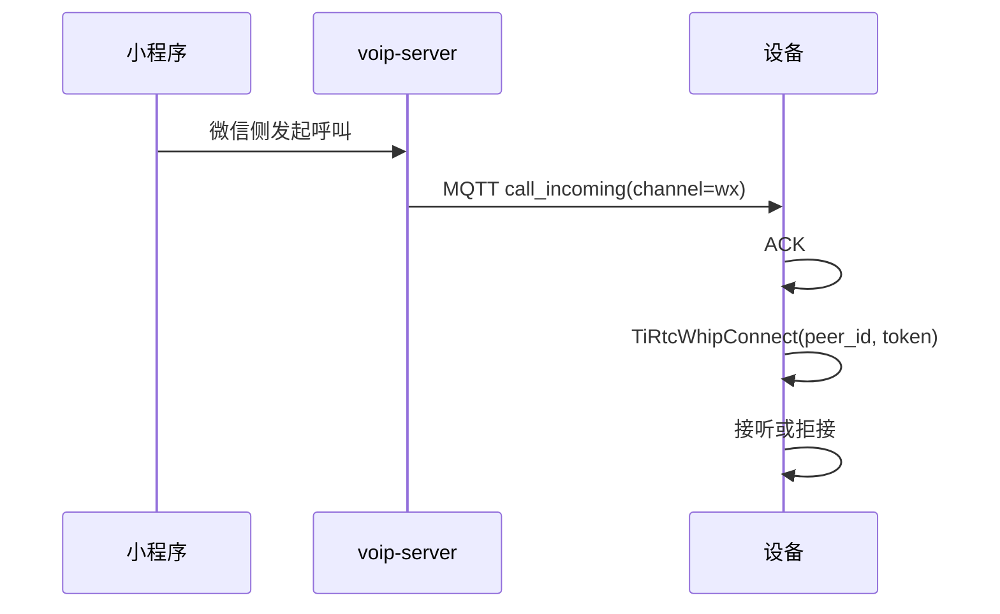
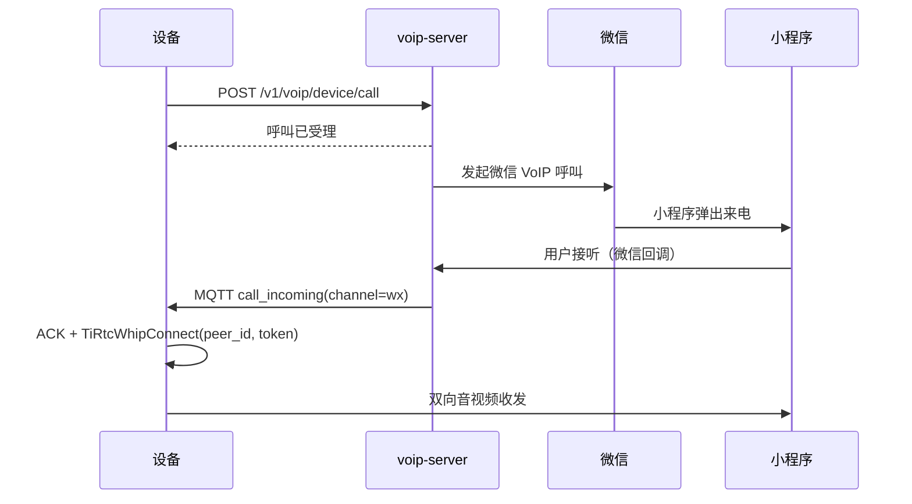

# 微信 VoIP 对讲设备接入

这份指南说明微信小程序与设备之间的 VoIP 对讲接入，包括授权、来电、外呼、拒接和取消，
以及设备如何调用 <a href="https://docs.tange.ai/products/tirtc/api-reference/c.html#tirtcwhipconnect" target="_blank" rel="noopener">`TiRtcWhipConnect`</a> 建立连接。

> 这里说明 VoIP 业务链路。设备上线和 MQTT 规范见 [device-integration.md](device-integration.md)，字段、错误码和微信回调格式见 [api-reference.md#voip-server](api-reference.md#voip-server)。一台设备同时运行 VoIP、AI 和设备互呼时，还需要遵守 [device-session-model.md](device-session-model.md) 中的状态切换规则。

**文档导航：** [返回总览](README.md) | [返回设备入口](device-integration.md) | [H5 实时](device-h5-live.md) | [AI 对讲](device-ai.md) | [设备呼设备](device-call.md) | [统一状态机](device-session-model.md)

## 目录

- [快速接入](#快速接入)
- [设备侧前提](#设备侧前提)
- [小程序端接入](#小程序端接入)
- [小程序呼设备](#小程序呼设备)
- [设备呼小程序](#设备呼小程序)
- [授权列表与联系人](#授权列表与联系人)
- [拒接与取消](#拒接与取消)
- [协议速查](#协议速查)
- [问题排查](#问题排查)

---

## 快速接入

设备侧按以下四步接入微信 VoIP：

1. 按 [device-integration.md](device-integration.md) 上线，拿到 `mqtt_token`
2. 启动后调用 [`POST /v1/voip/device/profile`](api-reference.md#post-v1voipdeviceprofile)
3. 监听 MQTT `device/sn_{device_id}/cmd` 和 `device/sn_{device_id}/notify`
4. 收到 `call_incoming` 后，用 payload 中的 `peer_id + token` 调
   <a href="https://docs.tange.ai/products/tirtc/api-reference/c.html#tirtcwhipconnect" target="_blank" rel="noopener">`TiRtcWhipConnect(peer_id, token, callback, NULL)`</a>

`TiRtcWhipConnect` 返回 `0` 只表示请求已提交；回调中的 `error == 0` 才表示建连成功。
完整流程见[小程序呼设备](#小程序呼设备)。

VoIP 场景下，设备作为 WHIP 客户端，通过
<a href="https://docs.tange.ai/products/tirtc/api-reference/c.html#tirtcwhipconnect" target="_blank" rel="noopener">`TiRtcWhipConnect`</a>
连接服务端。设备呼设备使用
<a href="https://docs.tange.ai/products/tirtc/api-reference/c.html#tirtcconnect" target="_blank" rel="noopener">`TiRtcConnect`</a>，
两个接口不能混用。

联调时检查以下结果：

| 验收端 | 验收结果 |
|--------|----------|
| 设备 | MQTT 收到含 `peer_id`、`token` 的 `call_incoming`；接听后 `TiRtcWhipConnect` 回调 `error == 0` |
| 小程序 | `wx.requestDeviceVoIP` 成功，`POST /v1/voip/user/report-auth` 返回 200；发起呼叫后设备收到 MQTT 来电 |

---

## 设备侧前提

### 1. 上报媒体能力

设备上线完成后，应尽快调用：

- [`POST /v1/voip/device/profile`](api-reference.md#post-v1voipdeviceprofile)

这是接收 VoIP 来电的前提；未上报 profile 的设备无法收到 `call_incoming`。

字段、枚举值和错误码见
[profile 接口说明](api-reference.md#post-v1voipdeviceprofile)。

至少应上报：

- 音频采样率、声道数
- 是否有视频能力
- 上下行视频/音频编码能力
- 呼叫超时

视频设备还应上报屏幕宽高；需要适配微信下行画面时，再设置 `video_res_mode`。

相关代码：

- C VoIP 完整实现：[device-sim/device-sim-c/src/tirtc_voip.c](device-sim/device-sim-c/src/tirtc_voip.c)
- C 方法声明：[device-sim/device-sim-c/src/tirtc_voip.h](device-sim/device-sim-c/src/tirtc_voip.h)

**HTTP 请求：**

```http
POST /v1/voip/device/profile
Authorization: Bearer <mqtt_token>
Content-Type: application/json
```

```json
{
  "screen_width": 640,
  "screen_height": 480,
  "camera_rotation": 0,
  "aspect_ratio": 1.3333333333,
  "hor_mirror": false,
  "vert_mirror": false,
  "object_fit": "contain",
  "audio_rate": 8000,
  "audio_channels": 1,
  "up_video_mt": "h264",
  "down_video_mt": "mjpeg",
  "video_res_mode": "fit_screen",
  "down_audio_mt": "alaw",
  "no_video": false,
  "calling_timeout_sec": 30
}
```

示例设备的屏幕为 640 × 480。微信下行使用 MJPEG，完整画面会等比缩小到屏幕范围内。

`video_res_mode` 只影响小程序发送给设备的下行视频：

| 取值 | 画面处理 | 使用要求 |
|------|----------|----------|
| `auto` | 不缩放、不裁剪 | 无；省略字段时使用此模式 |
| `fit_screen` | 按比例缩小到屏幕范围内，不放大、不裁剪；输出宽高向下取偶数 | `down_video_mt=mjpeg`，并上报有效的屏幕宽高 |
| `fill_screen` | 按比例缩放并居中裁剪到屏幕尺寸，允许放大 | `down_video_mt=mjpeg`，并上报有效且为偶数的屏幕宽高 |

三种模式都不旋转画面。配置不符合要求时，VoIP 呼叫可能失败。

- 完整约束：[TiRTC Server API](https://docs.tange.ai/products/wxvoip/api-reference/server-api.html)
- 上报时机：设备上线后、接听来电前
- 重新上报：媒体能力或屏幕参数变化后

视频 UI 参数均可省略：

| profile 字段 | 作用 | 默认值 |
|--------------|------|--------|
| `camera_rotation` | 顺时针旋转设备画面：`0/90/180/270` | `0` |
| `aspect_ratio` | 设备视频宽高比，必须大于 `0` | `4/3` |
| `hor_mirror` | 水平镜像 | `false` |
| `vert_mirror` | 垂直镜像 | `false` |
| `object_fit` | 画面填充方式：`fill/contain` | `fill` |

小程序通过 [`setUIConfig`](https://developers.weixin.qq.com/miniprogram/dev/framework/device/voip-plugin/api/setUIConfig.html)
应用这些参数。`callerUI`、`listenerUI` 的对应关系见
[小程序 VoIP 页面参数](weixin-mini-program/README.md#5-callerui-和-listenerui)。

**成功返回：**

```json
{ "code": 0, "msg": "ok", "data": null }
```

### 2. 监听 VoIP MQTT 消息

VoIP 相关下行消息有三类：

| type | topic | 说明 |
|------|-------|------|
| `call_incoming` | `device/sn_{device_id}/cmd` | 来电 |
| `call_cancel` | `device/sn_{device_id}/notify` | 对方取消/挂断 |
| `callers_update` | `device/sn_{device_id}/notify` | 授权列表变化 |

其中 `cmd` topic 的消息要回 ACK。

---

## 小程序端接入

本节供微信小程序开发者使用。设备接听流程见[小程序呼设备](#小程序呼设备)。

可参考以下实现：

- 小程序总体说明：[weixin-mini-program/README.md](weixin-mini-program/README.md)
- 设备列表页实现：[weixin-mini-program/pages/devices/index.js](weixin-mini-program/pages/devices/index.js)
- 小程序全局 VoIP 取消回调：[weixin-mini-program/app.js](weixin-mini-program/app.js)

### 1. 前置条件

小程序呼叫设备前，需要满足以下条件：

1. 用户已在小程序里登录，拿到 `user_jwt`
2. 当前设备已经绑定到这个登录用户
3. 小程序已配置 `wmpf-voip` 插件
4. 设备已完成 [`POST /v1/voip/device/profile`](api-reference.md#post-v1voipdeviceprofile)，否则微信回调到服务端后无法下发 `call_incoming`

### 2. 小程序初始化

设备列表页加载时依次完成：

1. <a href="https://developers.weixin.qq.com/miniprogram/dev/api/open-api/login/wx.login.html" target="_blank" rel="noopener">`wx.login()`</a>，再调用 [`POST /v1/voip/user/wechat-mini-login`](api-reference.md#post-v1voipuserwechat-mini-login)
2. <a href="https://developers.weixin.qq.com/miniprogram/dev/api/open-api/device-voip/wx.getDeviceVoIPList.html" target="_blank" rel="noopener">`wx.getDeviceVoIPList()`</a>，同步当前微信侧已有的设备授权状态
3. [`GET /v1/voip/user/auth-list`](api-reference.md#get-v1voipuserauth-list)，读取服务端保存的授权名称快照

字段、响应和错误码见
[微信登录接口说明](api-reference.md#post-v1voipuserwechat-mini-login)。

`wechat-mini-login` 将微信登录凭证换成 `wx_user_openid`，供后续授权和呼叫使用。

### 3. 申请设备授权

小程序第一次呼叫某台设备前，按以下流程完成授权：

1. 小程序先通过 [`PUT /v1/user/device/name`](api-reference.md#put-v1userdevicename) 设置设备名称
2. 调 [`POST /v1/voip/user/sn-ticket`](api-reference.md#post-v1voipusersn-ticket)
3. 将响应中的 `device_name` 传给 <a href="https://developers.weixin.qq.com/miniprogram/dev/framework/device/voip/auth.html" target="_blank" rel="noopener">`wx.requestDeviceVoIP(...)`</a>
4. 成功后将相同 `device_name` 调 [`POST /v1/voip/user/report-auth`](api-reference.md#post-v1voipuserreport-auth)

相关接口的完整字段说明见：

- [api-reference.md#post-v1voipusersn-ticket](api-reference.md#post-v1voipusersn-ticket)
- [api-reference.md#post-v1voipuserreport-auth](api-reference.md#post-v1voipuserreport-auth)

`sn-ticket` 和 `report-auth` 分别用于：

- `sn-ticket` 用来获取 <a href="https://developers.weixin.qq.com/miniprogram/dev/framework/device/voip/auth.html" target="_blank" rel="noopener">`wx.requestDeviceVoIP`</a> 所需的 `sn_ticket`
- `report-auth` 用来把“这位微信用户已被授权呼叫这台设备”同步到服务端

`report-auth` 成功后，设备可通过
[`GET /v1/voip/device/contacts`](api-reference.md#get-v1voipdevicecontacts) 或
`callers_update` 获取授权变化。

**设备名称规则**

| 场景 | 规则 |
|------|------|
| 首次授权 | 授权名称、手机端来电名称和 `deviceName` 必须一致；绑定名称为空时，`sn-ticket` 使用 `device_id` |
| 设备改名 | 微信仍保留授权时的名称快照；按页面提示删除微信“最近使用”中的小程序，再重新进入并授权 |
| 设备解绑 | 设备名称和授权记录一并清空 |

### 4. 小程序呼叫设备

小程序通过 `wmpf-voip` 插件呼叫设备：

- <a href="https://developers.weixin.qq.com/miniprogram/dev/framework/device/voip-plugin/api/callDevice.html" target="_blank" rel="noopener">`wmpfVoip.callDevice(...)`</a>

插件调用参数根据设备 profile 确定：

- 是否启用主叫摄像头
- 是否启用被叫摄像头
- 房间类型是 `voice` 还是 `video`

插件发起呼叫后，调用链如下：

1. 小程序插件向微信侧发起设备 VoIP 呼叫
2. 微信服务器回调 `voip-server`
3. `voip-server` 查询设备 profile，向设备下发 MQTT `call_incoming`
4. 设备按后续章节完成 ACK、建连、接听或拒接

小程序列表会阻止对明确离线的设备发起呼叫；回调服务也会在 MQTT 在线状态明确为离线时
返回失败。在线状态是基于 Broker 心跳/上下线缓存，刚掉线的短窗口仍可能显示在线，因此
设备侧和小程序侧仍需保留通话超时处理。

### 5. 小程序取消和挂断

小程序通过以下接口取消呼叫：

- [`POST /v1/voip/user/cancel`](api-reference.md#post-v1voipusercancel)

字段、响应和错误码见
[取消接口说明](api-reference.md#post-v1voipusercancel)。

取消流程如下：

- 小程序收到 `cancelVoip`
- 调 [`POST /v1/voip/user/cancel`](api-reference.md#post-v1voipusercancel)
- `voip-server` 再向设备推送 `call_cancel`

设备最终会在 `device/sn_{device_id}/notify` 收到 `type=call_cancel` 的通知。

### 6. 授权失效与取消授权

`wx.getDeviceVoIPList()` 的判断规则：

- 列表中存在且 `status=1`：已授权
- 列表中存在但不是 `status=1`：用户已关闭，微信不会再次弹授权框，应引导到小程序设置的“语音、视频通话提醒”重新开启
- 列表中不存在：授权记录已被清空，可以重新调用 `wx.requestDeviceVoIP`
- API 调用失败：状态未知，不误报为未授权

微信设置变化按以下规则同步：

| 场景 | 处理方式 |
|------|----------|
| 列表缺失或提醒已关闭 | 小程序删除仍为 `active` 的授权，并通知设备刷新联系人 |
| `wx.getDeviceVoIPList()` 调用失败 | 状态记为 `unknown`，保留现有授权 |
| 设备外呼收到微信错误码 `9` | 授权标记为 `invalid`，从联系人列表隐藏，并推送 `callers_update` |
| 用户重新开启提醒 | 小程序重新上报，恢复授权状态 |
| 设备解绑 | 授权和设备名称一并删除，小程序无需补调接口 |

错误码 `9` 只能说明授权不可用，不能据此判断用户主动取消。

如需在保持设备绑定的情况下删除授权，调用：

- [`POST /v1/voip/user/delete-auth`](api-reference.md#post-v1voipuserdelete-auth)

字段、响应和错误码见
[删除授权接口说明](api-reference.md#post-v1voipuserdelete-auth)。

设备侧随后会收到：

- `callers_update`

并应重新拉取授权列表。

---

## 小程序呼设备

小程序呼设备时，微信用户是主叫，设备是被叫。



### 1. 收到 `call_incoming`

`call_incoming` payload 中的关键字段按用途分为三组：

| 用途 | 字段 |
|------|------|
| 建立 RTC 连接 | `peer_id`、`token` |
| 微信会话 | `wx_app_id`、`wx_model_id`、`wx_room_id`、`wx_server_token`、`wx_session_key`、`wx_payload` |
| 联系人与回铃关联 | `wx_user_openid`、`wx_user_remark`、`wx_user_nickname`，以及可选的 `wx_call_id`、`wx_from` |

`wx_user_nickname` 与 `wx_user_remark` 的值相同。

**MQTT 下行通知：**

topic:

```text
device/sn_{device_id}/cmd
```

payload:

```json
{
  "type": "call_incoming",
  "channel": "wx",
  "payload": {
    "peer_id": "whips://wxvoip?x_wx_room_id=...",
    "token": "v1.eyJ...",
    "wx_app_id": "wxXXX",
    "wx_model_id": "HRHY_xxx",
    "wx_room_id": "wxf...",
    "wx_user_openid": "o4DLd5...",
    "wx_user_remark": "客厅联系人",
    "wx_user_nickname": "客厅联系人",
    "wx_server_token": "...",
    "wx_session_key": "...",
    "wx_payload": "..."
  }
}
```

设备动作：

1. 先向 `device/sn_{device_id}/ack` 回 `{"ack":true}`
2. 根据当前本地状态决定接听还是拒接
3. 若接听，用 payload 里的 `peer_id + token` 调 <a href="https://docs.tange.ai/products/tirtc/api-reference/c.html#tirtcwhipconnect" target="_blank" rel="noopener">`TiRtcWhipConnect(peer_id, token, callback, NULL);`</a>

**MQTT 上行 ACK：**

topic:

```text
device/sn_{device_id}/ack
```

payload:

```json
{ "ack": true }
```

### 2. 建连后开始媒体收发

VoIP 建连成功后，设备进入对讲态，开始本地音频收发；如果设备有视频能力，也可开始视频收发。

接口说明见
<a href="https://docs.tange.ai/products/tirtc/api-reference/c.html#tirtcwhipconnect" target="_blank" rel="noopener">`TiRtcWhipConnect`</a>。
连接结果以 `callback(error, hconn, ...)` 为准：

- `error == 0`：WHIP 连接建立成功；回调保存必要状态并投递事件，控制任务随后保存 `hconn`、启动本地媒体任务
- `error != 0`：建连失败，不能开始收发

C 参考实现收到 `error == 0` 后只保存连接状态，控制任务等到 `0x2000` 再启动本地媒体。收到 `0x2001` 时，回调只投递断开动作，再由延后任务调用 `TiRtcDisconnect`。

### 3. C 参考实现接听与媒体生命周期

下列代码使用 C 参考实现提供的方法。MQTT 分发层收到 `channel=wx` 的 payload 后，
只调用 `voip_on_call_incoming()` 保存待接听信息。产品 UI、按键或自动应答策略决定
何时调用 `voip_accept_pending()`；不要在 MQTT 回调线程中阻塞等待。

~~~c
#include "tirtc_voip.h"
#include "tirtc_runtime.h"

VoipState *voip = voip_create(voip_server, device_id, mqtt_token,
                              "/data/voip_up.g711a");
if (!voip) return -1;
voip_configure_video(voip, "/data/voip_up.h264");
if (voip_configure_down_audio_format("alaw_8khz") != 0) return -1;

/* 进程启动时执行一次；同时支持其他业务时，先注册全部业务回调。 */
if (voip_service_register() != 0 ||
    tirtc_runtime_start(device_id, device_key, client_id, endpoint) != 0) {
    voip_destroy(voip);
    return -1;
}

/* 启动时上报一次 profile；callers_update 到达后刷新联系人缓存。 */
cJSON *callers = NULL;
if (voip_report_profile(voip_server, mqtt_token, &callers) != 0) {
    tirtc_runtime_stop();
    voip_destroy(voip);
    return -1;
}
voip_set_auth_list(voip, callers); /* 所有权转给 VoipState，由 voip_destroy 释放。 */

/* 正式 MQTT 的 channel=wx 来电回调：payload 就是消息 payload 字段。 */
void on_mqtt_wx_call(const cJSON *payload) {
    voip_on_call_incoming(voip, payload);
    /* cmd topic ACK 由 device_flow.c 在分发前发送。 */
}

/* SessionCoordinator 接听前停止 STREAM，再激活 VoIP 业务代次。 */
uint64_t generation = tirtc_runtime_activate(TIRTC_SERVICE_VOIP);
if (generation == 0 || voip_service_start(voip) != 0) {
    if (generation != 0)
        tirtc_runtime_deactivate(TIRTC_SERVICE_VOIP, generation);
    tirtc_runtime_stop();
    voip_destroy(voip);
    return -1;
}

/* 用户按下“接听”。内部取保存的 peer_id/token 并 TiRtcWhipConnect。 */
if (voip_accept_pending(voip) != 0) {
    /* 建连提交失败；通知 UI 并恢复 STREAM 会话。 */
}

/* 用户挂断、收到 call_cancel 或连接错误时： */
tirtc_runtime_deactivate(TIRTC_SERVICE_VOIP, generation);
voip_service_stop(voip);     /* 0x2001 -> TiRtcDisconnect -> 回收推流任务 */

/* Coordinator 此时恢复 STREAM，设备继续运行；这里不能停止或反初始化 SDK。 */

/* 以下两行属于整个设备进程的统一退出路径，不属于 VoIP 会话结束路径。 */
tirtc_runtime_stop();
voip_destroy(voip);
~~~

**Linux 参考实现的媒体接入点**

| 环节 | 接入要求 |
|------|----------|
| 接听 | 通常调用 `voip_accept_pending()`；它使用已保存的 `peer_id`、`token` 和上行媒体配置，避免应用层重复解析来电 |
| 下行播放 | `_von_audio()` 将帧交给 `DeviceMediaSinkOps.submit`；默认没有 sink，只记录元数据后丢弃 |
| 产品适配 | sink 需要把帧复制到有界播放队列；通过 `DeviceMediaSourceOps` 接入麦克风采集和编码，替换默认文件源 |

`voip_start_session()` 是上述接听流程使用的底层方法。

---

## 设备呼小程序

设备主动外呼时，先走 HTTP，再等 MQTT 回推。



### 1. 设备发起呼叫

调用：

- [`POST /v1/voip/device/call`](api-reference.md#post-v1voipdevicecall)

请求体里至少带：

- `device_id`
- `wx_user_openid`
- `wx_room_type`

设备使用 `mqtt_token` 鉴权。旧设备仍可传入 `wx_app_id`、`wx_model_id`，接口以有效授权
记录为准；新设备不需要保存型号 ID。

字段、枚举值和错误码见
[设备外呼接口说明](api-reference.md#post-v1voipdevicecall)。

**HTTP 请求：**

```http
POST /v1/voip/device/call
Authorization: Bearer <mqtt_token>
Content-Type: application/json
```

```json
{
  "device_id": "TIRZ00000001",
  "wx_user_openid": "o4DLd5...",
  "wx_room_type": "video"
}
```

**成功返回：**

```json
{ "code": 0, "msg": "ok", "data": { "call_id": "8d4bc1f..." } }
```

`data.call_id` 用于关联本次外呼与后续 MQTT 回铃。

**外呼结果**

| 场景 | 返回或行为 | 设备动作 |
|------|------------|----------|
| 设备未绑定 | HTTP 200，业务码 `6006` | 重新完成设备绑定 |
| 联系人授权无效，或微信返回错误码 `9` | 业务码 `40205` | 刷新联系人列表 |
| 设备 JWT 缺失、无效或过期 | HTTP 401，业务码 `401` | 重新获取 `mqtt_token` |
| 同一设备或联系人 30 秒内重复发起 | 业务码 `40900` | 等待当前呼叫结束或限制解除 |
| 微信房间通知已下发到在线设备 | 解除重复呼叫限制 | 正常接通或挂断后可立即重拨 |

**视频 UI 与回铃关联**

| 项目 | 规则 |
|------|------|
| 视频 UI | 使用 profile 中的旋转、比例和镜像值；小程序从 `query` 读取 |
| 默认 payload | 自动包含 `id`、`from`、`to`、`room_type` |
| 自定义 payload | 原值透传；必须自行包含 `id`、`from`、`to`、`room_type` |
| MQTT 回铃 | 使用 `wx_call_id` 关联，不能只按 OpenID 判断 |

`payload` 和 `wxa_payload` 用于加入房间和设备通知链路，不作为小程序 UI 配置来源。

### 2. 等待回推 `call_incoming`

接口成功后仍需等待 MQTT `call_incoming`。收到回推并完成连接后，RTC 媒体才算建立。

主叫设备后续动作：

1. 收到 `call_incoming`
2. ACK
3. <a href="https://docs.tange.ai/products/tirtc/api-reference/c.html#tirtcwhipconnect" target="_blank" rel="noopener">`TiRtcWhipConnect(peer_id, token)`</a>
4. 等待平台下发 `0x2000`
5. 收到接通确认后开始媒体收发并进入通话态

设备外呼和小程序呼设备使用相同的 `call_incoming` 消息格式：

- 小程序呼设备：设备是被叫
- 设备呼小程序：设备先主动发起，再等待微信侧用户接听

设备外呼也要等到 `0x2000` 再启动媒体线程。`TiRtcWhipConnect` 返回成功或连接回调成功，
都不能作为双方已接通的判断依据。

设备外呼成功后应启动 30 秒本地等待计时器。期间没有收到对应 `wx_call_id` 的
`call_incoming`，应清理外呼状态；已取消或已超时的 `call_id` 建议至少保留 60 秒，
迟到的同一次回铃应拒绝或忽略，不能重新变成普通来电。

### 3. 设备取消外呼等待

仓库没有设备侧 `POST /v1/voip/device/cancel` 接口。设备发起外呼后，取消操作分为两种：

| 目标 | 处理方式 | 结果 |
|------|----------|------|
| 结束本地等待 | 清理本地外呼状态，并记录已取消的 `call_id` | 不保证小程序停止振铃；迟到回铃应拒绝或忽略 |
| 让小程序停止振铃 | 收到 `call_incoming` 后进入房间，发送 `TiRtcSendCommand(0x2001, ...)`，再调用 `TiRtcDisconnect` | 挂断命令通过媒体链路送达小程序 |

未进入房间时，本地 `cancel` 无法立即停止小程序振铃。房间通知已经超时的设备只需清理
本地状态，无需再进入房间补发挂断命令。

不同参考实现的取消策略如下：

| 实现 | 收到 `cancel` 后的行为 |
|------|-------------------------|
| Python 模拟器 | 最多等待 10 秒；房间通知到达后自动建连、发送 `0x2001` 并断开，否则结束本地取消状态 |
| Linux C 参考实现 | 立即结束本地等待，暂存已取消的 `call_id`，并拒绝迟到回铃 |

其他芯片的移植行为以各自文档和代码为准。

---

## 授权列表与联系人

VoIP 联系人来自微信授权，与 `call-server` 的联系人申请相互独立。

### 1. 刷新授权列表

设备可调用：

- [`GET /v1/voip/device/contacts`](api-reference.md#get-v1voipdevicecontacts)

该接口返回允许呼叫当前设备的小程序用户。字段和错误码见
[联系人接口说明](api-reference.md#get-v1voipdevicecontacts)。

**HTTP 请求：**

```http
GET /v1/voip/device/contacts
Authorization: Bearer <mqtt_token>
```

**成功返回：**

```json
{
  "code": 0,
  "msg": "ok",
  "data": {
    "contacts": [
      {
        "wx_open_id": "o4DLd5...",
        "wx_app_id": "wxXXX",
        "wx_model_id": "HRHY_xxx",
        "remark": "小雨"
      }
    ]
  }
}
```

### 2. 响应 `callers_update`

调用以下任一接口后，设备会收到 `callers_update`：

- [`POST /v1/voip/user/report-auth`](api-reference.md#post-v1voipuserreport-auth)
- [`POST /v1/voip/user/delete-auth`](api-reference.md#post-v1voipuserdelete-auth)

设备按以下规则刷新本地联系人缓存：

| 场景 | 设备处理 |
|------|----------|
| 收到 `callers_update` | 启动一个去重的后台 HTTP 刷新任务，不阻塞 MQTT 回调线程 |
| 刷新成功 | 原子替换整个联系人缓存 |
| 刷新失败 | 保留上一次缓存，避免误清空联系人 |

Python 与 C 参考实现均按此处理。

**联系人名称规则**

| 项目 | 规则 |
|------|------|
| 名称范围 | `report-auth.remark` 属于 `wx_open_id + wx_app_id`，不是设备名称，也不属于某一台设备 |
| 修改入口 | 小程序、设备端和 H5 均可修改；最后一次成功写入生效 |
| 跨设备同步 | 所有已授权设备使用同一名称，修改后都会收到刷新通知 |
| 空值 | `report-auth` 未传或传空值时，沿用已有名称 |

**MQTT 下行通知：**

topic:

```text
device/sn_{device_id}/notify
```

payload:

```json
{ "type": "callers_update", "channel": "wx", "payload": {} }
```

> VoIP 授权与设备呼设备联系人是两套独立数据，不能混用。

---

## 拒接与取消

### 设备拒接

设备收到来电后，可以直接调用 TiRTC SDK 的服务请求接口拒接，不需要先调用仓库中的 Go 服务：

拒接接口说明见 <a href="https://docs.tange.ai/products/wxvoip/api-reference/api-for-service-request.html#wxvoip-reject" target="_blank" rel="noopener">`TiRtcServiceRequest`</a>。

```c
TiRtcServiceRequest("/v1/wxvoip/reject", json_body, NULL, callback, user_data);
```

拒接请求体里的关键字段都来自 `call_incoming` payload：

- `wx_app_id`
- `wx_model_id`
- `wx_session_token`（值取当前 payload 里的 `wx_server_token`）
- `wx_room_id`
- `wx_payload`
- `hangup_reason`

常用原因码：

- `5`：设备正在外呼等待中，拒绝非目标来电
- `7`：设备已在通话中或主动拒接

**SDK 服务请求体：**

```json
{
  "wx_app_id": "wxXXX",
  "wx_model_id": "HRHY_xxx",
  "wx_session_token": "...",
  "wx_room_id": "wxf...",
  "wx_payload": "...",
  "hangup_reason": 7
}
```

### 设备主动挂断

设备开始建连或接通后，主动结束 VoIP 会话时直接从 TiRTC 媒体层挂断：

1. 先停止本地音频/视频发送线程
2. 通过 <a href="https://docs.tange.ai/products/tirtc/api-reference/c.html#tirtcsendcommand" target="_blank" rel="noopener">`TiRtcSendCommand(0x2001, ...)`</a> 发送挂断命令
3. 再调用 <a href="https://docs.tange.ai/products/tirtc/api-reference/c.html#tirtcdisconnect" target="_blank" rel="noopener">`TiRtcDisconnect`</a>
4. 清理本地会话状态，恢复空闲态或实时推流态

C 参考实现中，终端在 `CONNECTING/IN_CALL` 状态下输入 `cancel`，会直接调用
`voip_stop_session()`，并发送：

```json
{ "reason": 0 }
```

建连中或通话中执行 `cancel`，按挂断处理。设备呼叫小程序时，如需停止小程序振铃，
设备要先进入房间，再发送 `0x2001`。设备主动挂断不调用额外的 Go 服务接口；
服务端也不提供 `/v1/voip/device/hangup`。

### 对方取消/挂断

小程序在业务层取消或挂断后，设备会在 `device/sn_{device_id}/notify` 收到 `call_cancel`。

**MQTT 下行通知：**

topic:

```text
device/sn_{device_id}/notify
```

payload:

```json
{
  "type": "call_cancel",
  "channel": "wx",
  "payload": { "wx_room_id": "wxf..." }
}
```

设备收到后应：

1. 如果当前还在等接听：清理等待状态，结束本次来电/外呼
2. 如果当前已在 `CONNECTING` 或已接通：断开对应 TiRTC 会话
3. 恢复空闲态或恢复实时推流态

`call_cancel` 必须按 `wx_room_id` 与当前房间匹配；旧房间迟到的取消通知不能结束新房间。

### 对端媒体层挂断（`0x2001`）

媒体连接建立后，对端也可以直接发送 TiRTC 命令字 `0x2001`。该挂断不一定伴随
`call_cancel` 通知。

设备侧收到 `0x2001` 时，应视为对端主动结束通话：

1. 立即停止本地媒体收发
2. 调用 <a href="https://docs.tange.ai/products/tirtc/api-reference/c.html#tirtcdisconnect" target="_blank" rel="noopener">`TiRtcDisconnect`</a>
3. 清理当前房间和会话状态

不要只依赖 MQTT `call_cancel` 判断通话结束。对讲中应同时处理：

- 业务层通知：`call_cancel`
- 媒体层命令：`0x2001`

---

## 协议速查

### HTTP 请求和成功响应

| 接口 | 请求方 | 用途 | 成功返回 |
|------|--------|------|---------|
| [`POST /v1/voip/device/profile`](api-reference.md#post-v1voipdeviceprofile) | 设备 | 上报媒体能力 | `{code:0,data:null}` |
| [`GET /v1/voip/device/contacts`](api-reference.md#get-v1voipdevicecontacts) | 设备 | 拉取小程序联系人 | `{code:0,data:{contacts:[...]}}` |
| [`POST /v1/voip/device/call`](api-reference.md#post-v1voipdevicecall) | 设备 | 主动呼叫小程序 | `{code:0,data:{call_id}}` |

> 设备侧没有 `cancel/hangup` HTTP 接口。主动结束会话时，先发送 TiRTC `0x2001`，再调用 <a href="https://docs.tange.ai/products/tirtc/api-reference/c.html#tirtcdisconnect" target="_blank" rel="noopener">`TiRtcDisconnect`</a>。

### MQTT 下行通知

| topic | type | 设备动作 |
|------|------|---------|
| `device/sn_{device_id}/cmd` | `call_incoming` | ACK 后接听或拒接 |
| `device/sn_{device_id}/notify` | `call_cancel` | 清理等待态或断开当前会话 |
| `device/sn_{device_id}/notify` | `callers_update` | 重新拉取授权列表 |

### TiRTC 命令和回调

| 方向 | 载体 | 含义 | 设备动作 |
|------|------|------|---------|
| 平台 → 设备 | `0x2000` | 接通确认（被叫场景） | 收到后开始本地媒体发送 |
| 对端 → 设备 | `0x2001` | 对端主动挂断 | 停止媒体、`TiRtcDisconnect`、清理状态 |
| 设备 → 对端 | `0x2001` | 设备主动挂断 | 发送后断开本地会话 |

## 问题排查

| 现象 | 检查项 |
|------|--------|
| 微信上已经呼出，设备没有收到 `call_incoming` | 确认设备已正式 MQTT 在线，并已调用 [`POST /v1/voip/device/profile`](api-reference.md#post-v1voipdeviceprofile) |
| `TiRtcWhipConnect` 返回 0，但没有通话 | 返回 0 只表示请求已提交；检查连接回调及其 `error` 参数 |
| 设备收到来电，但无法拒接 | 确认拒接请求中的 `wx_*` 字段来自本次 `call_incoming` payload |
| 收到 `callers_update` 后列表没有变化 | 确认设备重新调用了 [`GET /v1/voip/device/contacts`](api-reference.md#get-v1voipdevicecontacts) |
| 设备呼叫小程序时 HTTP 成功，但没有通话 | 接口成功后仍要等待 MQTT `call_incoming` |
| 设备取消外呼等待后，小程序仍在振铃 | 未进入房间时无法通过本地 `cancel` 停止小程序振铃；进入房间后发送 `0x2001` |
| 通话已经结束，设备状态没有清理 | 确认同时处理 MQTT `call_cancel` 和 TiRTC `0x2001` |

使用 C 参考实现验证时，按 [C 参考实现说明](device-sim/device-sim-c/README.md) 启动程序。收到来电后输入 `yes/no`，主动呼叫时输入 `wxcall [N]`。拒接字段和原因码见[拒接与取消](#拒接与取消)。
