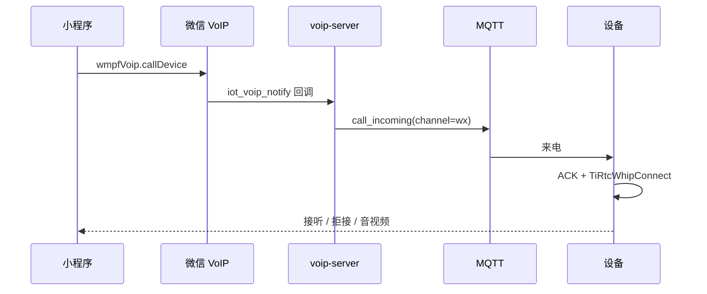

# 微信小程序开发

这里提供 ThingConnect 的原生微信小程序参考实现，包括用户登录、设备绑定、设备列表、
微信 IoT VoIP 授权，以及小程序与设备之间的音视频呼叫。

> 这里说明小程序侧的开发方式。设备如何接听、外呼和收发媒体见
> [微信 VoIP 对讲设备接入](../device-voip.md)；设备如何主动建立 AI 会话见
> [AI 对讲设备接入](../device-ai.md)；接口字段和错误码见
> [API Reference](../api-reference.md)。

**文档导航：** [返回总览](../README.md) |
[设备 VoIP](../device-voip.md) |
[设备 AI 对讲](../device-ai.md) |
[统一会话状态](../device-session-model.md) |
[部署与运维](../deployment.md)

## 目录

- [能力边界](#能力边界)
- [快速开始](#快速开始)
- [工程结构](#工程结构)
- [请求与身份模型](#请求与身份模型)
- [设备管理](#设备管理)
- [微信 VoIP 开发](#微信-voip-开发)
- [与 AI 对讲的关系](#与-ai-对讲的关系)
- [接口速查](#接口速查)
- [测试与调试](#测试与调试)
- [问题排查](#问题排查)
- [发布检查](#发布检查)

---

## 能力边界

小程序支持：

- 邮箱注册、登录和 JWT 本地保存
- 通过 6 位验证码、设备 ID 或二维码绑定设备
- 展示、刷新和解绑当前账号下的设备
- 从设备卡片进入实时查看 H5 页面
- 从设备卡片进入 AI 角色页面，编辑角色并设置设备使用的角色
- 获取微信 OpenID，维护当前微信用户的统一联系人名称
- 申请微信设备 VoIP 授权
- 小程序主动呼叫设备
- 接收设备主动发起的微信 VoIP 呼叫
- 根据设备 profile 配置视频旋转、镜像、画面比例和 `contain/fill`
- 小程序取消主动呼叫时通知 `voip-server`

小程序不包含：

- 直接建立 AI 对讲媒体连接
- 调用设备专用的 `GET /v1/ai/token`
- 原生 AI 角色编辑器或 AI 字幕页面（角色编辑使用内嵌 H5）
- 自定义微信插件通话页面

各端职责如下：

| 组件 | 职责 |
|---|---|
| 微信小程序 | 用户身份、设备管理、微信授权、VoIP 发起/接收和通话页配置 |
| `user-server` | 账号、JWT、设备绑定和设备列表 |
| `voip-server` | 微信登录关系、授权关系、微信回调和取消通知 |
| 设备 | MQTT 在线、上报 VoIP profile、接听/外呼、音视频采集和播放、AI 对讲 |
| 微信 `wmpf-voip` 插件 | 创建微信 VoIP 房间并展示通话页面 |
| TiRTC | 设备侧实时音视频连接和传输 |

小程序是一个前端参考客户端，不替代 `user-server`、`voip-server`，也不直接承担设备
侧媒体编解码。

---

## 快速开始

### 1. 前置条件

开发前需要准备：

1. 已开通微信 IoT VoIP 能力的正式小程序 AppID，测试号不能完整验证设备 VoIP。
2. 微信 IoT 平台分配的 `ModelID`。
3. 已部署且可通过公网 HTTPS 访问的 `user-server` 和 `voip-server`。
4. 小程序后台已配置 request 合法域名，并将 H5 的 HTTPS 域名配置为 web-view 业务域名。
5. 设备已按[设备上线](../device-integration.md)完成绑定并保持正式 MQTT 在线。
6. 设备已调用
   [`POST /v1/voip/device/profile`](../api-reference.md#post-v1voipdeviceprofile)
   上报实际媒体能力。

服务端部署和微信回调配置见[部署与运维](../deployment.md)。

### 2. 导入工程

1. 打开微信开发者工具，选择“导入项目”。
2. 项目目录选择 `thing-connect/weixin-mini-program`。
3. AppID 使用已开通 IoT VoIP 的正式小程序 AppID。
4. 开发工具首次联调可以临时关闭合法域名校验；真机和发布版必须使用有效 HTTPS 域名。

这是原生小程序工程，不需要执行 `npm install` 或前端构建命令。

### 3. 配置服务地址和微信参数

编辑 [app.js](app.js) 的 `globalData`：

```js
globalData: {
  userServerBaseUrl: 'https://api.example.com',
  voipServerBaseUrl: 'https://api.example.com',
  modelId: '微信 IoT 平台分配的 ModelID',
  wxAppId: '正式小程序 AppID',
  wxOpenId: '',
  currentCall: null,
},
```

| 字段 | 说明 |
|---|---|
| `userServerBaseUrl` | `user-server` 公网 HTTPS 地址，用于账号和设备管理 |
| `voipServerBaseUrl` | `voip-server` 公网 HTTPS 地址，用于微信登录和 VoIP 授权 |
| `modelId` | 微信 IoT 平台设备型号 ID，必须与设备使用的型号一致 |
| `wxAppId` | 正式小程序 AppID；启动时会用 `wx.getAccountInfoSync()` 的结果覆盖 |
| `wxOpenId` | 当前运行中的微信用户 OpenID，不需要手工填写 |
| `currentCall` | 小程序主动呼叫的临时状态，不需要手工填写 |

两个服务可以通过同一个 Nginx 域名反向代理。地址末尾不要带 `/`，因为
[utils/api.js](utils/api.js) 会直接拼接接口路径。

### 4. 最小联调顺序

按以下顺序验证：

1. 注册或登录，确认本地存储中存在 `token`。
2. 用设备显示的 6 位验证码绑定设备。
3. 打开设备列表，确认设备 profile、媒体能力和在线状态正确。
4. 点击授权，完成 `wx.requestDeviceVoIP`。
5. 点击呼叫，确认设备收到 MQTT `call_incoming`。
6. 在设备侧接听，确认双方音频；有视频能力时再验证旋转和 `contain/fill`。
7. 从设备主动呼叫小程序，确认来电页视频方向和比例正确。

---

## 工程结构

```text
weixin-mini-program/
├── app.js                         # 全局生命周期、设备入呼 UI、取消事件
├── app.json                       # 页面、窗口和微信插件声明
├── app.wxss                       # 全局样式
├── pages/
│   ├── login/                     # 邮箱登录、注册和验证码
│   ├── devices/                   # 设备列表、联系人名称、授权和呼叫
│   ├── bind/                      # 验证码、设备 ID、扫码绑定
│   ├── device-web/                # 实时查看与 AI 角色 H5 承接
│   └── call-box/                  # 预留空页面，当前不承载插件通话 UI
├── utils/
│   ├── api.js                     # userApi / voipApi
│   ├── voip-video-profile.js      # profile 归一化和本地缓存
│   ├── voip-ui-config.js          # 双向 caller/listener UI 角色映射
│   └── voip-incoming-query.js     # 设备入呼 query 兼容解析
└── tests/
    ├── voip-auth-refresh.test.js  # VoIP 授权状态刷新测试
    └── voip-ui-config.test.js     # 双向 VoIP UI 回归测试
```

页面职责：

| 页面 | 路径 | 职责 |
|---|---|---|
| 登录/注册 | `pages/login/index` | 登录、注册、发送邮箱验证码、存储 JWT |
| 设备列表 | `pages/devices/index` | 拉取设备、同步授权、编辑联系人名称、解绑和呼叫 |
| 绑定设备 | `pages/bind/index` | 验证码绑定、设备 ID 绑定、扫码解析 |
| 设备网页 | `pages/device-web/index` | 验证设备归属、承接实时查看与 AI 角色页面、失败重试 |
| 预留页 | `pages/call-box/index` | 当前为空；微信通话使用插件的 `CALL_PAGE_PATH` |

VoIP 和验证码插件声明在 [app.json](app.json)：

| 插件 | 版本 | provider | 用途 |
|---|---|---|---|
| `wmpf-voip` | `latest` | `wxf830863afde621eb` | 微信 IoT VoIP；构建时应解析到不低于 2.4.1 |
| `captcha` | `1.4.1` | `wxb7c8f9ea9ceb4663` | 易盾验证码 |
| `tencentCaptcha` | `2.1.4` | `wx1fe8d9a3cb067a75` | 腾讯验证码 |
| `captcha4` | `2.7.5` | `wx1629d117cf9be937` | 极验验证码 |
| `AliyunCaptcha` | `3.0.0` | `wxbe275ff84246f1a4` | 阿里云验证码 |

`callDevice` 要求插件不低于 2.4.0；传入 `deviceName` 时，插件版本需不低于 2.4.1。

---

## 请求与身份模型

小程序同时使用两种身份，不要混用。

### 1. ThingConnect 用户身份

登录或注册成功后，`user-server` 返回 `user_jwt`。代码将它保存为：

```js
wx.setStorageSync('token', token)
```

之后 `userApi(...)` 和 `voipApi(...)` 都自动添加：

```http
Authorization: Bearer <user_jwt>
```

JWT 用来证明“当前 ThingConnect 账号是谁，以及是否拥有目标设备”。

### 2. 微信用户身份

设备列表页执行：

1. `wx.login()` 获取短期 `code`
2. 调 `POST /v1/voip/user/wechat-mini-login`
3. 服务端换取并返回 `wx_user_openid`

OpenID 用来证明“当前微信用户是谁”，供联系人名称、授权关系和设备外呼使用。

`user_jwt` 与 `wx_user_openid` 缺一不可：

- 只有 JWT：能管理账号设备，但不能完成微信 VoIP 用户授权。
- 只有 OpenID：不能证明目标设备属于当前 ThingConnect 账号。

### 3. 请求封装和业务码

[utils/api.js](utils/api.js) 只在 HTTP 状态码为 `200` 时 resolve；其它状态会 reject。
resolve 后页面仍要检查服务端业务码：

- `user-server` 成功通常为 `code = 200`
- `voip-server` 成功通常为 `code = 0`

接入接口时先确认它属于哪个服务，不要只根据 URL 名称猜测业务码。

---

## 设备管理

### 登录和注册

[pages/login/index.js](pages/login/index.js) 包含两条链路：

- 登录：邮箱、密码、人机验证 → `POST /v1/user/login`
- 注册：邮箱、人机验证 → `POST /v1/user/send-code` → 邮箱验证码和密码 →
  `POST /v1/user/register`

成功后保存 JWT，并跳转到设备列表。

### 绑定设备

[pages/bind/index.js](pages/bind/index.js) 支持：

- 6 位验证码：`POST /v1/user/device/bind`
- 设备 ID：`POST /v1/user/device/bind-by-id`
- 扫码：从二维码文本或 URL 中解析 `device_id`、`deviceid`、`sn`、`id`

验证码来自设备首次调用 `POST /v1/device/report` 的响应。绑定成功后，设备应完成正式
身份切换；详细过程见[设备上线与绑定](../device-integration.md)。

### 设备列表和解绑

右下角的圆形“＋”按钮用于添加设备。

设备卡片以微信通话为主要操作，右侧“查看画面”用于打开实时播放，底部提供“AI 角色设置”。离线设备不能实时查看或呼叫，
但仍可编辑 AI 角色。设备名称、设备信息和解绑位于卡片右上角的管理菜单；
联系人设置和退出登录分别使用页面顶部的人像图标和退出图标。解绑和退出登录均需确认。

首次加载、暂无设备和加载失败分别展示对应状态；刷新失败时保留已有设备，并提供重试入口。

[pages/devices/index.js](pages/devices/index.js) 的 `loadDevices()` 会：

1. 调 `GET /v1/user/device/list`
2. 将设备按绑定时间排序并归一化媒体字段
3. 更新设备视频 profile 本地缓存
4. 调 `wx.getDeviceVoIPList()` 同步微信侧授权状态
5. 同步服务端授权名称快照和当前 OpenID 的统一联系人名称

解绑调用 `DELETE /v1/user/device/reset`。`user-server` 会完成设备所有权和 VoIP 授权
清理，并清空设备名称；小程序解绑成功后不要再用已经失去所有权的设备调用
`delete-auth`。

### 实时查看与 AI 角色页面

两个入口均由 `pages/device-web/index` 承接，使用 `userServerBaseUrl` 的同源地址：

| 入口 | H5 路径 | 使用方式 |
|---|---|---|
| 实时查看 | `/player?device_id=...` | 查看设备音视频；进入后台会暂停，返回页面后点击“重新连接” |
| AI 角色设置 | `/v1/ai/agent?device_id=...` | 编辑并保存角色；选择其他角色或新建角色后，点击“绑定到此设备”应用 |

AI 页面由 ai-server 提供，需要按现有同源部署方式将 `/v1/ai/*` 代理到 ai-server。
H5 域名必须满足微信 [web-view 业务域名要求](https://developers.weixin.qq.com/miniprogram/dev/component/web-view.html)；
request 合法域名不能替代业务域名。真机发布前完成域名校验，并确保
`/static/js/mini-program-page.js`、播放器及 AI 页面均部署到对应服务。

页面使用当前小程序账号，进入前重新确认设备归属。登录凭证仅通过 HTTPS 页面 URL 的
fragment 传入，页面启动时立即清除，只保存在页面内存，不写入浏览器本地登录态。
不要记录或分享承接页面的完整 URL。承接页关闭转发菜单，页面刷新或登录过期后需返回
小程序重新打开。返回时使用微信顶部导航；不要将业务页面改为可接收任意外部 URL 的入口。

设备在线状态不代表媒体资源空闲。正在进行其他业务时，实际播放结果取决于设备会话仲裁。
音频播放及麦克风权限以微信真机环境为准；音视频能力需分别在 iOS、Android 上验收。

---

## 微信 VoIP 开发

### 1. VoIP 前置条件

一台设备能够被呼叫，需要同时满足：

1. 设备属于当前登录用户。
2. 设备保持正式 MQTT 在线。
3. 设备已上报 `/v1/voip/device/profile`。
4. 小程序完成 `wechat-mini-login`。
5. 当前微信用户已通过
   [`wx.requestDeviceVoIP`](https://developers.weixin.qq.com/miniprogram/dev/framework/device/voip/auth.html)
   授权该设备。
6. 授权结果已通过 `/v1/voip/user/report-auth` 同步到服务端。

微信侧授权成功但 `report-auth` 失败时，页面会保留“微信已授权”的状态并提示用户重新
保存联系人名称。不要把这两步当成一个不可区分的操作。

### 2. 初始化和授权

设备列表页显示时会并行处理：

- [`wx.login()`](https://developers.weixin.qq.com/miniprogram/dev/api/open-api/login/wx.login.html) + `wechat-mini-login`
- `GET /v1/user/device/list`
- [`wx.getDeviceVoIPList()`](https://developers.weixin.qq.com/miniprogram/dev/api/open-api/device-voip/wx.getDeviceVoIPList.html)
- `GET /v1/voip/user/contact-remark`

首次授权流程：

1. 用户设置设备名称和“我的联系人名称”。
2. 小程序调 `POST /v1/voip/user/sn-ticket`。
3. 小程序把响应中的 `device_name` 传给
   [`wx.requestDeviceVoIP(...)`](https://developers.weixin.qq.com/miniprogram/dev/framework/device/voip/auth.html)。
4. 再次刷新微信登录关系，避免服务端缓存过期。
5. 小程序将同一 `device_name` 调 `POST /v1/voip/user/report-auth`。

联系人名称属于 `wx_open_id + wx_app_id`，不是设备名称。同一微信身份授权的所有设备
共用该名称，设备端、H5 或小程序最后一次成功修改的值生效。

设备名称属于绑定关系，新绑定默认空，最多 13 个 Unicode 字符。授权时的名称是微信
快照；授权后改名会显示“待重新授权”，用户需在微信“最近使用”中删除本小程序并重新
授权后才会更新微信来电名称。服务端对旧版小程序保留兼容：名称为空时，
`sn-ticket` 返回设备 ID 作为授权名称。

页面将
[`wx.getDeviceVoIPList()`](https://developers.weixin.qq.com/miniprogram/dev/api/open-api/device-voip/wx.getDeviceVoIPList.html)
结果区分为四种状态：已授权、已关闭、记录缺失和未知。
已关闭时引导用户到小程序设置重新开启；记录缺失时可直接重新申请授权；查询失败时不
误报为未授权。重新开启后页面会把有效状态重新同步到服务端。

### 3. 小程序呼叫设备

小程序不直接调用 `voip-server` 创建房间，而是调用
[`wmpfVoip.callDevice`](https://developers.weixin.qq.com/miniprogram/dev/framework/device/voip-plugin/api/callDevice.html)：

```js
const wmpfVoip = requirePlugin('wmpf-voip').default
const randUuid = generateUUID() // 本项目生成的外呼关联 ID
const { roomId } = await wmpfVoip.callDevice({
  sn: deviceId,
  modelId: app.globalData.modelId,
  roomType,
  enableCallerCamera,
  enableListenerCamera,
  nickName: 'User',
  deviceName: authorizedDeviceName,
  isCloud: true,
  payload: randUuid,
})
wx.redirectTo({ url: wmpfVoip.CALL_PAGE_PATH })
```

| 参数 | 含义 |
|------|------|
| `sn` | 接听方设备 ID/SN |
| `modelId` | 微信 IoT 平台分配的接听方设备 ModelID |
| `roomType` | `voice` 为纯音频，`video` 为音视频 |
| `enableCallerCamera` | 拨打方小程序是否启用摄像头；本项目按设备是否有屏幕决定 |
| `enableListenerCamera` | 接听方设备是否启用摄像头；本项目按设备是否有摄像头决定 |
| `nickName` | 设备端显示的微信联系人名称 |
| `deviceName` | 微信端显示的设备名称；应使用授权时的名称快照，要求插件不低于 2.4.1 |
| `isCloud` | ThingConnect 固定传 `true`，使微信的设备消息回调进入 `voip-server` |
| `payload` | 本次外呼的开发者透传值；微信回调后由服务端原样下发为 `wx_payload` |
| 返回值 `roomId` | 本次微信 VoIP 房间 ID，保存到 `currentCall` 以关联取消和结束事件 |

官方接口还有计费、时长和视频编码参数；未在本项目示例中使用的字段以
[`callDevice(Object req)` 参数表](https://developers.weixin.qq.com/miniprogram/dev/framework/device/voip-plugin/api/callDevice.html)
为准。仓库中的完整调用见
[`pages/devices/index.js`](pages/devices/index.js#L873)。

链路如下：



设备列表根据 profile 决定呼叫类型：

- `up_video_mt`：设备是否有摄像头，即设备能否向小程序发送视频
- `down_video_mt`：设备是否有屏幕/视频解码能力，即小程序是否发送摄像头视频
- 两者都没有：`roomType = voice`
- 任一存在：`roomType = video`

设备侧如何处理 MQTT 来电、ACK、接听、拒接和媒体收发见
[小程序呼设备](../device-voip.md#小程序呼设备)。

### 4. 设备呼叫小程序

设备主动外呼时，小程序一般不会先进入自己的业务页面。微信插件会拉起通话页，因此
入呼 UI 配置必须放在全局 [app.js](app.js)，不能只写在设备列表页。

入呼处理顺序：

1. `onLaunch` 读取 [`getPluginEnterOptions()`](app.js#L44)。
2. `onShow` 再读取一次 enter options。
3. 插件触发 `callPageOnShow` 时读取
   [`getPluginOnloadOptions()`](https://developers.weixin.qq.com/miniprogram/dev/framework/device/voip-plugin/api/getPluginOnloadOptions.html)。
4. 立即调用一次
   [`setUIConfig`](https://developers.weixin.qq.com/miniprogram/dev/framework/device/voip-plugin/api/setUIConfig.html)。
5. 保留一个 `0ms` 延迟补调用，使配置落在插件 `initByListener` 前。

不要删除“立即设置 + 0ms 补设置”。这是为了兼容插件来电页的初始化时序，不是普通的
重复调用。

入呼 query 可能是字符串、对象，也可能把 `\u0026` 原样放在首个字段值中。
[utils/voip-incoming-query.js](utils/voip-incoming-query.js) 统一解析这些情况。
当 query 缺少 profile 字段时，可根据 `device_id`、`deviceId`、`callerId` 或 `sn`
从本地缓存补齐。

设备如何取得联系人并发起外呼见
[设备呼小程序](../device-voip.md#设备呼小程序)。

### 5. callerUI 和 listenerUI

`caller`、`listener` 表示本次通话角色，不代表固定设备类型：

| 呼叫方向 | 小程序角色 | 设备角色 | 设备视频配置 |
|---|---|---|---|
| 小程序呼设备 | `caller` | `listener` | 旋转、镜像和缩放写入 `listenerUI` |
| 设备呼小程序 | `listener` | `caller` | 写入 `callerUI`；来电页还需同步到 `listenerUI` |

统一映射由 [utils/voip-ui-config.js](utils/voip-ui-config.js) 负责。

关键规则：

- 小程序本机画面的 `cameraRotation` 固定为 `0`。
- 设备的 `camera_rotation`、`hor_mirror`、`vert_mirror` 和 `object_fit` 来自 profile。
- 手机通话页容器比例使用 `screenHeight / screenWidth`，不是设备屏幕尺寸，也不是视频
  素材分辨率。
- 设备呼小程序且 `object_fit=contain` 时，两端 `aspectRatio` 都使用手机屏幕比例，
  否则视频容器可能与素材比例重合，使 `contain` 看起来和 `fill` 一样。
- profile 未上报的字段不强行设置，保留插件默认行为。

### 6. 取消、挂断和取消授权

小程序主动呼叫成功后，会把 `{deviceId, roomId}` 保存到
`app.globalData.currentCall`。插件触发 `cancelVoip` 时，[app.js](app.js) 调用：

- `POST /v1/voip/user/cancel`

`voip-server` 随后向设备推送 `call_cancel`。如果修改呼叫状态结构，要同时更新全局
取消处理，否则设备可能继续处于等待或通话状态。

取消 VoIP 授权使用：

- `POST /v1/voip/user/delete-auth`

设备列表没有单独的“取消授权”按钮，解绑走 `user-server` 的统一清理。需要增加独立
取消授权入口时，应在用户仍拥有设备时调用 `delete-auth`。

---

## 与 AI 对讲的关系

[AI 对讲设备接入](../device-ai.md) 描述的是**设备主动发起**的媒体业务：

1. 设备用 `mqtt_token` 调 `GET /v1/ai/token`。
2. 设备用返回的 `peer_id + token` 调 `TiRtcWhipConnect`。
3. 设备发送 `0x2100 start_session`。
4. 设备向 AI 上行音频，并播放 AI 下行音频。

这条链路不经过小程序。小程序的 `user_jwt` 也不能代替设备 `mqtt_token` 调用
`GET /v1/ai/token`。

如需在小程序增加“让设备开始 AI 对讲”的按钮，应提供明确的服务端控制接口或 MQTT
命令，由设备收到命令后按 `device-ai.md` 自己获取 token、建连和管理媒体。不要
让小程序获取设备的 AI token，也不要在小程序里复制设备端 `start_session` 状态机。

AI、VoIP、H5 实时流和设备互呼共用设备媒体资源。产品设备应按
[统一会话状态](../device-session-model.md) 做互斥和恢复；小程序只展示服务端返回的
状态，不应自行推断设备一定空闲。

---

## 接口速查

### user-server

| 接口 | 页面 | 用途 |
|---|---|---|
| `GET /v1/config/captcha` | 登录页 | 获取验证码配置 |
| `POST /v1/user/login` | 登录页 | 邮箱登录 |
| `POST /v1/user/send-code` | 登录页 | 发送注册验证码 |
| `POST /v1/user/register` | 登录页 | 注册并登录 |
| `GET /v1/user/device/list` | 设备列表 | 获取当前用户名下设备和 profile |
| `PUT /v1/user/device/name` | 设备列表 | 修改设备名称 |
| `POST /v1/user/device/bind` | 绑定页 | 使用 6 位验证码绑定 |
| `POST /v1/user/device/bind-by-id` | 绑定页 | 使用设备 ID 绑定 |
| `DELETE /v1/user/device/reset` | 设备列表 | 解绑设备并清理关联授权 |

### voip-server

| 接口 | 使用位置 | 用途 |
|---|---|---|
| `POST /v1/voip/user/wechat-mini-login` | 设备列表 | 微信 code 换 OpenID |
| `GET /v1/voip/user/contact-remark` | 设备列表 | 获取统一联系人名称 |
| `PUT /v1/voip/user/contact-remark` | 用户资料弹窗 | 修改统一联系人名称 |
| `POST /v1/voip/user/sn-ticket` | 授权流程 | 获取微信设备授权票据 |
| `POST /v1/voip/user/report-auth` | 授权流程 | 同步微信授权结果 |
| `POST /v1/voip/user/delete-auth` | 独立取消授权入口 | 删除授权关系 |
| `POST /v1/voip/user/cancel` | `app.js` | 小程序取消主动呼叫 |

设备列表里的“呼叫”由 `wmpfVoip.callDevice()` 发起，不是一个小程序 HTTP 呼叫接口。

---

## 测试与调试

### 1. 静态和单元测试

在仓库根目录执行：

```bash
node --check thing-connect/weixin-mini-program/app.js
node --check thing-connect/weixin-mini-program/pages/devices/index.js
node --test thing-connect/weixin-mini-program/tests/*.test.js
```

测试会检查授权状态刷新和 VoIP UI 配置。其中，VoIP UI 用例覆盖：

- 小程序呼设备和设备呼小程序两种角色映射
- `contain` 与 `fill`
- 手机屏幕比例
- 旋转和镜像
- profile query 与缓存回退
- `callerId` 和 `\u0026` 入呼参数

### 2. 开发者工具检查

- 登录后检查 Storage 中是否有 `token`。
- Network 中确认请求地址属于正确服务，且带有 `Authorization`。
- 检查 `wechat-mini-login` 是否返回 OpenID。
- 检查 `wx.getDeviceVoIPList()` 中目标设备状态是否为已授权。
- 查看 `[voip] outgoing video UI` 和 `[voip-trace]` 日志，确认 caller/listener 角色、
  `objectFit` 和 `aspectRatio`。

### 3. 真机检查

微信 IoT VoIP 的授权、来电页、摄像头方向和真实插件生命周期应以真机为准。开发者工具
适合检查页面和 HTTP，不应作为最终通话结论。

建议至少覆盖：

1. 小程序呼设备：纯音频。
2. 小程序呼设备：设备视频。
3. 设备呼小程序：应用前台。
4. 设备呼小程序：冷启动或后台拉起。
5. `camera_rotation = 0/90/180/270`。
6. 竖屏素材和横屏素材的 `contain/fill`。
7. 取消、拒接、对端挂断和网络断开。

---

## 问题排查

- **登录成功但设备列表 401**：本地 JWT 已失效，清除 Storage 后重新登录。
- **设备列表没有设备**：确认设备已绑定到当前 ThingConnect 账号，而不只是 MQTT 在线。
- **微信授权失败**：检查正式 AppID、ModelID、`sn-ticket`、插件版本和微信后台能力。
- **微信显示已授权但服务端没有联系人**：检查 `report-auth` 是否成功，以及
  `wechat-mini-login` 是否刚刚刷新。
- **小程序呼叫后设备没收到 `call_incoming`**：确认设备正式 MQTT 在线并已上报
  `/v1/voip/device/profile`。
- **设备呼小程序没有弹出来电页**：检查设备联系人 OpenID、微信 AppID、ModelID 和设备
  外呼接口结果；HTTP 成功后仍要继续检查 MQTT/微信后续链路。
- **`contain` 看起来和 `fill` 一样**：查看日志中两端 `aspectRatio` 是否使用手机
  `screenHeight / screenWidth`，不要使用设备屏幕尺寸或素材比例。
- **视频方向只在一个呼叫方向正确**：检查设备在当前方向是 `caller` 还是 `listener`，
  不要把设备旋转固定写在某一端。
- **插件提示没有 `callDevice`**：确认构建实际使用的 `wmpf-voip` 版本不低于 2.4.0。
- **取消后设备仍在响铃**：确认 `currentCall` 已保存 `deviceId/roomId`，并且
  `cancelVoip` 调用了 `/v1/voip/user/cancel`。
- **AI token 调用失败**：小程序不应调用设备 AI token；按
  [device-ai.md](../device-ai.md) 从设备侧使用 `mqtt_token` 发起。

更完整的设备侧 VoIP 排查见
[设备 VoIP：问题排查](../device-voip.md#问题排查)。

---

## 发布检查

- [ ] 使用正式小程序 AppID，不使用测试号。
- [ ] `userServerBaseUrl`、`voipServerBaseUrl` 是公网 HTTPS 且证书有效。
- [ ] 微信后台已配置 request 合法域名和 VoIP 回调。
- [ ] H5 HTTPS 域名已配置为 web-view 业务域名，实时查看与 AI 页面均能在正式版打开。
- [ ] 同账号进入 H5 无需重复登录，切换账号后不沿用旧账号；过期登录能返回小程序重新登录。
- [ ] 在线/离线、解绑后打开、网络失败重试、页面返回和后台恢复均完成真机检查。
- [ ] AI 角色详情、修改保存、角色切换与绑定在手机上完成验收。
- [ ] `modelId` 与微信 IoT 平台、设备 profile 一致。
- [ ] `app.json` 中 VoIP 和四个验证码插件的 provider、版本与上表一致。
- [ ] 真机完成双向呼叫、旋转、镜像和 `contain/fill` 验证。
- [ ] 小程序取消、设备拒接和双方挂断都能清理状态。
- [ ] 用户 JWT 过期时会返回登录页。
- [ ] 没有把本地调试地址、测试 JWT、OpenID 或设备密钥提交到仓库。
- [ ] `project.private.config.json` 中的个人开发者工具设置不作为运行时依赖。
